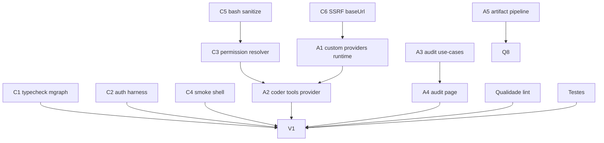

# Correction Plan 1 — Funcionalidades Residuais (RM1–RM13)

> Plano de correção dos achados do code review realizado em 2026-06-24.
> **Objetivo:** tornar a implementação compatível com os gates de qualidade do projeto (`typecheck`, `lint`, `test`), eliminar vulnerabilidades críticas, completar gaps funcionais e elevar a cobertura de testes.

---

## Estratégia Geral

1. **Fase 1 — Correções críticas:** build (typecheck) e segurança (RCE, bypass, traversal, SSRF).
2. **Fase 2 — Arquitetura e funcionalidades faltantes:** use-cases de audit, página `/audit`, pipeline de artefatos, resolução de providers custom, aplicação do redesign.
3. **Fase 3 — Qualidade de código:** refatorar funções/arquivos que quebram lint/complexidade, corrigir import/order, remover dead code.
4. **Fase 4 — Testes e cobertura:** adicionar testes faltantes, ajustar configuração de cobertura.
5. **Fase 5 — Verificação final:** rodar todos os gates globais do plano.

---

## Fase 1 — Correções Críticas (Build + Segurança)

### C1 — Corrigir typecheck em `apps/worker/src/routes/mgraph.ts`

**Severidade:** Crítico (build quebrado)  
**Arquivos:** `apps/worker/src/routes/mgraph.ts`  
**Problema:** O tipo mock de `reply` possui apenas `{ status: (...) => { send: (...) } }`, mas os handlers chamam `reply.send(...)` diretamente.

**Como corrigir:**

- Remover o tipo manual de `reply` e usar `FastifyReply` do Fastify.
- Garantir que todos os handlers retornem `reply.status(n).send(payload)`.
- Se houver necessidade de tipar o reply por causa de schema, usar `FastifyReply<{ Params: ..., Reply: ... }>`.

**Critérios de aceitação:**

- [ ] `pnpm exec turbo typecheck --filter=@wolfkrow/worker` passa.

---

### C2 — Autenticar rotas do harness

**Severidade:** Crítico (RCE não autenticado)  
**Arquivos:** `apps/worker/src/routes/harness.ts`  
**Problema:** Nenhuma rota do harness usa `preHandler: [server.authenticate]`.

**Como corrigir:**

- Adicionar `preHandler: [server.authenticate]` no plugin registration ou em cada handler.
- Extrair `userId` do token JWT (do request autenticado) e usar nos use-cases; não confiar em query/body.
- Atualizar testes de rota para incluir token válido.

**Critérios de aceitação:**

- [ ] `POST /harness/projects`, `POST /harness/projects/:id/run`, `POST /harness/projects/:id/plan` retornam `401` sem token.
- [ ] Testes de harness passam com autenticação mockada.

---

### C3 — Implementar `PermissionResolver` no `ClaudeCompatProvider`

**Severidade:** Crítico (execução automática de tools destrutivas)  
**Arquivos:**

- `packages/infra/src/ai-providers/claude-compat.ts`
- `apps/worker/src/container.ts` (`getCompatAgenticStreamPort`, `resolveAgentStreamPort`)
- `packages/infra/src/ai-providers/factory.ts`

**Problema:** `ClaudeCompatProvider.executeTool` chama o executor diretamente sem consultar `PermissionResolver`.

**Como corrigir:**

- Alterar construtor de `ClaudeCompatProvider` para aceitar `permissionResolver?: PermissionResolver` (espelhar `ClaudeAgentProvider`).
- Antes de executar tools destrutivas (`bash`, `filesystem`, `writeFile`), verificar se há permissão e emitir evento `toolPermission` se necessário.
- Atualizar `factory.createFromConfig` para receber e propagar `toolRegistry` e `permissionResolver` quando `cfg.supportsTools`.
- Atualizar `getCompatAgenticStreamPort` para passar `requestPermission`.
- Adicionar teste que simula tool destrutiva e exige permissão antes de execução.

**Critérios de aceitação:**

- [ ] `ClaudeCompatProvider` com tool destrutiva emite `toolPermission` e só executa após aprovação.
- [ ] `factory.createFromConfig(cfg, apiKey, registry, permissionResolver)` funciona.

---

### C4 — Remover `shell: true` do `SmokeTestRunner`

**Severidade:** Crítico (RCE via path controlado)  
**Arquivos:** `packages/infra/src/services/smoke-test-runner.ts`  
**Problema:** `spawnCommand` usa `shell: true` concatenando comando e argumentos.

**Como corrigir:**

- Refatorar `spawnCommand(cmd, args, cwd)` para usar `spawn(cmd, args, { cwd, shell: false, env: { ...process.env, PATH: ... } })`.
- Separar corretamente `npx tsc --noEmit`, `npm run lint`, `npm test -- --run` em comando + args.
- Validar `projectPath` com `path.resolve` + `startsWith(allowedRoot + path.sep)` antes de executar.
- Adicionar teste com path malicioso (`/tmp/evil; rm -rf /`).

**Critérios de aceitação:**

- [ ] `pnpm --filter @wolfkrow/infra run test -- smoke-test-runner` passa.
- [ ] Lint não reporta mais `shell: true`/`child_process` inseguro.

---

### C5 — Sanitizar `BashTool`

**Severidade:** Crítico (command injection)  
**Arquivos:** `packages/infra/src/tools/bash-tool.ts`  
**Problema:** `spawn('sh', ['-c', command])` executa string literal do LLM.

**Como corrigir:**

- Mudar a tool para aceitar comando como array (`command: string[]`) e usar `spawn(command[0], command.slice(1), { shell: false })`.
- Ou, se manter string, implementar parser/allowlist rigoroso e bloquear shell metacharacters.
- Validar `cwd` com `path.resolve(workDir, cwd)` e `startsWith(workDir + path.sep)`.
- Atualizar callers (`ClaudeAgentProvider`, testes) para passar array.
- Adicionar teste de command injection.

**Critérios de aceitação:**

- [ ] `BashTool` não aceita string de comando arbitrário sem sanitização.
- [ ] Testes existentes de `BashTool` passam.

---

### C6 — Validar `baseUrl` de providers custom contra SSRF

**Severidade:** Crítico (SSRF)  
**Arquivos:**

- `packages/domain/src/value-objects/provider-config.ts`
- `apps/worker/src/routes/providers.ts`
- `packages/infra/src/ai-providers/factory.ts` (opcional)

**Problema:** `baseUrl` aceita `http://localhost`, `file://`, `http://169.254.169.254`, etc.

**Como corrigir:**

- Validar no domínio (`ProviderConfig.create`) que `baseUrl` é HTTPS em produção; permitir HTTP apenas para `localhost/127.0.0.1` se `NODE_ENV !== 'production'`.
- Rejeitar protocolos `file://`, `ftp://`, etc.
- Bloquear hosts privados (`169.254.169.254`, `10.*`, `172.16-31.*`, `192.168.*`) via regex/allowlist.
- Adicionar testes para cada caso de rejeição.

**Critérios de aceitação:**

- [ ] `ProviderConfig.create({ baseUrl: 'http://169.254.169.254/...' })` lança erro.
- [ ] Testes de provider-config cobrem casos SSRF.

---

## Fase 2 — Arquitetura e Funcionalidades Faltantes

### A1 — Resolver providers custom em runtime

**Severidade:** Alto  
**Arquivos:**

- `apps/worker/src/container.ts` (`resolveAIProvider`, `resolveAgentStreamPort`, `makePlanner`, `makeCoder`, `makeEvaluator`)
- `packages/use-cases/src/providers/list-providers.ts`

**Problema:** Apenas `BUILT_IN_PROVIDERS` são considerados; providers persistidos pelo usuário são ignorados.

**Como corrigir:**

- Criar helper interno `async function listAllProviders(userId: string): Promise<ProviderConfig[]>` que faz `mergeProviders(BUILT_IN_PROVIDERS, await repo.findAll(userId))`.
- Usar esse helper em `resolveAIProvider`, `resolveAgentStreamPort` e `makePlanner/makeCoder/makeEvaluator`.
- Garantir que built-in tenha precedência apenas se não houver override custom (ou vice-versa, conforme regra de negócio documentada).
- Adicionar testes de integração.

**Critérios de aceitação:**

- [ ] Provider custom salvo aparece na lista e pode ser usado em chat/harness.
- [ ] Teste de `makePlanner('custom1')` resolve config custom.

---

### A2 — `makeCoderWithTools` respeitar `providerId`

**Severidade:** Alto  
**Arquivos:** `apps/worker/src/container.ts`  
**Problema:** Sempre instancia `ClaudeAgentProvider` com chave Anthropic.

**Como corrigir:**

- Receber `providerId` do `HarnessConfig`.
- Resolver provider via helper de merge (A1).
- Se provider for anthropic-compat e suportar tools, usar `ClaudeCompatProvider` via `getCompatAgenticStreamPort`.
- Se for Anthropic, manter `ClaudeAgentProvider`.
- Se for openai-compatible, levantar erro claro (não suporta tools) ou implementar suporte.
- Adicionar teste parametrizado.

**Critérios de aceitação:**

- [ ] `makeCoderWithTools(workDir, { providerId: 'zai', ... })` usa provider zai.
- [ ] Harness runner test valida provider não-anthropic.

---

### A3 — Criar use-cases de audit

**Severidade:** Alto (Clean Architecture)  
**Arquivos:**

- Criar: `packages/use-cases/src/audit/run-audit.ts`
- Criar: `packages/use-cases/src/audit/list-findings.ts`
- Criar: `packages/use-cases/src/audit/index.ts`
- Modificar: `apps/worker/src/routes/audit.ts`

**Problema:** A rota worker implementa orquestração diretamente e importa infra.

**Como corrigir:**

- `RunAuditUseCase`: recebe `{ dir, userId, agentIds?, filesByRole? }`, cria scan, chama `SecurityAuditRunner`, persiste findings via `securityFindingRepo`, atualiza scan.
- `ListFindingsUseCase`: recebe `{ scanId, severity?, userId }`, valida ownership, retorna findings paginados.
- Refatorar `audit.ts` para usar os use-cases via `getRepos()` / `getServices()`.
- Remover imports diretos de `@wolfkrow/infra` da rota.

**Critérios de aceitação:**

- [ ] `apps/worker/src/routes/audit.ts` não importa `@wolfkrow/infra`.
- [ ] Use-cases testados com repositórios fake.

---

### A4 — Criar página web `/audit`

**Severidade:** Alto (funcionalidade faltante RM8.3)  
**Arquivos:**

- Criar: `apps/web/app/(app)/audit/page.tsx`
- Criar: `apps/web/components/audit/audit-run-form.tsx`
- Criar: `apps/web/components/audit/findings-table.tsx`
- Criar: `apps/web/components/audit/severity-badge.tsx`
- Criar: `apps/web/app/api/audit/route.ts` (proxy POST/GET para worker)
- Modificar: `apps/web/components/common/sidebar.tsx` (link para `/audit`)

**Problema:** RM8.3 prevê página de audit, mas não existe.

**Como corrigir:**

- Página com formulário de diretório, botão "Run audit", SSE/progresso opcional.
- Tabela de findings com colunas severity, file, line, message, dimension.
- Filtro por severidade.
- Export CSV (reusar util existente de audit-log se possível).
- API route proxy para `POST /audit/run` e `GET /audit/:scanId/findings`.
- Cobrir com testes RTL.

**Critérios de aceitação:**

- [ ] `/audit` renderiza no navegador.
- [ ] Testes RTL passam.

---

### A5 — Criar `chat/artifact-pipeline.ts`

**Severidade:** Alto (RM10.2 não implementado)  
**Arquivos:**

- Criar: `apps/worker/src/chat/artifact-pipeline.ts`
- Modificar: `apps/worker/src/routes/chat.ts` (`writeStreamAsSse`)

**Problema:** Detecção de artefatos está inline na rota de chat.

**Como corrigir:**

- Extrair função `emitArtifactsForToolResult(toolName, input, output, workDir)` que chama `ArtifactDetector.detect` e retorna eventos SSE `artifact`.
- Na rota, após `tool_result`, chamar essa função e emitir eventos.
- Manter a função pura (sem side effects além de retorno de eventos) para facilitar testes.
- Criar teste unitário do pipeline com fixture de tool result.

**Critérios de aceitação:**

- [ ] `apps/worker/src/chat/artifact-pipeline.ts` existe e é testado.
- [ ] Chat route emite evento `artifact` após tool result.

---

### A6 — Aplicar redesign (RM13)

**Severidade:** Alto  
**Arquivos:**

- Criar: `apps/web/components/settings/settings-shell.tsx`
- Criar: `apps/web/components/common/topbar.tsx`
- Modificar: `apps/web/app/(app)/layout.tsx`
- Modificar: `apps/web/components/settings/settings-view.tsx`
- Modificar: páginas `agents`, `mcp-servers`, `knowledge`, `tasks`, `usage`, `harness`, `pipeline`
- Modificar: `apps/web/components/common/command-palette.tsx`

**Problema:** Componentes base criados mas não aplicados; `topbar`/`settings-shell` ausentes; palette sem ações.

**Como corrigir:**

- Criar `topbar.tsx` com breadcrumb dinâmico via `usePathname` e slot de ações.
- Criar `settings-shell.tsx` com nav vertical de tabs (Providers, Vault, Agents, MCP, Automation, Rules, Permissions, Channels, Usage) e conteúdo inline.
- Renderizar `<Topbar />` e `<CommandPalette />` no layout.
- Adicionar ações ao `CommandPalette`: "New agent", "Run audit", "New provider", etc.
- Aplicar `PageHeader` e `EmptyState` em todas as páginas-chave.
- Ajustar grupos da sidebar para `Main / Build / Knowledge / System` conforme plano (ou documentar se `Automation` for decisão consciente).
- Adicionar/ajustar testes RTL.

**Critérios de aceitação:**

- [ ] `PageHeader` e `EmptyState` são importados em pelo menos 5 páginas reais.
- [ ] `topbar.tsx` e `settings-shell.tsx` existem e são renderizados.
- [ ] `CommandPalette` executa ao menos 3 ações além de navegação.

---

## Fase 3 — Qualidade de Código (Lint / Complexidade)

### Q1 — Corrigir `import/order` em testes e componentes

**Severidade:** Médio  
**Arquivos afetados:**

- `packages/domain/src/__tests__/repo-profile.test.ts`
- `packages/domain/src/services/__tests__/provider-registry.test.ts`
- `packages/domain/src/value-objects/__tests__/provider-config.test.ts`
- `packages/use-cases/src/providers/__tests__/providers.test.ts`
- `apps/web/components/common/command-palette.tsx`
- `apps/web/components/settings/provider-config/provider-form-modal.tsx`
- `apps/web/components/settings/provider-config/provider-list.tsx`

**Como corrigir:**

- Rodar `eslint --fix` nesses arquivos.
- Verificar manualmente ordenação: externo → `@wolfkrow/*` → `@/` → relativo.

**Critérios de aceitação:**

- [ ] `pnpm exec turbo lint` passa para os pacotes afetados.

---

### Q2 — Refatorar `ProviderFormModal`

**Severidade:** Médio  
**Arquivo:** `apps/web/components/settings/provider-config/provider-form-modal.tsx`  
**Problema:** 147 linhas, complexidade 16.

**Como corrigir:**

- Extrair sub-componentes:
  - `ProtocolField`
  - `ModelsField` (input + chips)
  - `ApiKeyField`
  - `SupportsToolsField`
- Extrair mutation handler para hook customizado ou função auxiliar.
- Cada sub-componente deve ter <50 linhas.
- Adicionar campo `pricingUrl` opcional (RM1).

**Critérios de aceitação:**

- [ ] `ProviderFormModal` ≤50 linhas.
- [ ] Complexidade ≤10.
- [ ] Testes existentes continuam passando.

---

### Q3 — Refatorar `ProviderList`

**Severidade:** Médio  
**Arquivo:** `apps/web/components/settings/provider-config/provider-list.tsx`  
**Problema:** 83 linhas, sem testes.

**Como corrigir:**

- Extrair sub-componentes: `ProviderCard`, `BuiltInBadge`, `ProviderActions`.
- Importar `BUILT_IN_PROVIDERS` do domain em vez de duplicar `BUILT_IN_IDS`.
- Adicionar confirmação antes de deletar provider custom.
- Renderizar erros de `saveMut.error` / `deleteMut.error`.
- Adicionar estado empty e loading.
- Criar `provider-list.test.tsx`.

**Critérios de aceitação:**

- [ ] `ProviderList` ≤50 linhas.
- [ ] Testes cobrem built-ins, override e delete.

---

### Q4 — Refatorar `artifact-detector.ts`

**Severidade:** Médio  
**Arquivo:** `packages/infra/src/services/artifact-detector.ts`  
**Problema:** 392 linhas, múltiplas funções com complexidade >10.

**Como corrigir:**

- Dividir em módulos:
  - `artifact-detector/image.ts` — detecção/renderização de imagem.
  - `artifact-detector/excalidraw.ts` — parsing excalidraw.
  - `artifact-detector/audio.ts` — detecção de áudio.
  - `artifact-detector/index.ts` — orquestração.
- Substituir `if/else` profundos por lookup tables e early returns.
- Manter testes existentes e adicionar testes para caminhos não cobertos.

**Critérios de aceitação:**

- [ ] Nenhum arquivo >300 linhas.
- [ ] Nenhuma função >10 de complexidade.
- [ ] Testes ≥90% statements.

---

### Q5 — Refatorar `smoke-test-runner.ts`

**Severidade:** Médio  
**Arquivo:** `packages/infra/src/services/smoke-test-runner.ts`  
**Problema:** 320 linhas, complexidade alta, `shell: true`.

**Como corrigir:**

- Extrair `spawn-safe.ts` utilitário.
- Extrair `broken-imports.ts` e `missing-files.ts`.
- Refatorar `checkBrokenImports` e `collectSourceFiles` para reduzir aninhamento.
- Aplicar C4 (remover `shell: true`).

**Critérios de aceitação:**

- [ ] Arquivo ≤300 linhas.
- [ ] Complexidade ≤10.
- [ ] Testes passam.

---

### Q6 — Refatorar `mgraph-engine.ts`

**Severidade:** Médio  
**Arquivo:** `packages/infra/src/services/mgraph-engine.ts`  
**Problema:** 336 linhas, `parseFrontmatter` complexidade 13.

**Como corrigir:**

- Extrair módulos:
  - `mgraph-engine/path.ts` — `sanitizeFilename`, `validateVaultPath`.
  - `mgraph-engine/frontmatter.ts` — parse/build.
  - `mgraph-engine/graph.ts` — `buildGraphData`.
  - `mgraph-engine/index.ts` — orquestração.
- Simplificar `parseFrontmatter` com regexes compostas ou parser simples.

**Critérios de aceitação:**

- [ ] Arquivos ≤300 linhas.
- [ ] Testes passam.

---

### Q7 — Refatorar `container.ts`

**Severidade:** Médio  
**Arquivo:** `apps/worker/src/container.ts`  
**Problema:** 302 linhas, funções longas/complexas.

**Como corrigir:**

- Extrair provider resolution para `provider-resolution.ts`.
- Extrair harness agent factory para `harness-agents.ts`.
- Manter `container.ts` como ponto de composição.
- Aplicar A1 e A2.

**Critérios de aceitação:**

- [ ] `container.ts` ≤300 linhas.
- [ ] `pnpm exec turbo lint --filter=@wolfkrow/worker` passa.

---

### Q8 — Simplificar `writeStreamAsSse` e `ArtifactInline`

**Severidade:** Médio  
**Arquivos:**

- `apps/worker/src/routes/chat.ts:59`
- `apps/web/components/chat/chat-message.tsx:27`

**Problema:** Complexidade cognitiva 19 (chat.ts) e 13 (ArtifactInline).

**Como corrigir:**

- Em `chat.ts`: extrair handlers de evento SSE para funções nomeadas, usar lookup table por `chunk.type`.
- Em `chat-message.tsx`: usar mapa de renderizadores por `artifact.type`.
- Aplicar A5 (pipeline separado) para reduzir responsabilidade da rota.

**Critérios de aceitação:**

- [ ] Complexidade ≤10.
- [ ] Testes de chat passam.

---

### Q9 — Alinhar tipos de `Artifact`

**Severidade:** Médio  
**Arquivos:**

- `packages/domain/src/entities/artifact.ts`
- `apps/web/components/chat/artifact-detector.ts`
- `apps/web/components/chat/artifact-card.tsx`
- `apps/web/components/chat/chat-message.tsx`

**Problema:** Domínio define `image | audio | mcp_app | text`; web define `excalidraw | json | code | text`.

**Como corrigir:**

- Usar o tipo do domínio como fonte da verdade.
- Adicionar `excalidraw` como subtipo/variante de `image` ou como kind próprio no domínio.
- Garantir que `ArtifactCard` renderize todos os kinds do domínio.
- Remover `artifact-detector.ts` do web se for redundante.

**Critérios de aceitação:**

- [ ] Apenas um tipo de artifact no projeto.
- [ ] Renderização cobre imagem, áudio, excalidraw.

---

### Q10 — Remover comentários `RMx.y` restantes

**Severidade:** Baixo  
**Arquivos:** `apps/worker/src/container.ts:126,144`  
**Como corrigir:**

- Substituir `// RM3.2 ...` por descrição funcional pura.

**Critérios de aceitação:**

- [ ] `grep -rn "RM[0-9]\.[0-9]" packages apps --include="*.ts" --include="*.tsx" | grep -v "__tests__\|\.test\."` retorna vazio.

---

## Fase 4 — Testes e Cobertura

### T1 — Adicionar testes de entidades de domínio

**Severidade:** Médio  
**Arquivos:**

- `packages/domain/src/entities/__tests__/artifact.test.ts`
- `packages/domain/src/entities/__tests__/vault-note.test.ts`
- `packages/domain/src/entities/__tests__/security-finding.test.ts`

**Problema:** 0% de funções cobertas nessas entidades.

**Como corrigir:**

- Testar `create` com valores válidos, invalidações, getters, helpers.
- Cobrir todos os getters de `SecurityFinding` (severity, file, line, etc.).
- Cobrir `VaultNote.create`, `updateContent`, `withFrontmatter`.

**Critérios de aceitação:**

- [ ] Cobertura de funções do domain ≥90%.

---

### T2 — Adicionar teste de rota `/providers`

**Severidade:** Médio  
**Arquivo:** `apps/worker/src/routes/__tests__/providers-route.test.ts`  
**Problema:** Rota CRUD não tem teste.

**Como corrigir:**

- Seguir padrão de `harness-run.test.ts` para buildar app Fastify de teste.
- Testar GET /providers, POST /providers, DELETE /providers/:id.
- Mockar `secretsAdapter` e `providerConfigRepo`.

**Critérios de aceitação:**

- [ ] Testes passam.

---

### T3 — Melhorar `model-section.test.tsx`

**Severidade:** Médio  
**Arquivo:** `apps/web/components/agents/__tests__/model-section.test.tsx`  
**Problema:** Não valida que modelos do provider aparecem.

**Como corrigir:**

- Renderizar com providers mock.
- Selecionar `runtime=claude-compat` e `provider=zai`.
- Verificar que `glm-4.7` aparece como opção.

**Critérios de aceitação:**

- [ ] Teste valida o requisito RM5.

---

### T4 — Melhorar `command-palette.test.tsx`

**Severidade:** Baixo  
**Arquivo:** `apps/web/components/common/__tests__/command-palette.test.tsx`  
**Problema:** Não testa navegação ao selecionar item; usa `fireEvent`.

**Como corrigir:**

- Substituir `fireEvent` por `userEvent`.
- Selecionar um item e verificar que `router.push` foi chamado com URL correta.

**Critérios de aceitação:**

- [ ] Teste usa `userEvent` e valida navegação.

---

### T5 — Adicionar testes de `DeleteProviderUseCase`

**Severidade:** Médio  
**Arquivo:** `packages/use-cases/src/providers/__tests__/providers.test.ts`  
**Problema:** Não testa rejeição de deleção de built-in.

**Como corrigir:**

- Adicionar caso: `delete('anthropic')` deve lançar erro.
- Adicionar caso: `delete('custom1')` remove do repo.

**Critérios de aceitação:**

- [ ] Testes passam.

---

### T6 — Ajustar configuração de cobertura

**Severidade:** Baixo  
**Arquivos:**

- `packages/domain/vitest.config.ts`
- `packages/infra/vitest.config.ts`
- `packages/use-cases/vitest.config.ts`
- `apps/web/vitest.config.ts`

**Problema:** Testes aninhados inflacionam cobertura; web exclui páginas demais.

**Como corrigir:**

- Adicionar `'**/__tests__/**'` e `'**/*.test.ts'` ao `coverage.exclude` de domain/infra/use-cases.
- Revisar exclusões do web: incluir `components/common/**` e `app/api/**` na métrica, ou pelo menos documentar por que estão excluídos.
- Garantir que metas do plano sejam atingidas de forma honesta.

**Critérios de aceitação:**

- [ ] `pnpm exec turbo test:cov --force` passa e metas de cobertura são atingidas sem distorção.

---

## Fase 5 — Verificação Final

### V1 — Rodar gates globais

**Comandos:**

```bash
export PATH="/Users/juniorfaria/.nvm/versions/node/v24.17.0/bin:$PATH"
pnpm exec turbo typecheck --force
pnpm exec turbo lint --force
pnpm exec turbo test --force
pnpm exec turbo test:cov --force
```

**Critérios de aceitação:**

- [ ] `typecheck` passa em todos os pacotes.
- [ ] `lint` passa em todos os pacotes.
- [ ] `test` passa em todos os pacotes.
- [ ] `test:cov` atinge: domain ≥95%, use-cases ≥90%, infra ≥85%, web ≥70%.

---

## Rastreamento de Dependências



---

## Notas

- **Ordem recomendada:** Fase 1 → A1/A2/A3 → A4/A5 → Fase 3 → Fase 4 → V1.
- **Decisões pendentes:**
  - RM13: grupos da sidebar (`Automation` vs `Build`) devem ser alinhados com o plano ou o plano deve ser atualizado.
  - RM11: Graph/Memory usarão de fato o vault de notas (`mgraph-engine`) ou manterão o knowledge graph semântico atual? Se manter, atualizar o plano.
  - `skill-tool.ts` / `memory-tool.ts`: implementar ou remover (dead code).
- **Não esquecer:** ao alterar interfaces, atualizar `AGENTS.md` se houver documentação de arquitetura afetada.
