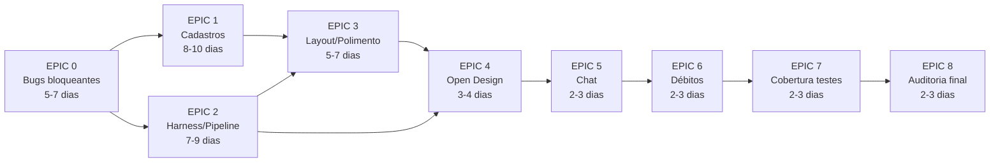
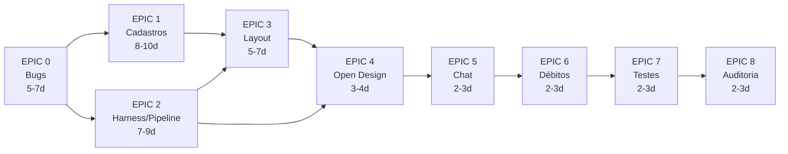

# MVP Final Plan v2 — Wolfkrow Tool (Plano Consolidado)

> **For Claude / Equipe:** Plano consolidado a partir de 4 auditorias independentes (Opus, Kimi, MiniMax, DeepSeek) executadas em 2026-06-26 contra `lionclawv1.0` (referência) e o código real do `wolfkrow-tool` (Next.js 15 + Fastify Worker).
>
> **Supersede:** `mvp_final_plan.md` (v1) e os 4 relatórios parciais (`mvp_final_plan_v2*.md`). Este é o plano único e autoritativo.
>
> **Objetivo:** Levar o Wolfkrow Tool a um MVP em que **todas as funcionalidades existentes e funcionais no LionClaw v3.0 estejam presentes, funcionais e iguais-ou-melhores** na stack Next.js 15, com layout redesenhado/polido, integração backend↔frontend correta, zero bug bloqueante, zero trava por usuário, e cobertura de testes validando comportamento real.
>
> **Referência (produto-alvo):** `/Users/juniorfaria/projects/lionclawv1.0`
>
> **Base da auditoria:** inventário LionClaw, frontend/UX Wolfkrow, backend/SDK/integração Wolfkrow, specs/ADR vs código real.

---

## Índice

1. [Sumário Executivo e Decisões Macro](#1-sumário-executivo-e-decisões-macro)
2. [Status Declarado vs Código Real](#2-status-declarado-vs-código-real)
3. [Princípios e Restrições (Binding)](#3-princípios-e-restrições-binding)
4. [Inventário Consolidado de Itens](#4-inventário-consolidado-de-itens)
5. [EPIC 0 — Bugs Bloqueantes e Débitos Críticos de DB/Auth](#5-epic-0--bugs-bloqueantes-e-débitos-críticos-de-dbauth)
6. [EPIC 1 — Cadastros & Configs](#6-epic-1--cadastros--configs-padrão-tabela--tela-dedicada-com-markdown)
7. [EPIC 2 — Harness / Pipeline / Execução / Métricas](#7-epic-2--harness--pipeline--execução--métricas)
8. [EPIC 3 — Layout / Redesign / Polimento](#8-epic-3--layout--redesign--polimento)
9. [EPIC 4 — Open Design Studio (Integração)](#9-epic-4--open-design-studio-integração)
10. [EPIC 5 — Chat (Paridade + Melhorias)](#10-epic-5--chat-paridade--melhorias)
11. [EPIC 6 — Eliminação de Débitos Técnicos](#11-epic-6--eliminação-de-débitos-técnicos)
12. [EPIC 7 — Cobertura de Testes Rigorosa](#12-epic-7--cobertura-de-testes-rigorosa)
13. [EPIC 8 — Auditoria Final e Gate de Release](#13-epic-8--auditoria-final-e-gate-de-release)
14. [Ordem de Execução Recomendada](#14-ordem-de-execução-recomendada)
15. [Cronograma e Estimativa](#15-cronograma-e-estimativa)
16. [Apêndice — Mapa de Arquivos Load-Bearing](#16-apêndice--mapa-de-arquivos-load-bearing)

---

## 1. Sumário Executivo e Decisões Macro

### 1.1 Estado Atual (2026-06-26)

O Wolfkrow está **substancialmente mais avançado** do que o `FEATURE_MATRIX.md` declara, mas ainda **não atinge o critério de MVP final**:

- ✅ Harness e pipeline executam de fato (loop AI + SSE + monitor)
- ✅ Seeds de skills/rules/MCP rodam no boot
- ✅ Token já é 30 dias com lock-on-expiry
- ✅ Provider anthropic-compat (GLM/Kimi/MiniMax/Qwen) funciona via runtime de **agente**
- ❌ **15+ bugs bloqueantes/críticos reais** (chat FK, SDK routing, provider override, MCP error masking, isolamento por usuário, schema drift, SSRF, etc.)
- ❌ Cadastros sem padrão único (modal × tela, textarea × markdown)
- ❌ Telas de execução inline em vez de console dedicado
- ❌ Open Design Studio com UI placeholder
- ❌ 15+ débitos técnicos rastreados (`// DEBT #XX`, try/catch silenciosos, shadow Zod, `as unknown as`)
- ❌ Cobertura de testes: worker 25%, shared-types 0% (vs meta ≥85%/80%)

### 1.2 Decisões Macro (consolidadas dos 4 auditores)

| Decisão | Fonte | Justificativa |
|---|---|---|
| **Auto-lock APENAS no `exp` do token (30d)** — não em idle 5min | Opus, MiniMax, DeepSeek | Requisito explícito do usuário |
| **Token 30 dias** já implementado — apenas validar | Todos | `jwt.ts:46` + cookies `maxAge 30d` + lock-on-expiry OK |
| **Padrão único de cadastro**: tabela + tela dedicada `/[id]/edit` com MarkdownEditor | Opus, Kimi, MiniMax, DeepSeek | DRY forte, paridade LionClaw |
| **Open Design Studio**: integrar no pipeline dev-v2 (não portar UI standalone; não remover) | Kimi, DeepSeek | Sidecar engine já existe; UI 22 linhas é placeholder mas engine worker é real |
| **Remover isolamento por usuário no worker** (mirror do web owner-rewrite) | Opus | Single-user por design; requisito do usuário |
| **Uma única fonte de provider registry** (`provider-catalog.ts`) | MiniMax | 4 fontes divergentes (`provider-registry`, `claude-compat-presets`, `pricing-calculator`, `orchestrator`) |
| **Tabela + DataTable para Skills/Rules/MCP** (substituir card grid) | Todos | LionClaw é flat/table; Wolfkrow está inconsistente |
| **Subir cobertura de testes para 85%** (worker sobe de 25% para 85%) | MiniMax | ADR-0020 + `tdd-mandatory` |
| **Provider override não pode duplicar registro** | Opus, Kimi, MiniMax, DeepSeek | Bug real; `resolveProviderId` re-slug em edição |
| **`apiKey` nunca em GET** — usar `hasApiKey: boolean` | Opus, Kimi | Secret via Vault/keytar, regra `no-secrets` |
| **Schema drift `settings.*` deve ser resolvido** (criar migration) | Kimi | `orchestrator/voice/stt/compaction` no schema sem migration |
| **SSRF bypass via IPs decimal/octal** deve ser bloqueado | MiniMax | Validação atual só checa prefixo string |
| **Cookie `secure` e `sameSite` configuráveis** | Kimi | Hardcoded `secure: false` inseguro em prod |
| **Não bloquear nenhuma feature por usuário** | Todos | Single-user OK; auto-lock só no exp |
| **Script `check-debts.sh`** em CI | MiniMax | Detectar débitos automaticamente |

### 1.3 Itens a NÃO incluir (YAGNI)

- **Auth sessions table com revogação server-side** (Kimi 0.4) — YAGNI para single-user; lock-on-expiry já é suficiente
- **Remover Open Design Studio** (MiniMax 6.4) — decisão prematura; engine worker já está integrada
- **Slash commands `/` no chat** (DeepSeek GAP-003) — nice-to-have; não-bloqueante para MVP
- **Husky + lint-staged + commitlint** (Kimi 5.3) — não-bloqueante; pode entrar em epic posterior
- **Property-based testing com fast-check** (MiniMax 8.4) — nice-to-have; testes tradicionais bastam
- **Token counter em tempo real** (DeepSeek GAP-004) — nice-to-have
- **Diff viewer de rounds** (DeepSeek GAP-042) — nice-to-have; console já mostra streaming

---

## 2. Status Declarado vs Código Real

Correções ao `FEATURE_MATRIX.md` baseado em auditoria de 2026-06-26:

| Item | FEATURE_MATRIX declara | Código real |
|---|---|---|
| Harness execução AI | deferido v1.1 | **DONE** — `apps/worker/src/harness/runner.ts` + SSE `POST /projects/:id/run` + monitor |
| Pipeline execução | templates | **DONE** — SSE `POST /projects/:id/phases/:phaseId/run/stream` + multi-turn `awaiting-input` |
| Token auth | 24h≠30d | **DONE** — `jwt.ts:46` `30d` + cookies `maxAge 30d` + lock só no `exp` |
| Seeds Skills/Rules/MCP | bug/ausente | **DONE** — wired em `apps/worker/src/index.ts:82-84,96-97` |
| SDK GLM/Kimi/MiniMax/Qwen | funciona | **PARCIAL** — funciona via runtime de **agente**; chat **sem agente** roteia errado |
| Open Design Studio | sidecar+iframe | **PARCIAL** — engine worker real; **sidecar UI é placeholder** |
| Multi-usuário sem trava | satisfeito (web) | **PARCIAL** — web OK; **worker NÃO** → isolamento vaza |
| Token counter tempo real | OK | **FALTA** — não implementado |
| Slash commands | OK | **FALTA** — não implementado |
| Provider Test connection | OK | **FALTA** — endpoint não existe |
| MCP Test connection | OK | **FALTA** — endpoint não existe |
| Provider catalog unificado | n/a | **FALTA** — 4 fontes divergentes |
| Schema settings persistido | OK | **FALTA** — drift (colunas sem migration) |
| SSRF protection | OK | **FALTA** — validação só de prefixo |
| Cobertura testes ≥85% | OK | **FALTA** — worker 25%, shared-types 0% |

---

## 3. Princípios e Restrições (Binding)

Toda implementação DEVE obedecer aos ADRs e regras:

- **Clean Architecture** (ADR-0003): `domain → use-cases → infra → presentation`. Sem lógica de negócio em rota/componente.
- **Zod = single source of truth** (ADR-0005): todo contrato novo (channel config, project, run events, hasApiKey) é Zod-first em `packages/shared-types`.
- **Drizzle, sem SQL cru** (ADR-0004); migrations up/down obrigatórias e testadas.
- **SSE para streaming** (ADR-0012); **WebSocket só para PTY** (ADR-0013). Runs de harness/pipeline/chat = SSE.
- **TDD obrigatório** (ADR-0020 / regra `tdd-mandatory`): RED→GREEN→REFACTOR. Cobertura backend ≥85%, frontend ≥70% (≥80% em auth).
- **shadcn/ui + Tailwind v4 + design-tokens** (ADR-0006/0007): nada de `<button>` cru; usar primitivos `ui/`.
- **TanStack Query** (ADR-0009) p/ server-state; **Zustand** (ADR-0008) p/ client-state, sem god-stores.
- **ESLint bars**: arquivo ≤300 linhas, função ≤50 — quebrar telas grandes em sub-componentes.
- **Sem secrets em código** (regra `no-secrets`): provider keys via Vault/keytar; nunca retornar `apiKey` em GET.
- **Sem trava por usuário**: nenhum cadastro pode ser filtrado/limitado por usuário no MVP.
- **Worktree isolation** por epic; PRs revisados antes de merge.

---

## 4. Inventário Consolidado de Itens

> **Total:** 60 itens identificados (15 BLOCKER/CRÍTICO + 30 MAJOR + 15 MINOR/Polish).
> Distribuídos em 9 Epics. Cada item tem: ID, severidade, problema, arquivos, implementação, critério de aceite.

### 4.1 Bugs Bloqueantes (B) — 15 itens

| ID | Item | Severidade | Epic |
|---|---|---|---|
| B01 | FK constraint no chat (`agent_id NOT NULL`) | BLOCKER | 0 |
| B02 | Roteamento SDK errado no chat sem agente | BLOCKER | 0 |
| B03 | Provider override duplica registro | BLOCKER | 0 |
| B04 | Provider edit não carrega campos (apiKey write-only) | BLOCKER | 0 |
| B05 | MCP "lista vazia" mascara erro real | BLOCKER | 0 |
| B06 | Isolamento por usuário no worker | BLOCKER | 0 |
| B07 | Auto-lock dispara em idle (deveria só no `exp`) | CRÍTICO | 0 |
| B08 | Schema drift `settings` (colunas sem migration) | CRÍTICO | 0 |
| B09 | Cookie de sessão inseguro (`secure: false` hardcoded) | CRÍTICO | 0 |
| B10 | FKs e índices faltantes (8+ relações) | CRÍTICO | 0 |
| B11 | SSRF bypass via IPs decimal/octal/hex | CRÍTICO | 0 |
| B12 | MCPs built-in não seedados no boot | CRÍTICO | 0 |
| B13 | Shadow Zod schemas (20+ em routes) | MAJOR | 0 |
| B14 | Provider registry com 4 fontes divergentes | MAJOR | 0 |
| B15 | Schemas de settings incompletos | MAJOR | 0 |

### 4.2 Gaps de UI/UX (U) — 20 itens

| ID | Item | Epic |
|---|---|---|
| U01 | Agents: nova tela `/agents/[id]/edit` com markdown | 1 |
| U02 | Agents: provider/LLM dinâmico em todos runtimes | 1 |
| U03 | Agents: campos faltantes (maxToolRounds, mcpServers, squad, description) | 1 |
| U04 | Skills: tabela + tela dedicada `/skills/[id]/edit` | 1 |
| U05 | Skills: YAML frontmatter parsing | 1 |
| U06 | Rules: tabela + EDIT + MarkdownEditor + tela dedicada | 1 |
| U07 | MCP: tabela + edit dedicado + transport (stdio/sse/http) | 1 |
| U08 | Provider: PUT endpoint + carregar todos os campos | 1 |
| U09 | Provider: Test connection endpoint | 1 |
| U10 | Channel config: tela data-driven (Telegram funcional + "em breve") | 1 |
| U11 | Settings: central unificada com tabs (não hub de cards) | 1 |
| U12 | Shell: header/content/footer padronizado (1 só estilo) | 3 |
| U13 | Sidebar: collapsable + ativo destacado + sem duplicações | 3 |
| U14 | Footer/ActiveRunsBar global (paridade LionClaw) | 3 |
| U15 | Empty states + skeletons padronizados | 3 |
| U16 | Cor de acento identidade + sem emoji como ícone | 3 |
| U17 | Markdown editor reusado em Agents/Rules (não só Skills) | 3 |
| U18 | ConfirmDialog para deleções (substituir overlay manual) | 3 |
| U19 | Polimento de formulários inline → modal/tela dedicada | 3 |
| U20 | Centralizar mapa de cores de status | 3 |

### 4.3 Execução (E) — 10 itens

| ID | Item | Epic |
|---|---|---|
| E01 | Run console dedicado (paridade LionClaw) | 2 |
| E02 | Pipeline: campo de project path | 2 |
| E03 | Métricas per-phase/per-round/Coder-Evaluator/cloud-local | 2 |
| E04 | Tipos de pipeline (dev / dev-v2 / feature / security / arch-review) | 2 |
| E05 | 14-17 fases por pipeline type (paridade LionClaw) | 2 |
| E06 | Sprint metrics com recharts | 2 |
| E07 | Document preview no pipeline | 2 |
| E08 | Reset de fases/sprints | 2 |
| E09 | Abort/Pause/Resume em Harness/Pipeline | 2 |
| E10 | MCP tools list expandable | 2 |

### 4.4 Open Design (D) — 3 itens

| ID | Item | Epic |
|---|---|---|
| D01 | UI do sidecar funcional (substituir placeholder 22 linhas) | 4 |
| D02 | Integração com pipeline dev-v2 (fases design/design_lock) | 4 |
| D03 | Validação end-to-end (artifact.html + contract + snapshot) | 4 |

### 4.5 Chat (C) — 6 itens

| ID | Item | Epic |
|---|---|---|
| C01 | FK constraint corrigido (B01) | 0 |
| C02 | Roteamento SDK corrigido (B02) | 0 |
| C03 | Agent selector por sessão | 5 |
| C04 | Provider selector explícito (além do model picker) | 5 |
| C05 | Syntax highlight em code blocks | 5 |
| C06 | Markdown rendering rico (tabelas, listas, blockquotes) | 5 |

### 4.6 Débitos Técnicos (T) — 15 itens

| ID | Débito | Epic |
|---|---|---|
| T01 | `as unknown as` (134x ocorrências) | 6 |
| T02 | try/catch silenciosos (8+) | 6 |
| T03 | Cobertura worker 25% → 85% | 7 |
| T04 | Cobertura shared-types 0% → 80% | 7 |
| T05 | 2 layouts de settings duplicados | 6 |
| T06 | Topbar sem SidebarTrigger mobile | 6 |
| T07 | Falta `loading.tsx` por rota | 6 |
| T08 | Falta `not-found.tsx` global | 6 |
| T09 | Permission store em memória | 6 |
| T10 | Abort/Stop não propaga em claude-compat | 6 |
| T11 | ClaudeCompatProvider silencia tools | 6 |
| T12 | SSE `ask_question` morto | 6 |
| T13 | SSE `log-stream` sem auth | 6 |
| T14 | `permission-store` em memória | 6 |
| T15 | Audit doc desatualizado | 6 |

### 4.7 Documentação/ADR (A) — 6 itens

| ID | Item | Epic |
|---|---|---|
| A01 | ADR-0017: JWT HS256 → ES256 + keytar | 8 |
| A02 | ADR-0011: Server Actions status | 8 |
| A03 | ADR-0002: 19 MCPs → 15 built-in + 3 planned | 8 |
| A04 | ADR-0028: embeddings JS → sqlite-vec | 8 |
| A05 | Specs e FEATURE_MATRIX regenerados contra código real | 8 |
| A06 | README dos ADRs sincronizado | 8 |

---

## 5. EPIC 0 — Bugs Bloqueantes e Débitos Críticos de DB/Auth

> **Objetivo:** estabilizar o core para que chat, auth, MCPs e providers funcionem sem erros. Nenhuma feature nova antes deste epic.
> **Estimativa:** 5-7 dias.
> **Critério de saída:** Todos os 15 bugs (B01-B15) resolvidos com testes que validam comportamento real (DB com FK enforcement).

### Tarefa 0.1 — Corrigir FK do Chat (`chat_sessions.agent_id`) [B01]

**Severidade:** BLOCKER
**Arquivos afetados:**
- `packages/infra/src/db/schema/chat.ts:18-20`
- `packages/infra/src/repos/chat-repos.ts:26,32,48`
- `packages/domain/src/entities/chat-session.ts:8,17`
- `packages/use-cases/src/chat/send-message.ts:63`
- Teste: `packages/infra/src/repos/__tests__/chat-repos.test.ts`

**Problema:**

```typescript
// packages/infra/src/db/schema/chat.ts:18-20
agentId: text('agent_id')
  .notNull()                                                    // ❌ NOT NULL
  .references(() => agents.id, { onDelete: 'restrict' }),       // ❌ FK restritiva
```

```typescript
// packages/infra/src/repos/chat-repos.ts:24-32
async save(session: ChatSession): Promise<ChatSession> {
  const agentId = session.agentId ?? '';   // ❌ string vazia quebra FK
  ...
  .values({ ..., agentId, ... })
}
```

Quando o usuário clica "New Chat" → `ChatSession.create({ agentId: undefined })` → repo salva com `agentId = ''` → FK falha.

**Implementação (TDD):**

**Passo 1 — Atualizar schema:**

```typescript
// packages/infra/src/db/schema/chat.ts (linhas 18-20)
agentId: text('agent_id')
  .references(() => agents.id, { onDelete: 'set null' }),  // nullable, SET NULL
```

**Passo 2 — Atualizar repo:**

```typescript
// packages/infra/src/repos/chat-repos.ts
const agentId = session.agentId ?? null;  // null ao invés de ''
// Tanto no .values() quanto no .onConflictDoUpdate.set()
```

**Passo 3 — Atualizar entity:**

```typescript
// packages/domain/src/entities/chat-session.ts
export class ChatSession {
  constructor(
    public readonly id: string,
    public readonly userId: string,
    public agentId: string | null,  // ✅ permite null
    // ...
  ) {}
}
```

**Passo 4 — Gerar e aplicar migration:**

```bash
pnpm --filter @wolfkrow/infra db:generate
# Nome sugerido: make_chat_sessions_agent_id_nullable
pnpm --filter @wolfkrow/infra db:migrate
```

Migration esperada (SQLite, requer rebuild de tabela):

```sql
CREATE TABLE chat_sessions_new (...);
INSERT INTO chat_sessions_new SELECT * FROM chat_sessions;
DROP TABLE chat_sessions;
ALTER TABLE chat_sessions_new RENAME TO chat_sessions;
PRAGMA foreign_keys=ON;
```

**Passo 5 — Testes:**

```typescript
// packages/infra/src/repos/__tests__/chat-repos.test.ts
describe('ChatSessionRepo with nullable agentId', () => {
  it('saves session without agent (null)', async () => {
    const session = ChatSession.create({ userId, agentId: undefined, /*...*/ });
    const saved = await repo.save(session);
    expect(saved.agentId).toBeNull();
  });

  it('does not throw FOREIGN KEY on agentId undefined', async () => {
    const session = ChatSession.create({ userId, agentId: undefined, /*...*/ });
    await expect(repo.save(session)).resolves.toBeDefined();
  });

  it('saves session with valid agentId', async () => {
    const agent = await agentRepo.save(/*...*/);
    const session = ChatSession.create({ userId, agentId: agent.id, /*...*/ });
    const saved = await repo.save(session);
    expect(saved.agentId).toBe(agent.id);
  });

  it('sets agentId to null when agent is deleted', async () => {
    const agent = await agentRepo.save(/*...*/);
    const session = ChatSession.create({ userId, agentId: agent.id, /*...*/ });
    await repo.save(session);
    await agentRepo.delete(agent.id);
    const reloaded = await repo.findById(session.id);
    expect(reloaded.agentId).toBeNull();
  });
});
```

**Critérios de aceitação:**
- [ ] Schema aceita `agentId = NULL`
- [ ] Migration aplicada com sucesso em banco novo e existente
- [ ] Todos os 4 testes passam
- [ ] `pnpm typecheck && pnpm lint && pnpm test` verdes
- [ ] E2E manual: criar "New Chat" sem agentId não dá erro
- [ ] E2E manual: deletar agent com sessões associadas não dá erro

---

### Tarefa 0.2 — Corrigir Roteamento de SDK no Chat Sem Agente [B02]

**Severidade:** BLOCKER
**Arquivos afetados:**
- `apps/worker/src/orchestrator.ts:85-99,173-184`
- `apps/worker/src/routes/chat.ts:31`
- Teste: `apps/worker/src/__tests__/orchestrator.test.ts`

**Problema:**

`mapRegistryProviderToWire` (`apps/worker/src/orchestrator.ts:85-99`) só mapeia `anthropic/openai/ollama/openrouter`; `zai/minimax/moonshot/qwen` caem no default `'anthropic'`. Chat com modelo GLM/Kimi/MiniMax/Qwen **sem agente** vai pro Anthropic real (cobrança errada + falha).

**Implementação:**

**Passo 1 — Corrigir `mapRegistryProviderToWire`:**

```typescript
// apps/worker/src/orchestrator.ts (linhas 85-99)
function mapRegistryProviderToWire(providerId: string): WireProvider {
  switch (providerId) {
    case 'anthropic': return 'anthropic';
    case 'openai': return 'openai';
    case 'ollama': return 'ollama';
    case 'openrouter': return 'openrouter';
    case 'zai':
    case 'minimax':
    case 'moonshot':
    case 'qwen':
      return `claude-compat:${providerId}`;  // ✅ roteia para ClaudeCompatProvider
    default:
      return 'anthropic';
  }
}
```

**Passo 2 — Garantir que `inferProvider` chame corretamente:**

```typescript
function inferProvider(model: string, explicit?: WireProvider): WireProvider {
  if (explicit) return explicit;
  if (model.startsWith('glm-')) return 'claude-compat:zai';
  if (model.startsWith('kimi-')) return 'claude-compat:moonshot';
  if (model.startsWith('minimax-')) return 'claude-compat:minimax';
  if (model.startsWith('qwen-')) return 'claude-compat:qwen';
  if (model.startsWith('claude-')) return 'anthropic';
  if (model.startsWith('gpt-') || model.startsWith('o1-') || model.startsWith('o3-')) return 'openai';
  return 'anthropic';  // default
}
```

**Passo 3 — Body do `POST /chat/send` resolve provider:**

```typescript
// apps/worker/src/routes/chat.ts:31
const { provider: explicitProvider, model } = request.body;
const wireProvider = explicitProvider
  ? mapRegistryProviderToWire(explicitProvider)
  : inferProvider(model);
```

**Passo 4 — Testes:**

```typescript
describe('inferProvider / mapRegistryProviderToWire', () => {
  it.each([
    ['glm-4.7', 'claude-compat:zai'],
    ['glm-4.6', 'claude-compat:zai'],
    ['kimi-k2', 'claude-compat:moonshot'],
    ['minimax-m2', 'claude-compat:minimax'],
    ['qwen3-coder', 'claude-compat:qwen'],
    ['claude-opus-4', 'anthropic'],
    ['gpt-4o', 'openai'],
    ['o1-preview', 'openai'],
  ])('inferProvider(%s) → %s', (model, expected) => {
    expect(inferProvider(model)).toBe(expected);
  });

  it.each([
    ['anthropic', 'anthropic'],
    ['zai', 'claude-compat:zai'],
    ['minimax', 'claude-compat:minimax'],
    ['moonshot', 'claude-compat:moonshot'],
    ['qwen', 'claude-compat:qwen'],
  ])('mapRegistryProviderToWire(%s) → %s', (id, expected) => {
    expect(mapRegistryProviderToWire(id)).toBe(expected);
  });

  it('uses ClaudeCompatProvider for glm without agent', async () => {
    const factorySpy = vi.spyOn(aiProviderFactory, 'create');
    await sendChatMessage({ content: 'hi', model: 'glm-4.7' });
    expect(factorySpy).toHaveBeenCalledWith(
      expect.objectContaining({ wireProvider: 'claude-compat:zai' })
    );
  });
});
```

**Critérios de aceitação:**
- [ ] `inferProvider` retorna o wire correto para todos os modelos
- [ ] `mapRegistryProviderToWire` roteia providers compat
- [ ] Chat sem agente com modelo compat usa `ClaudeCompatProvider` (baseURL/apiKey corretos)
- [ ] Mock do factory valida que `ClaudeCompatProvider` é instanciado
- [ ] E2E: enviar mensagem com modelo `glm-4.7` no chat sem agente funciona

---

### Tarefa 0.3 — Provider: Override Não Duplica Registro [B03]

**Severidade:** BLOCKER
**Arquivos afetados:**
- `apps/web/components/settings/provider-config/provider-form-helpers.ts:21-23`
- `apps/web/components/settings/provider-config/provider-form-modal.tsx:28-30`
- `apps/web/app/api/providers/[id]/route.ts:14-19` (só DELETE; falta PUT)
- `apps/worker/src/routes/providers.ts:34-50` (só POST upsert)
- `packages/infra/src/repos/provider-config-repo.ts`

**Problema:**
1. `slugifyProviderId(displayName)` regenera id se `displayName` muda
2. Edição usa mesmo POST de criar → upsert pode criar novo registro
3. PK composta `${userId}::${id}` manual é frágil

**Implementação:**

**Passo 1 — Adicionar endpoint PUT no worker:**

```typescript
// apps/worker/src/routes/providers.ts (após o POST)
server.put<{ Params: { id: string }; Body: ProviderConfig }>(
  '/providers/:id',
  {
    preHandler: [server.authenticate],
    schema: {
      params: z.object({ id: z.string() }),
      body: UpdateProviderSchema,  // id imutável
    },
  },
  async (request, reply) => {
    const { id } = request.params;
    const updates = request.body;
    if (updates.id && updates.id !== id) {
      return reply.code(400).send({ error: 'id_mismatch' });
    }
    return providerRepo.update(id, updates);
  }
);
```

**Passo 2 — Adicionar handler PUT no web:**

```typescript
// apps/web/app/api/providers/[id]/route.ts
export async function PUT(
  request: Request,
  { params }: { params: { id: string } }
) {
  const body = await request.json();
  return workerFetch(`/providers/${params.id}`, {
    method: 'PUT',
    body: JSON.stringify(body),
  });
}
```

**Passo 3 — Corrigir `resolveProviderId` para preservar id em edição:**

```typescript
// apps/web/components/settings/provider-config/provider-form-helpers.ts
export function resolveProviderId(
  displayName: string,
  originalId?: string
): string {
  if (originalId) return originalId;  // ✅ preserva id na edição
  return slugifyProviderId(displayName);
}
```

**Passo 4 — Refatorar `ProviderFormModal` para carregar todos os campos:**

```typescript
// apps/web/components/settings/provider-config/provider-form-modal.tsx
useEffect(() => {
  if (initial) {
    form.reset({
      ...initial,
      models: [...initial.models],
      displayName: initial.displayName,
      baseUrl: initial.baseUrl,
      apiKey: initial.apiKey,
      enabled: initial.enabled,
      provider: initial.provider,
    });
  }
}, [initial, form]);

const isEditing = !!initial?.id;
const onSubmit = async (data) => {
  if (isEditing) {
    await updateProvider({ id: initial.id, ...data });
  } else {
    await createProvider(data);
  }
};
```

**Passo 5 — Adicionar `update()` no repo:**

```typescript
// packages/infra/src/repos/provider-config-repo.ts
async update(id: string, updates: Partial<ProviderConfig>): Promise<ProviderConfig> {
  const now = new Date();
  const [updated] = await this.db
    .update(providerConfigs)
    .set({ ...updates, updatedAt: now })
    .where(eq(providerConfigs.id, id))
    .returning();
  return updated;
}
```

**Passo 6 — Testes:**

```typescript
describe('Provider PUT endpoint', () => {
  it('updates existing provider without duplicating', async () => {
    const created = await repo.create({ id: 'anthropic-custom', displayName: 'Anthropic Custom', /*...*/ });
    const updated = await fetch(`/api/providers/anthropic-custom`, {
      method: 'PUT',
      body: JSON.stringify({ displayName: 'Anthropic Override', /*...*/ }),
    });
    expect(updated.status).toBe(200);
    const all = await repo.list();
    expect(all).toHaveLength(1);  // não duplicou
    expect(all[0].displayName).toBe('Anthropic Override');
  });

  it('rejects id_mismatch on PUT', async () => {
    const res = await fetch(`/api/providers/anthropic-custom`, {
      method: 'PUT',
      body: JSON.stringify({ id: 'different-id', displayName: 'X' }),
    });
    expect(res.status).toBe(400);
  });
});
```

**Critérios de aceitação:**
- [ ] `PUT /api/providers/:id` existe e valida
- [ ] Editar provider built-in (override) NÃO cria novo registro
- [ ] Form carrega todos os campos ao editar
- [ ] Botão diz "Update" ao editar, "Create" ao criar
- [ ] `resolveProviderId` preserva id em edição
- [ ] Testes de repo + endpoint cobrem PUT sem duplicação

---

### Tarefa 0.4 — Provider: Carregar Campos + hasApiKey [B04]

**Severidade:** BLOCKER
**Arquivos afetados:**
- `apps/worker/src/routes/providers.ts` GET
- `packages/shared-types/src/schemas/provider.ts` (Zod)
- `apps/web/components/settings/provider-config/provider-form-fields.tsx`
- `packages/infra/src/config/provider-config.ts`

**Problema:** `apiKey` é write-only (secret via `getAdapters().secrets`), nunca retorna no `GET /api/providers` → form aparece vazio.

**Implementação:**

**Passo 1 — Adicionar `hasApiKey: boolean` no DTO de retorno:**

```typescript
// packages/shared-types/src/schemas/provider.ts
export const ProviderConfigDTOSchema = ProviderConfigSchema.omit({ apiKey: true }).extend({
  hasApiKey: z.boolean(),
});
export type ProviderConfigDTO = z.infer<typeof ProviderConfigDTOSchema>;
```

**Passo 2 — Worker retorna `hasApiKey`:**

```typescript
// apps/worker/src/routes/providers.ts
async function toDTO(config: ProviderConfig): Promise<ProviderConfigDTO> {
  const secretValue = await secrets.get(`provider:${config.id}:apiKey`);
  return { ...config, apiKey: undefined, hasApiKey: !!secretValue };
}
```

**Passo 3 — Frontend renderiza campo com indicação:**

```typescript
// apps/web/components/settings/provider-config/provider-form-fields.tsx
<FormField
  name="apiKey"
  render={({ field }) => (
    <FormItem>
      <FormLabel>API Key</FormLabel>
      <FormControl>
        <Input
          type="password"
          placeholder={initial?.hasApiKey ? '•••• (definida — deixe em branco para manter)' : 'sk-...'}
          {...field}
        />
      </FormControl>
      {initial?.hasApiKey && (
        <p className="text-xs text-muted-foreground">Chave já definida. Deixe em branco para manter.</p>
      )}
    </FormItem>
  )}
/>
```

**Passo 4 — Salvar com apiKey vazio preserva segredo:**

```typescript
// apps/web/components/settings/provider-config/provider-form-modal.tsx
const onSubmit = async (data) => {
  if (isEditing && !data.apiKey) {
    delete data.apiKey;  // não enviar para o backend
  }
  // ... PUT ou POST
};
```

**Critérios de aceitação:**
- [ ] `GET /api/providers` retorna `hasApiKey: boolean` (nunca `apiKey`)
- [ ] Form de edição mostra "•••• (definida)" se chave já existe
- [ ] Salvar com apiKey vazio preserva segredo existente
- [ ] Schema Zod documenta que `apiKey` é opcional no PUT

---

### Tarefa 0.5 — MCP: Superficiar Erro em vez de "Lista Vazia" [B05]

**Severidade:** BLOCKER
**Arquivos afetados:**
- `apps/web/components/mcp-servers/mcp-servers-view.tsx:155`
- `apps/web/components/agents/agents-view.tsx:57`
- `apps/web/components/skills/skills-view.tsx:54`
- `apps/worker/src/index.ts:82-84,96-97` (verificar seed wiring)

**Problema:** `catch { /* graceful */ }` em vários fetchers faz falha de backend/auth parecer "sem registros".

**Implementação:**

**Passo 1 — Refatorar fetcher para distinguir erro de vazio:**

```typescript
// apps/web/components/mcp-servers/mcp-servers-view.tsx
const { data, isLoading, error, refetch } = useQuery({
  queryKey: ['mcp-servers'],
  queryFn: () => fetch('/api/mcp-servers').then(r => {
    if (!r.ok) throw new Error(`HTTP ${r.status}: ${r.statusText}`);
    return r.json();
  }),
});

if (isLoading) return <Skeleton />;
if (error) {
  return (
    <Alert variant="destructive">
      <AlertCircle className="h-4 w-4" />
      <AlertTitle>Erro ao carregar MCP servers</AlertTitle>
      <AlertDescription>
        {error.message}
        <Button onClick={() => refetch()} variant="outline" size="sm" className="ml-2">
          Tentar novamente
        </Button>
      </AlertDescription>
    </Alert>
  );
}
if (!data?.servers?.length) {
  return (
    <EmptyState
      icon={Server}
      title="Nenhum MCP server configurado"
      description="Adicione um MCP server ou verifique se os built-in foram seedados."
      action={<Button onClick={openCreate}><Plus /> Adicionar MCP</Button>}
    />
  );
}
return <McpServerList servers={data.servers} />;
```

**Passo 2 — Verificar seed de MCPs built-in:**

```typescript
// apps/worker/src/index.ts (verificar)
// startMcpsAsync deve popular mcp_servers com 15 built-in via upsert
const BUILT_IN_MCPS = 15;
const mcpCount = await mcpRepo.count();
if (mcpCount < BUILT_IN_MCPS) {
  await upsertBuiltInMcpServers();  // ✅ garante seed
}
```

**Passo 3 — Remover try/catch silenciosos em agents-view e skills-view (mesmo padrão):**

```bash
grep -rn "catch.*graceful\|catch.*ignore" apps/web/components --include="*.tsx"
```

**Critérios de aceitação:**
- [ ] Worker offline/401 mostra banner de erro (não "nenhum servidor")
- [ ] Lista vazia distinta de erro de fetch
- [ ] Retry button presente
- [ ] Boot limpo popula 15 MCPs built-in
- [ ] Idem para Agents e Skills

---

### Tarefa 0.6 — Remover Isolamento por Usuário no Worker [B06]

**Severidade:** BLOCKER
**Arquivos afetados:**
- `apps/worker/src/plugins/auth.ts:58`
- `packages/infra/src/repos/user-repo.ts` (já tem `findOwner()`)
- `apps/web/lib/auth.ts:54-71` (referência do owner-rewrite)

**Problema:** `apps/worker/src/plugins/auth.ts:58` usa `payload.sub` (id real); repos filtram por `userId` → usuários isolados. Web já reescreve p/ owner. Requisito: todos veem tudo.

**Implementação:**

**Passo 1 — Flag de shared workspace:**

```typescript
// apps/worker/src/plugins/auth.ts
const SHARED_WORKSPACE = process.env.WOLFKROW_SHARED_WORKSPACE !== 'false';  // default on

async function resolveOwnerId(payload: JWTPayload): Promise<string> {
  if (!SHARED_WORKSPACE) return payload.sub;
  return userRepo.findOwner().then(u => u.id);  // ✅ sempre owner
}
```

**Passo 2 — Substituir `payload.sub` por `resolveOwnerId(payload)`:**

```typescript
// apps/worker/src/plugins/auth.ts
server.decorateRequest('userId', null);

server.addHook('onRequest', async (request) => {
  const payload = await verifyToken(request);
  request.userId = await resolveOwnerId(payload);  // ✅ owner
  request.realSub = payload.sub;  // para auditoria
});
```

**Passo 3 — Auditoria registra `realSub`:**

```typescript
// apps/worker/src/plugins/auth.ts
await auditLog.record({
  userId: request.userId,  // owner
  realUserId: request.realSub,  // quem realmente fez
  action: 'request',
  path: request.url,
});
```

**Passo 4 — Testes:**

```typescript
describe('Worker auth with shared workspace', () => {
  it('two distinct users see same data', async () => {
    const user1 = await createUser('user1@test');
    const user2 = await createUser('user2@test');
    await createAgent({ userId: user1.id, name: 'Test' });

    // user2 deve ver o agent de user1 (porque ambos viram owner)
    const agents1 = await fetchAs(user1, '/api/agents');
    const agents2 = await fetchAs(user2, '/api/agents');
    expect(agents1).toEqual(agents2);
  });

  it('audit log records realSub even with shared workspace', async () => {
    // verificar que user2 é gravado em audit_log.real_user_id
  });
});
```

**Critérios de aceitação:**
- [ ] Dois usuários distintos enxergam os mesmos agents/providers/skills/mcp/projetos
- [ ] Auditoria registra o `sub` real em `real_user_id`
- [ ] Flag `WOLFKROW_SHARED_WORKSPACE=false` desabilita (modo antigo)
- [ ] Teste de integração com 2 users passa

---

### Tarefa 0.7 — Auto-lock: Apenas no `exp` do Token, Não em Idle [B07]

**Severidade:** CRÍTICO
**Arquivos afetados:**
- `apps/web/hooks/use-auto-lock.ts`
- `apps/web/middleware.ts:24`
- `apps/web/app/api/auth/{login,unlock,totp}/route.ts`
- `packages/infra/src/auth/jwt.ts:46`

**Problema:** Auto-lock dispara em 5min de inatividade. Requisito: bloquear APENAS quando token expira (30d).

**Implementação:**

**Passo 1 — Remover handler de idle em use-auto-lock:**

```typescript
// apps/web/hooks/use-auto-lock.ts
export function useAutoLock() {
  const { session } = useSession();

  // ✅ NÃO bloquear em idle
  // Bloquear APENAS quando token expira (handled by middleware/redirect)

  // Manter verificação de visibilidade apenas para refresh
  useEffect(() => {
    const handleVisibility = () => {
      if (document.visibilityState === 'visible') {
        refetchSession();  // apenas valida token
      }
    };
    document.addEventListener('visibilitychange', handleVisibility);
    return () => document.removeEventListener('visibilitychange', handleVisibility);
  }, []);

  // Verificação periódica do exp
  useEffect(() => {
    const checkExpiration = () => {
      const exp = getTokenExpiration();
      if (exp && Date.now() >= exp * 1000) {
        window.location.href = '/unlock';
      }
    };
    const interval = setInterval(checkExpiration, 60 * 60 * 1000);  // 1h
    return () => clearInterval(interval);
  }, []);
}
```

**Passo 2 — Validar que middleware redireciona no exp:**

```typescript
// apps/web/middleware.ts:24
if (session.exp * 1000 <= Date.now()) {
  return NextResponse.redirect(new URL('/unlock', request.url));
}
```

**Passo 3 — Testes:**

```typescript
describe('Auto-lock behavior', () => {
  it('does not lock on idle for 5 min', async () => {
    // Simular inatividade de 5 min
    // App NÃO deve redirecionar para /unlock
  });

  it('does not lock on tab switch', async () => {
    // visibility change não dispara lock
  });

  it('locks ONLY when token exp is reached', async () => {
    // Mock token com exp = now
    // App DEVE redirecionar para /unlock
  });
});
```

**Critérios de aceitação:**
- [ ] App NÃO bloqueia em idle de 5min
- [ ] App NÃO bloqueia ao trocar de aba
- [ ] App bloqueia APENAS quando `exp * 1000 <= now`
- [ ] `settings.auto_lock_minutes` removido do schema (YAGNI) ou desabilitado

---

### Tarefa 0.8 — Resolver Drift do Schema `settings` [B08]

**Severidade:** CRÍTICO
**Arquivos afetados:**
- `packages/infra/src/db/schema/settings.ts` (revisar)
- `packages/infra/drizzle/` (gerar migration)
- `packages/infra/src/repos/settings-repo.ts` (criar)
- `packages/use-cases/src/settings/{get,update}-settings.ts` (criar)

**Problema:** Schema `settings` define colunas `orchestrator/voice/stt/compaction` (JSON), mas migration 0000 não as cria. Bancos novos quebram.

**Implementação:**

**Decisão:** **(A) implementar persistence de settings no DB**

**Passo 1 — Migration:**

```bash
pnpm --filter @wolfkrow/infra db:generate
# Nome: add_settings_json_columns
```

```sql
ALTER TABLE settings ADD COLUMN orchestrator TEXT;  -- JSON
ALTER TABLE settings ADD COLUMN voice TEXT;  -- JSON
ALTER TABLE settings ADD COLUMN stt TEXT;  -- JSON
ALTER TABLE settings ADD COLUMN compaction TEXT;  -- JSON
```

**Passo 2 — SettingsRepo:**

```typescript
// packages/infra/src/repos/settings-repo.ts
export class SettingsRepo {
  async get(userId: string): Promise<Settings> { /*...*/ }
  async update(userId: string, updates: Partial<Settings>): Promise<Settings> { /*...*/ }
}
```

**Passo 3 — Use cases:**

```typescript
// packages/use-cases/src/settings/get-settings.ts
// packages/use-cases/src/settings/update-settings.ts
```

**Passo 4 — Mover voz de localStorage para DB (migração one-shot):**

```typescript
// apps/web/hooks/useVoiceSettings.ts
// Antes: localStorage.getItem('voice-settings')
// Depois: useQuery({ queryKey: ['settings'], queryFn: fetchSettings })
```

**Critérios de aceitação:**
- [ ] `pnpm db:generate` não gera migration adicional (schema e migrations sincronizados)
- [ ] Settings de voz persistem no DB
- [ ] Migration up/down testada
- [ ] Teste de integração valida leitura/escrita

---

### Tarefa 0.9 — Cookie de Sessão Seguro [B09]

**Severidade:** CRÍTICO
**Arquivos afetados:**
- `apps/web/app/api/auth/{login,unlock,totp}/route.ts`
- `.env.example`

**Problema:** `secure: false` e `sameSite: 'lax'` hardcoded em login/unlock.

**Implementação:**

**Passo 1 — Variáveis de ambiente:**

```bash
# .env.example
COOKIE_SECURE=false  # true em produção
COOKIE_SAME_SITE=lax
SESSION_MAX_AGE_DAYS=30
```

**Passo 2 — Aplicar nas rotas:**

```typescript
// apps/web/app/api/auth/login/route.ts
const cookieOptions = {
  httpOnly: true,
  secure: process.env.COOKIE_SECURE === 'true',
  sameSite: process.env.COOKIE_SAME_SITE || 'lax',
  maxAge: parseInt(process.env.SESSION_MAX_AGE_DAYS || '30') * 24 * 60 * 60 * 1000,
  path: '/',
};
response.cookies.set('session', token, cookieOptions);
```

**Critérios de aceitação:**
- [ ] Cookie `secure` é `true` em produção
- [ ] `sameSite` configurável
- [ ] Token JWT expira em 30 dias (já está; validar via decode)
- [ ] `.env.example` atualizado
- [ ] Documentação: `auth-sessions.md` explica flags

---

### Tarefa 0.10 — Adicionar FKs e Índices Faltantes [B10]

**Severidade:** CRÍTICO
**Arquivos afetados:**
- `packages/infra/src/db/schema/*.ts` (8+ relações)
- `packages/infra/drizzle/` (migration consolidada)

**Problema:** Muitas relações lógicas não têm FK; tabelas user-scoped sem índice por `user_id`.

**Implementação:**

**Passo 1 — Adicionar FKs:**

| Tabela.Coluna | → Referência |
|---|---|
| `scheduled_tasks.agent_id` | `agents.id` |
| `token_usage.session_id` | `chat_sessions.id` |
| `token_usage.agent_id` | `agents.id` |
| `compaction_log.session_id` | `chat_sessions.id` |
| `enrich_sessions.validator_agent_id` | `agents.id` |
| `enrich_sessions.enricher_agent_id` | `agents.id` |
| `graph_edges.source_node_id` | `graph_nodes.id` |
| `graph_edges.target_node_id` | `graph_nodes.id` |
| `pipeline_projects.harness_project_id` | `harness_projects.id` |
| `provider_configs.user_id` | `users.id` |
| `tool_permissions.user_id` | `users.id` |
| `tool_permissions.agent_id` | `agents.id` |

**Passo 2 — Adicionar índices por `user_id`:**

```typescript
// channels, tasks, global_rules, secrets_metadata, enrich_sessions,
// workflow_runs, harness_projects, pipeline_projects, enrich_messages
```

**Passo 3 — Corrigir `mcp_servers.name` unique para ser por `user_id`:**

```typescript
// Antes: unique(name)
// Depois: unique(userId, name)
```

**Passo 4 — Migration consolidada:**

```bash
pnpm --filter @wolfkrow/infra db:generate
# Nome: add_missing_foreign_keys_and_indexes
```

**Critérios de aceitação:**
- [ ] `drizzle-kit generate` não reporta diferenças
- [ ] Todas tabelas user-scoped têm índice por `user_id`
- [ ] Testes de integridade de schema passam
- [ ] Migration up/down testada

---

### Tarefa 0.11 — SSRF Bypass via IPs Decimal/Octal/Hex [B11]

**Severidade:** CRÍTICO (segurança)
**Arquivos afetados:**
- `packages/infra/src/config/provider-config.ts:12-15,57-61`
- Dependência nova: `ipaddr.js`

**Problema:** Validação atual só checa prefixo string. Atacante usa `https://2130706433` (decimal de 127.0.0.1) ou `https://0x7f000001` (hex).

**Implementação:**

**Passo 1 — Instalar dependência:**

```bash
pnpm add ipaddr.js
```

**Passo 2 — Implementar validação robusta:**

```typescript
// packages/infra/src/config/provider-config.ts
import { lookup } from 'node:dns/promises';
import { parse as parseIp } from 'ipaddr.js';

async function validateBaseUrl(url: string): Promise<void> {
  const parsed = new URL(url);

  if (!['https:', 'http:'].includes(parsed.protocol)) {
    throw new Error('Invalid protocol');
  }

  const hostname = parsed.hostname;

  // 1. Rejeita IPs literais (exceto allowlist explícita)
  if (/^[\d.]+$/.test(hostname) || /^0x[0-9a-f]+$/i.test(hostname) || /^\d+$/.test(hostname)) {
    throw new Error('IP literal not allowed');
  }

  // 2. Resolve DNS e checa se aponta para IP privado
  const addresses = await lookup(hostname, { all: true });
  for (const { address } of addresses) {
    if (isPrivateIp(address)) {
      throw new Error(`Private IP not allowed: ${address}`);
    }
  }
}

function isPrivateIp(ip: string): boolean {
  try {
    const addr = parseIp(ip);
    const range = addr.kind() === 'ipv6' && addr.isIPv4MappedAddress()
      ? addr.toIPv4Address()
      : addr;
    return range.range() !== 'unicast';
  } catch {
    return true;  // fail-closed
  }
}
```

**Passo 3 — Testes (cada caso):**

```typescript
describe('validateBaseUrl SSRF protection', () => {
  it.each([
    ['https://127.0.0.1'],
    ['https://2130706433'],  // decimal
    ['https://0x7f000001'],  // hex
    ['https://169.254.169.254'],  // AWS metadata
    ['https://10.0.0.1'],
    ['https://192.168.1.1'],
    ['https://172.16.0.1'],
    ['https://[::1]'],
    ['https://[fe80::1]'],
  ])('rejects %s', async (url) => {
    await expect(validateBaseUrl(url)).rejects.toThrow();
  });

  it.each([
    ['https://api.anthropic.com'],
    ['https://api.z.ai/api/anthropic'],
    ['https://api.openai.com'],
  ])('accepts %s', async (url) => {
    await expect(validateBaseUrl(url)).resolves.toBeUndefined();
  });
});
```

**Critérios de aceitação:**
- [ ] IPs literais (decimal/octal/hex) rejeitados
- [ ] Ranges privados (10/8, 172.16/12, 192.168/16, 127/8, 169.254/16) rejeitados
- [ ] DNS resolution valida IP antes de aceitar
- [ ] `api.anthropic.com` aceito
- [ ] Testes cobrem 9+ casos de bypass

---

### Tarefa 0.12 — Seed de MCPs Built-in no Boot [B12]

**Severidade:** CRÍTICO
**Arquivos afetados:**
- `apps/worker/src/index.ts:82-84,96-97`
- `apps/worker/src/seed/mcp-servers.ts` (verificar/criar)

**Problema:** Worker inicia processos MCP a partir de catalog em memória, mas web lista registros do DB. Se `seedDatabase()` não rodou, `mcp_servers` está vazio.

**Implementação:**

**Passo 1 — Função de upsert:**

```typescript
// apps/worker/src/seed/mcp-servers.ts
export async function upsertBuiltInMcpServers(): Promise<void> {
  const builtIns = BUILT_IN_MCP_SERVERS;  // 15 entries
  for (const mcp of builtIns) {
    await mcpRepo.upsert({
      ...mcp,
      isBuiltIn: true,
      visibility: 'always',
    });
  }
}
```

**Passo 2 — Chamar no boot:**

```typescript
// apps/worker/src/index.ts
await seedDatabase();
await upsertBuiltInMcpServers();  // ✅ após DB seed
await startMcpsAsync();
```

**Passo 3 — Testes:**

```typescript
describe('upsertBuiltInMcpServers', () => {
  it('inserts 15 built-in MCPs on empty DB', async () => {
    await db.delete(mcpServers);
    await upsertBuiltInMcpServers();
    const all = await mcpRepo.list();
    expect(all).toHaveLength(15);
    expect(all.every(m => m.isBuiltIn)).toBe(true);
  });

  it('does not override custom MCPs', async () => {
    await upsertBuiltInMcpServers();
    await mcpRepo.create({ name: 'custom', command: 'foo', isBuiltIn: false, userId: 'user1' });
    await upsertBuiltInMcpServers();
    const all = await mcpRepo.list();
    expect(all).toHaveLength(16);
    expect(all.find(m => m.name === 'custom')).toBeDefined();
  });
});
```

**Critérios de aceitação:**
- [ ] Após `pnpm dev`, `/mcp-servers` exibe 15 built-in sem migração manual
- [ ] MCPs customizados do usuário não são sobrescritos
- [ ] Teste de integração valida que o boot popula `mcp_servers`

---

### Tarefa 0.13 — Eliminar Shadow Zod Schemas [B13]

**Severidade:** MAJOR
**Arquivos afetados:**
- `apps/worker/src/routes/*.ts` (20+ shadow schemas)
- `packages/shared-types/src/schemas/*.ts`

**Problema:** Routes do worker reescrevem Zod schemas inline em vez de importar de `shared-types`.

**Implementação:**

**Passo 1 — Auditar:**

```bash
grep -rn "z\.object(" apps/worker/src/routes --include="*.ts" | wc -l
# Esperado após fix: 0
```

**Passo 2 — Identificar schemas em shared-types:**

```bash
ls packages/shared-types/src/schemas/
# ChatSendBody, ProviderConfig, AgentConfig, McpServerConfig, etc.
```

**Passo 3 — Substituir em cada route:**

```typescript
// apps/worker/src/routes/chat.ts
// Antes
const body = z.object({
  sessionId: z.string().optional(),
  content: z.string().min(1).max(10000),
});

// Depois
import { ChatSendBodySchema } from '@wolfkrow/shared-types';
const body = ChatSendBodySchema;
```

**Passo 4 — Adicionar regra ESLint:**

```javascript
// .eslintrc.js
rules: {
  'no-restricted-syntax': ['error', {
    selector: "CallExpression[callee.object.name='z'][callee.property.name='object']",
    message: 'Use shared-types schemas in worker routes'
  }],
}
```

**Critérios de aceitação:**
- [ ] 0 shadow schemas em `apps/worker/src/routes/`
- [ ] Todos routes importam de `shared-types`
- [ ] Lint falha se shadow schema for criado
- [ ] Testes validam Zod-first

---

### Tarefa 0.14 — Provider Catalog Unificado (4 Fontes → 1) [B14]

**Severidade:** MAJOR
**Arquivos afetados:**
- `packages/infra/src/config/provider-registry.ts:33`
- `packages/infra/src/config/claude-compat-presets.ts:32`
- `packages/infra/src/pricing/pricing-calculator.ts:64,92`
- `packages/infra/src/orchestrator/orchestrator.ts:52`
- Novo: `packages/infra/src/config/provider-catalog.ts`

**Problema:** 4 fontes divergentes de provider: `provider-registry.ts`, `claude-compat-presets.ts`, `pricing-calculator.ts`, `orchestrator.ts`. Adicionar provider = editar 4 lugares.

**Implementação:**

**Passo 1 — Criar `provider-catalog.ts` (fonte única):**

```typescript
// packages/infra/src/config/provider-catalog.ts
export interface ProviderCatalogEntry {
  id: string;
  displayName: string;
  runtime: 'cloud' | 'local' | 'external' | 'codex' | 'claude-compat';
  baseUrl?: string;
  models: ModelCatalogEntry[];
  pricing: PricingTier;
  authType: 'api-key' | 'oauth' | 'none';
  envKey?: string;
  builtIn: boolean;
}

export interface ModelCatalogEntry {
  id: string;
  name: string;
  contextWindow: number;
  pricing?: PricingTier;
}

export interface PricingTier {
  input: number;  // per 1M tokens
  output: number;
  cacheRead?: number;
  cacheWrite?: number;
}

export const PROVIDER_CATALOG: ProviderCatalogEntry[] = [
  {
    id: 'anthropic',
    displayName: 'Anthropic',
    runtime: 'cloud',
    models: [
      { id: 'claude-opus-4', name: 'Claude Opus 4', contextWindow: 200000, pricing: { input: 15, output: 75 } },
      { id: 'claude-sonnet-4', name: 'Claude Sonnet 4', contextWindow: 200000, pricing: { input: 3, output: 15 } },
      { id: 'claude-haiku-4', name: 'Claude Haiku 4', contextWindow: 200000, pricing: { input: 0.8, output: 4 } },
    ],
    pricing: { input: 3, output: 15 },
    authType: 'api-key',
    envKey: 'ANTHROPIC_API_KEY',
    builtIn: true,
  },
  {
    id: 'z.ai',
    displayName: 'Z.ai (GLM)',
    runtime: 'claude-compat',
    baseUrl: 'https://api.z.ai/api/anthropic',
    models: [
      { id: 'glm-4.6', name: 'GLM 4.6', contextWindow: 128000, pricing: { input: 0.6, output: 2.2 } },
    ],
    pricing: { input: 0.6, output: 2.2 },
    authType: 'api-key',
    envKey: 'ZAI_API_KEY',
    builtIn: true,
  },
  {
    id: 'minimax',
    displayName: 'MiniMax (MiniMax M2)',
    runtime: 'claude-compat',
    baseUrl: 'https://api.minimax.chat/v1',
    models: [
      { id: 'minimax-m2', name: 'MiniMax M2', contextWindow: 128000, pricing: { input: 0.5, output: 2 } },
    ],
    pricing: { input: 0.5, output: 2 },
    authType: 'api-key',
    envKey: 'MINIMAX_API_KEY',
    builtIn: true,
  },
  {
    id: 'moonshot',
    displayName: 'Moonshot (Kimi)',
    runtime: 'claude-compat',
    baseUrl: 'https://api.moonshot.cn/anthropic',
    models: [
      { id: 'kimi-k2', name: 'Kimi K2', contextWindow: 128000, pricing: { input: 0.6, output: 2.5 } },
    ],
    pricing: { input: 0.6, output: 2.5 },
    authType: 'api-key',
    envKey: 'MOONSHOT_API_KEY',
    builtIn: true,
  },
  {
    id: 'qwen',
    displayName: 'Qwen (Alibaba)',
    runtime: 'claude-compat',
    baseUrl: 'https://dashscope.aliyuncs.com/api/anthropic',
    models: [
      { id: 'qwen3-coder', name: 'Qwen3 Coder', contextWindow: 128000, pricing: { input: 0.4, output: 2 } },
    ],
    pricing: { input: 0.4, output: 2 },
    authType: 'api-key',
    envKey: 'QWEN_API_KEY',
    builtIn: true,
  },
  // openai, openrouter, ollama, lm-studio, codex...
];

export function getProviderById(id: string): ProviderCatalogEntry | undefined {
  return PROVIDER_CATALOG.find(p => p.id === id);
}

export function getPricingForModel(modelId: string): PricingTier | undefined {
  for (const p of PROVIDER_CATALOG) {
    const m = p.models.find(m => m.id === modelId);
    if (m?.pricing) return m.pricing;
    if (m) return p.pricing;  // fallback do provider
  }
  return undefined;
}
```

**Passo 2 — Refatorar arquivos consumidores:**

```typescript
// packages/infra/src/config/provider-registry.ts
import { PROVIDER_CATALOG, getProviderById } from './provider-catalog';
export { PROVIDER_CATALOG, getProviderById };
```

```typescript
// packages/infra/src/config/claude-compat-presets.ts
import { PROVIDER_CATALOG } from './provider-catalog';
export const CLAUDE_COMPAT_PRESETS = PROVIDER_CATALOG.filter(p => p.runtime === 'claude-compat');
```

```typescript
// packages/infra/src/pricing/pricing-calculator.ts
import { getPricingForModel } from '../config/provider-catalog';
export { getPricingForModel };
```

**Passo 3 — Testes:**

```typescript
describe('ProviderCatalog', () => {
  it('getProviderById("z.ai") returns Z.ai entry', () => {
    const p = getProviderById('z.ai');
    expect(p).toBeDefined();
    expect(p?.runtime).toBe('claude-compat');
    expect(p?.baseUrl).toBe('https://api.z.ai/api/anthropic');
  });

  it('getPricingForModel("claude-opus-4") returns Claude pricing', () => {
    const pricing = getPricingForModel('claude-opus-4');
    expect(pricing?.input).toBe(15);
    expect(pricing?.output).toBe(75);
  });
});
```

**Critérios de aceitação:**
- [ ] Uma única fonte: `provider-catalog.ts`
- [ ] 4 fontes antigas delegam para `provider-catalog` (ou são removidas)
- [ ] Adicionar provider = 1 lugar só
- [ ] Testes unitários para `getProviderById` e `getPricingForModel`

---

### Tarefa 0.15 — Schemas de Settings Completos [B15]

**Severidade:** MAJOR
**Arquivos afetados:**
- `packages/infra/src/db/schema/settings.ts`
- `packages/shared-types/src/schemas/settings.ts`

**Problema:** Schema incompleto; falta tipagem para JSON columns.

**Implementação:**

```typescript
// packages/shared-types/src/schemas/settings.ts
export const OrchestratorSettingsSchema = z.object({
  defaultProvider: z.string().optional(),
  defaultModel: z.string().optional(),
  maxConcurrentRuns: z.number().default(3),
});
export type OrchestratorSettings = z.infer<typeof OrchestratorSettingsSchema>;

export const VoiceSettingsSchema = z.object({
  sttProvider: z.enum(['web-speech', 'whisper']).default('web-speech'),
  ttsProvider: z.enum(['web-speech', 'elevenlabs']).default('web-speech'),
  voiceId: z.string().optional(),
  rate: z.number().min(0.5).max(2).default(1),
  pitch: z.number().min(0).max(2).default(1),
});
export type VoiceSettings = z.infer<typeof VoiceSettingsSchema>;

export const SttSettingsSchema = z.object({
  language: z.string().default('en-US'),
  continuous: z.boolean().default(true),
  interimResults: z.boolean().default(true),
});
export type SttSettings = z.infer<typeof SttSettingsSchema>;

export const CompactionSettingsSchema = z.object({
  enabled: z.boolean().default(true),
  threshold: z.number().default(0.8),  // % do context window
  strategy: z.enum(['truncate', 'summarize']).default('summarize'),
});
export type CompactionSettings = z.infer<typeof CompactionSettingsSchema>;
```

**Critérios de aceitação:**
- [ ] Schemas Zod exportados de `shared-types`
- [ ] `OrchestratorSettings`, `VoiceSettings`, `SttSettings`, `CompactionSettings` tipados
- [ ] Migration persiste JSON
- [ ] Testes de round-trip (serialize/deserialize)

---

## 6. EPIC 1 — Cadastros & Configs (Padrão "Tabela + Tela Dedicada com Markdown")

> **Padrão único de cadastro** (aplicar a Agents, Skills, Rules, MCP, Provider): tela = **DataTable** (Nome/identificador, atributos-chave, status, ações por linha: Editar · Duplicar · Excluir) + botão "Novo". **Editar abre tela dedicada** (`/recurso/[id]/edit`, não modal) com **editor markdown** (`components/common/markdown-editor.tsx`) para o corpo (system prompt / SKILL.md / rule body) + painel lateral de campos estruturados. Reusar `EntityEditScreen` para consistência.
>
> **Estimativa:** 8-10 dias.

---

### Tarefa 1.1 — Refatorar Cadastro de Agents [U01, U02, U03]

**Arquivos afetados:**
- `apps/web/components/agents/agent-form-modal.tsx` (manter para quick-create)
- `apps/web/components/agents/agent-form-body.tsx`
- `apps/web/components/agents/model-section.tsx:23,134`
- Novo: `apps/web/components/agents/agent-edit-screen.tsx`
- Novo: `apps/web/app/(app)/agents/[id]/edit/page.tsx`
- Novo: `apps/web/app/(app)/agents/new/page.tsx`
- `packages/infra/src/db/schema/agents.ts` (adicionar maxToolRounds, mcpServers, squad, description)
- `packages/domain/src/entities/agent.ts`

**Implementação (TDD):**

**Passo 1 — Adicionar campos faltantes no schema:**

```typescript
// packages/infra/src/db/schema/agents.ts
export const agents = sqliteTable('agents', {
  // ... campos existentes
  description: text('description'),
  squad: text('squad'),  // 'harness' | 'workflow' | 'enrich' | 'custom'
  mcpServers: text('mcp_servers', { mode: 'json' }).$type<string[]>().default([]),
  maxToolRounds: integer('max_tool_rounds').default(10),
});
```

**Passo 2 — Migration:**

```bash
pnpm db:generate
# Nome: add_agent_description_squad_mcp_max_tool_rounds
```

**Passo 3 — Domain entity:**

```typescript
// packages/domain/src/entities/agent.ts
export class Agent {
  constructor(
    public readonly id: string,
    public readonly userId: string,
    public name: string,
    public description: string,
    public systemPrompt: string,
    public runtime: AgentRuntime,
    public provider: string | null,
    public model: string,
    public effort: EffortLevel,
    public thinking: ThinkingMode,
    public thinkingBudget: number,
    public maxTurns: number,
    public maxToolRounds: number,
    public allowedTools: string[],
    public mcpServers: string[],
    public skills: string[],
    public squad: 'harness' | 'workflow' | 'enrich' | 'custom',
    public isActive: boolean,
    public readonly createdAt: Date,
    public updatedAt: Date,
  ) {}
}
```

**Passo 4 — Tela dedicada de edição (split-pane):**

```typescript
// apps/web/app/(app)/agents/[id]/edit/page.tsx
export default function AgentEditPage({ params }: { params: { id: string } }) {
  return <AgentEditScreen agentId={params.id} />;
}
```

```typescript
// apps/web/components/agents/agent-edit-screen.tsx
<ResizablePanelGroup direction="horizontal">
  <ResizablePanel defaultSize={40}>
    <AgentFormFields form={form} />  {/* name, description, runtime, provider, model, tools, mcp, skills, squad */}
  </ResizablePanel>
  <ResizableHandle />
  <ResizablePanel defaultSize={60}>
    <MarkdownEditor
      value={form.watch('systemPrompt')}
      onChange={(v) => form.setValue('systemPrompt', v)}
      tabs={['edit', 'preview']}
      height="100%"
    />
  </ResizablePanel>
</ResizablePanelGroup>
```

**Passo 5 — Provider/LLM dinâmico em todos runtimes:**

```typescript
// apps/web/components/agents/model-section.tsx
const { data: providers } = useProviders();
const availableProviders = useMemo(() => {
  if (runtime === 'claude-compat') {
    return providers?.filter(p => p.runtime === 'claude-compat') ?? [];
  }
  if (runtime === 'cloud') {
    return [{ id: 'anthropic', displayName: 'Anthropic', models: ANTHROPIC_MODELS }];
  }
  if (runtime === 'codex') {
    return [{ id: 'openai', displayName: 'OpenAI', models: OPENAI_MODELS }];
  }
  if (runtime === 'local') {
    return [{ id: 'ollama', displayName: 'Ollama', models: OLLAMA_MODELS }];
  }
  return [];
}, [runtime, providers]);

<Select value={provider} onValueChange={(v) => {
  form.setValue('provider', v);
  form.setValue('model', '');  // reset
}}>
  {availableProviders.map(p => <SelectItem key={p.id} value={p.id}>{p.displayName}</SelectItem>)}
</Select>

<Select value={model} disabled={!provider}>
  {availableProviders.find(p => p.id === provider)?.models.map(m =>
    <SelectItem key={m.id} value={m.id}>{m.name}</SelectItem>
  )}
</Select>
```

**Passo 6 — Botão "New Agent" navega para /agents/new:**

```typescript
// apps/web/app/(app)/agents/page.tsx
<Button onClick={() => router.push('/agents/new')}>
  <Plus /> New Agent
</Button>
```

**Passo 7 — Testes:**

```typescript
describe('AgentEditScreen', () => {
  it('loads agent by id and populates form', async () => {
    render(<AgentEditScreen agentId="test-id" />);
    await waitFor(() => expect(screen.getByDisplayValue('Test Agent')).toBeInTheDocument());
  });

  it('updates model list when runtime changes', async () => {
    render(<AgentEditScreen agentId="test-id" />);
    fireEvent.change(screen.getByLabelText('Runtime'), { target: { value: 'codex' } });
    await waitFor(() => expect(screen.getByText('gpt-4o')).toBeInTheDocument());
  });

  it('updates model list when provider changes', async () => {
    // troca provider deve resetar model
  });

  it('saves updated agent', async () => {
    // mock PUT /api/agents/test-id
  });
});
```

**Critérios de aceitação:**
- [ ] Editar agent abre tela `/agents/[id]/edit` (não modal)
- [ ] System prompt usa MarkdownEditor com preview
- [ ] Provider/LLM dinâmico em TODOS os runtimes
- [ ] Campos: description, squad, mcpServers, maxToolRounds expostos
- [ ] Trocar provider reseta model
- [ ] Salvar persiste via `UpdateAgentUseCase`
- [ ] Testes cobrem criação, edição, troca de runtime/provider

---

### Tarefa 1.2 — Refatorar Cadastro de Skills [U04, U05]

**Arquivos afetados:**
- `apps/web/components/skills/skills-view.tsx`
- `apps/web/components/skills/skill-list.tsx`
- `apps/web/components/skills/skill-editor.tsx`
- Novo: `apps/web/components/skills/skill-edit-screen.tsx`
- Novo: `apps/web/app/(app)/skills/[id]/edit/page.tsx`
- Novo: `apps/web/app/(app)/skills/new/page.tsx`
- Dependência nova: `gray-matter` (frontmatter)

**Implementação:**

**Passo 1 — Instalar gray-matter:**

```bash
pnpm add gray-matter
```

**Passo 2 — DataTable para lista:**

```typescript
// apps/web/components/skills/skills-view.tsx
<DataTable
  columns={[
    { header: 'Name', accessorKey: 'name' },
    { header: 'Description', accessorKey: 'description' },
    { header: 'Category', accessorKey: 'category' },
    { header: 'Status', cell: ({ row }) => <StatusBadge status={row.original.isBuiltIn ? 'built-in' : 'custom'} /> },
    { header: 'Actions', cell: ({ row }) => <RowActions onEdit={() => router.push(`/skills/${row.original.id}/edit`)} onDelete={deleteSkill} /> },
  ]}
  data={skills}
/>
```

**Passo 3 — Frontmatter parser:**

```typescript
// packages/shared-types/src/schemas/skill.ts
import matter from 'gray-matter';

export const SkillFrontmatterSchema = z.object({
  name: z.string(),
  description: z.string().optional(),
  version: z.string().optional(),
  author: z.string().optional(),
  tags: z.array(z.string()).optional(),
  model: z.string().optional(),
  allowedTools: z.array(z.string()).optional(),
  disableModelInvocation: z.boolean().optional(),
  userInvocable: z.boolean().optional(),
  argumentHint: z.string().optional(),
  context: z.enum(['fork']).optional(),
  agent: z.string().optional(),
});

export function parseSkill(content: string) {
  const { data, content: body } = matter(content);
  return { frontmatter: SkillFrontmatterSchema.parse(data), body };
}

export function serializeSkill(frontmatter: object, body: string) {
  return matter.stringify(body, frontmatter);
}
```

**Passo 4 — Tela dedicada de edição (3 tabs: Content, Metadata, Behavior):**

```typescript
// apps/web/app/(app)/skills/[id]/edit/page.tsx
<Tabs defaultValue="content">
  <TabsList>
    <TabsTrigger value="content">Content</TabsTrigger>
    <TabsTrigger value="metadata">Metadata</TabsTrigger>
    <TabsTrigger value="behavior">Behavior</TabsTrigger>
  </TabsList>
  <TabsContent value="content">
    <MarkdownEditor value={body} onChange={setBody} tabs={['edit', 'preview']} />
  </TabsContent>
  <TabsContent value="metadata">
    {/* description, version, author, tags */}
  </TabsContent>
  <TabsContent value="behavior">
    {/* model, allowedTools, userInvocable, argumentHint */}
  </TabsContent>
</Tabs>
```

**Critérios de aceitação:**
- [ ] Skills em DataTable (não card grid)
- [ ] Editar abre `/skills/[id]/edit` com MarkdownEditor
- [ ] Frontmatter YAML parseado e validado (Zod)
- [ ] 3 tabs: Content, Metadata, Behavior
- [ ] Preview renderiza markdown
- [ ] Delete com confirmação

---

### Tarefa 1.3 — Refatorar Cadastro de Rules [U06]

**Arquivos afetados:**
- `apps/web/components/rules/rules-editor.tsx:74`
- Novo: `apps/web/components/rules/rule-edit-screen.tsx`
- Novo: `apps/web/app/(app)/rules/[id]/edit/page.tsx`
- Novo: `apps/web/app/(app)/rules/new/page.tsx`

**Implementação:**

**Passo 1 — Adicionar MarkdownEditor:**

```typescript
// apps/web/components/rules/rules-editor.tsx
<MarkdownEditor
  value={rule.body}
  onChange={(v) => form.setValue('body', v)}
  tabs={['edit', 'preview']}
  height={400}
/>
```

**Passo 2 — DataTable agrupado por kind:**

```typescript
<DataTable
  columns={[
    { header: 'Title', accessorKey: 'title' },
    { header: 'Kind', accessorKey: 'kind', cell: ({ row }) => <Badge>{row.original.kind}</Badge> },
    { header: 'Enabled', cell: ({ row }) => <Switch checked={row.original.enabled} onChange={() => toggleRule(row.original.id)} /> },
    { header: 'Actions', cell: ({ row }) => <RowActions onEdit={() => router.push(`/rules/${row.original.id}/edit`)} onDelete={deleteRule} /> },
  ]}
  data={rules}
  filterable
  groupBy="kind"
/>
```

**Passo 3 — Tela dedicada com preview do prompt final:**

```typescript
// apps/web/app/(app)/rules/[id]/edit/page.tsx
<RuleEditScreen>
  <PageHeader title="Edit Rule" />
  <div className="grid grid-cols-2 gap-6">
    <div>
      <h3>Rule Definition</h3>
      <MarkdownEditor value={body} onChange={setBody} />
    </div>
    <div>
      <h3>How it will appear in the prompt</h3>
      <PreviewPanel rule={rule} />
    </div>
  </div>
</RuleEditScreen>
```

**Critérios de aceitação:**
- [ ] Rules em DataTable (não card grid)
- [ ] EDIT presente (não só create/toggle/delete)
- [ ] MarkdownEditor com preview
- [ ] Preview do prompt final composto (BuildSystemPrompt)
- [ ] Toggle enable/disable mantido
- [ ] shadcn Select (não `<select>` nativo)

---

### Tarefa 1.4 — Refatorar Cadastro de MCP [U07]

**Arquivos afetados:**
- `apps/web/components/mcp-servers/mcp-servers-view.tsx`
- `apps/web/components/mcp/mcp-server-list.tsx`
- `apps/web/components/mcp/add-mcp-server-modal.tsx`
- Novo: `apps/web/app/(app)/mcp-servers/[id]/edit/page.tsx`
- Novo: `apps/web/app/(app)/mcp-servers/new/page.tsx`
- `apps/worker/src/routes/mcp-servers.ts` (PUT endpoint)

**Implementação:**

**Passo 1 — PUT endpoint:**

```typescript
// apps/worker/src/routes/mcp-servers.ts
server.put<{ Params: { id: string }; Body: McpServerUpdate }>(
  '/mcp-servers/:id',
  { preHandler: [server.authenticate] },
  async (request) => {
    return mcpServerRepo.update(request.params.id, request.body);
  }
);
```

**Passo 2 — DataTable:**

```typescript
<DataTable
  columns={[
    { header: 'Name', accessorKey: 'name' },
    { header: 'Transport', cell: ({ row }) => <Badge>{row.original.transport || 'stdio'}</Badge> },
    { header: 'Status', cell: ({ row }) => <StatusBadge status={row.original.isActive ? 'active' : 'inactive'} /> },
    { header: 'Health', cell: ({ row }) => <HealthIndicator status={row.original.health} /> },
    { header: 'Tools', accessorKey: 'toolCount' },
    { header: 'Source', cell: ({ row }) => <Badge variant={row.original.isBuiltIn ? 'secondary' : 'default'}>{row.original.isBuiltIn ? 'built-in' : 'custom'}</Badge> },
    { header: 'Actions', cell: ({ row }) => <McpRowActions server={row.original} /> },
  ]}
  data={servers}
/>
```

**Passo 3 — Formulário com transport type:**

```typescript
// apps/web/components/mcp/mcp-server-form.tsx
<FormField name="transport">
  <RadioGroup defaultValue="stdio">
    <RadioGroupItem value="stdio">stdio</RadioGroupItem>
    <RadioGroupItem value="sse">SSE</RadioGroupItem>
    <RadioGroupItem value="streamable-http">Streamable HTTP</RadioGroupItem>
  </RadioGroup>
</FormField>

{transport === 'stdio' && (
  <>
    <FormField name="command" label="Command" placeholder="npx -y @modelcontextprotocol/server-filesystem" />
    <FormField name="args" label="Args" tagInput />
    <FormField name="env" label="Env Vars" keyValueEditor />
  </>
)}

{(transport === 'sse' || transport === 'streamable-http') && (
  <>
    <FormField name="url" label="URL" />
    <FormField name="headers" label="Headers" keyValueEditor />
  </>
)}
```

**Critérios de aceitação:**
- [ ] MCP em DataTable (não card grid)
- [ ] 15 built-in + custom visíveis
- [ ] Editar abre tela dedicada
- [ ] Transport type: stdio/sse/streamable-http
- [ ] Form completo (command/args/env ou url/headers)
- [ ] Health check + Restart + Toggle funcionais
- [ ] Visibility: always/on-demand/background

---

### Tarefa 1.5 — Provider: PUT + Carregar Campos + Test Connection [U08, U09]

**PUT + carregar campos:** Já cobertos em Tarefas 0.3 e 0.4.

**Adicional (U09): Test Connection endpoint:**

**Passo 1 — Endpoint:**

```typescript
// apps/worker/src/routes/providers.ts
server.post<{ Body: { protocol: string; baseUrl: string; apiKeyAccount: string } }>(
  '/providers/test',
  { preHandler: [server.authenticate] },
  async (request) => {
    const { protocol, baseUrl, apiKeyAccount } = request.body;
    const apiKey = await secrets.get(`provider:${apiKeyAccount}:apiKey`);

    if (protocol === 'anthropic') {
      const res = await fetch(`${baseUrl}/v1/models`, {
        headers: { 'x-api-key': apiKey, 'anthropic-version': '2023-06-01' },
      });
      if (!res.ok) throw new Error(`HTTP ${res.status}`);
      return { ok: true, models: (await res.json()).data };
    }

    if (protocol === 'openai') {
      const res = await fetch(`${baseUrl}/v1/models`, {
        headers: { Authorization: `Bearer ${apiKey}` },
      });
      if (!res.ok) throw new Error(`HTTP ${res.status}`);
      return { ok: true, models: (await res.json()).data };
    }

    throw new Error(`Unknown protocol: ${protocol}`);
  }
);
```

**Passo 2 — Botão "Test Connection" no form:**

```typescript
<Button variant="outline" onClick={testConnection} disabled={isTesting}>
  {isTesting ? <Loader2 className="animate-spin" /> : <Zap />}
  Test Connection
</Button>
```

**Critérios de aceitação:**
- [ ] POST /api/providers/test valida conexão
- [ ] Retorna lista de modelos disponíveis
- [ ] Botão "Test Connection" no form e na listagem
- [ ] Erro de conexão exibido ao usuário

---

### Tarefa 1.6 — Channel Config (Telegram + "Em Breve" data-driven) [U10]

**Arquivos afetados:**
- `apps/web/components/channels/channels-view.tsx`
- `apps/web/components/channels/channels-catalog.ts` (novo)
- `apps/worker/src/routes/telegram.ts`
- `packages/infra/src/db/schema/channels.ts`

**Implementação:**

**Passo 1 — Catálogo data-driven:**

```typescript
// apps/web/components/channels/channels-catalog.ts
export const CHANNEL_CATALOG = [
  {
    id: 'telegram',
    name: 'Telegram',
    icon: 'telegram',
    status: 'available',
    component: 'TelegramSetup',
    description: 'Connect your Telegram bot for two-way conversations',
  },
  {
    id: 'slack',
    name: 'Slack',
    icon: 'slack',
    status: 'coming_soon',
    description: 'Available in v1.1',
  },
  {
    id: 'discord',
    name: 'Discord',
    icon: 'discord',
    status: 'coming_soon',
    description: 'Available in v1.1',
  },
  {
    id: 'whatsapp',
    name: 'WhatsApp',
    icon: 'whatsapp',
    status: 'coming_soon',
    description: 'Available in v1.2 (API complexa)',
  },
];
```

**Passo 2 — Render dinâmico:**

```typescript
// apps/web/components/channels/channels-view.tsx
{CHANNEL_CATALOG.map(channel => (
  <ChannelCard key={channel.id} channel={channel} />
))}
```

**Passo 3 — Telegram setup wizard:**

```typescript
// apps/web/components/channels/telegram-setup.tsx
<Stepper activeStep={step}>
  <Step title="1. Create Bot">
    <p>Open Telegram and message @BotFather. Send /newbot and follow instructions.</p>
    <Input placeholder="Bot Token" value={botToken} onChange={setBotToken} />
  </Step>
  <Step title="2. Configure">
    <Switch label="Enable bot" />
    <Select label="Default Agent" />
  </Step>
  <Step title="3. Pair">
    <p>Send /pair to your bot to generate a pairing code.</p>
  </Step>
</Stepper>
```

**Critérios de aceitação:**
- [ ] Catálogo data-driven (Telegram funcional + outros "em breve")
- [ ] Telegram setup wizard funcional
- [ ] Token persistido em vault
- [ ] Pairings persistem em `channel_pairings` (não memória)
- [ ] Múltiplas sessões Telegram (read-only na sidebar)

---

### Tarefa 1.7 — Settings Central Unificada [U11]

**Arquivos afetados:**
- `apps/web/app/(app)/settings/page.tsx` (refatorar)
- `apps/web/components/settings/settings-view.tsx`
- `apps/web/components/settings/settings-shell.tsx`

**Implementação:**

**Passo 1 — Tabs verticais:**

```typescript
// apps/web/app/(app)/settings/page.tsx
<SettingsShell>
  <Tabs defaultValue="orchestrator" orientation="vertical">
    <TabsList className="w-64">
      <TabsTrigger value="orchestrator"><Cpu /> Orchestrator</TabsTrigger>
      <TabsTrigger value="providers"><Server /> Providers</TabsTrigger>
      <TabsTrigger value="voice"><Mic /> Voice</TabsTrigger>
      <TabsTrigger value="appearance"><Palette /> Appearance</TabsTrigger>
      <TabsTrigger value="notifications"><Bell /> Notifications</TabsTrigger>
      <TabsTrigger value="security"><Shield /> Security</TabsTrigger>
      <TabsTrigger value="system"><SettingsIcon /> System</TabsTrigger>
    </TabsList>
    <TabsContent value="orchestrator">
      <OrchestratorSettings />
    </TabsContent>
    <TabsContent value="providers">
      <ProvidersView />
    </TabsContent>
  </Tabs>
</SettingsShell>
```

**Passo 2 — Mover `/settings/providers` e `/settings/voice` para dentro de settings:**

```typescript
// apps/web/app/(app)/settings/(sections)/providers/page.tsx
// apps/web/app/(app)/settings/(sections)/voice/page.tsx
// (remover rotas standalone; integrar em tabs)
```

**Critérios de aceitação:**
- [ ] `/settings` tem navegação interna (tabs verticais)
- [ ] Configurações de voz persistem no DB (Tarefa 0.8)
- [ ] Layout segue padrão SettingsShell
- [ ] Enxugar sidebar: Settings aponta para `/settings` apenas

---

### Tarefa 1.8 — AuthLayout Reutilizável (DRY login/unlock/onboarding) [Kimi 1.1]

**Arquivos afetados:**
- Novo: `apps/web/components/layouts/auth-layout.tsx`
- `apps/web/app/(auth)/login/page.tsx` (refatorar)
- `apps/web/app/(auth)/unlock/page.tsx` (refatorar)
- `apps/web/app/(auth)/onboarding/page.tsx` (refatorar)

**Problema:** Login, unlock e onboarding têm estrutura repetida (card centralizado, logo, formulário). Falta de DRY.

**Implementação:**

**Passo 1 — Criar AuthLayout compartilhado:**

```typescript
// apps/web/components/layouts/auth-layout.tsx
interface AuthLayoutProps {
  title: string;
  description?: string;
  children: React.ReactNode;
  footer?: React.ReactNode;
}

export function AuthLayout({ title, description, children, footer }: AuthLayoutProps) {
  return (
    <div className="min-h-screen flex items-center justify-center bg-gradient-to-br from-background to-muted p-4">
      <Card className="w-full max-w-md">
        <CardHeader className="space-y-1 text-center">
          <Logo className="mx-auto h-12 w-12" />
          <CardTitle className="text-2xl">{title}</CardTitle>
          {description && <CardDescription>{description}</CardDescription>}
        </CardHeader>
        <CardContent>{children}</CardContent>
        {footer && <CardFooter>{footer}</CardFooter>}
      </Card>
    </div>
  );
}
```

**Passo 2 — Refatorar rotas para usar AuthLayout:**

```typescript
// apps/web/app/(auth)/login/page.tsx
export default function LoginPage() {
  return (
    <AuthLayout
      title="Welcome back"
      description="Sign in to your account"
      footer={<p>Forgot password?</p>}
    >
      <LoginForm />
    </AuthLayout>
  );
}

// idem para unlock e onboarding
```

**Critérios de aceitação:**
- [ ] Login, unlock e onboarding compartilham AuthLayout
- [ ] Logo centralizado, título, descrição, conteúdo
- [ ] 0 duplicação de markup entre as 3 rotas

---

### Tarefa 1.9 — OrchestratorSelector (default provider/model persistido) [GAP-033]

**Arquivos afetados:**
- Novo: `apps/web/components/settings/orchestrator-selector.tsx`
- `packages/infra/src/repos/settings-repo.ts` (reusar de Tarefa 0.8)
- `apps/web/app/(app)/settings/(sections)/orchestrator/page.tsx`

**Problema:** Não há forma de escolher provider/model padrão global. Chat sempre volta ao default sem memória.

**Implementação:**

**Passo 1 — Componente OrchestratorSelector:**

```typescript
// apps/web/components/settings/orchestrator-selector.tsx
export function OrchestratorSelector() {
  const { data: settings, update } = useSettings();
  const { data: providers } = useProviders();

  return (
    <div className="space-y-6">
      <FormField
        name="defaultProvider"
        label="Provider padrão"
        description="Usado quando nenhum agent é selecionado"
      >
        <Select
          value={settings.orchestrator.defaultProvider}
          onValueChange={(v) => update({ orchestrator: { ...settings.orchestrator, defaultProvider: v } })}
        >
          <SelectTrigger>
            <SelectValue placeholder="Selecione um provider" />
          </SelectTrigger>
          <SelectContent>
            {providers?.map(p => (
              <SelectItem key={p.id} value={p.id}>{p.displayName}</SelectItem>
            ))}
          </SelectContent>
        </Select>
      </FormField>

      <FormField
        name="defaultModel"
        label="Model padrão"
        description="Model usado quando nenhum agent é selecionado"
      >
        <Select
          value={settings.orchestrator.defaultModel}
          onValueChange={(v) => update({ orchestrator: { ...settings.orchestrator, defaultModel: v } })}
          disabled={!settings.orchestrator.defaultProvider}
        >
          <SelectTrigger>
            <SelectValue placeholder="Selecione um model" />
          </SelectTrigger>
          <SelectContent>
            {providers?.find(p => p.id === settings.orchestrator.defaultProvider)?.models.map(m => (
              <SelectItem key={m.id} value={m.id}>{m.name}</SelectItem>
            ))}
          </SelectContent>
        </Select>
      </FormField>
    </div>
  );
}
```

**Passo 2 — Adicionar ao Settings (Tarefa 1.7 tab "orchestrator"):**

```typescript
<TabsContent value="orchestrator">
  <OrchestratorSelector />
</TabsContent>
```

**Passo 3 — Chat usa Orchestrator default quando sem agent:**

```typescript
// apps/web/components/chat/chat-view.tsx
const { data: settings } = useSettings();
const defaultProvider = settings?.orchestrator?.defaultProvider ?? 'anthropic';
const defaultModel = settings?.orchestrator?.defaultModel ?? 'claude-sonnet-4';
```

**Critérios de aceitação:**
- [ ] Usuário escolhe provider/model padrão em Settings → Orchestrator
- [ ] Escolha persiste no DB (`settings.orchestrator` JSON)
- [ ] Chat sem agent usa o default
- [ ] Trocar default propaga para próximos chats

---

### Tarefa 1.10 — Provider: ConfirmDialog em Delete + Polish [Opus 1.5]

**Arquivos afetados:**
- `apps/web/components/settings/provider-config/provider-list.tsx:140-173`
- `apps/web/components/ui/confirm-dialog.tsx` (compartilhado, criar se não existir)

**Problema:** Delete de provider usa overlay manual em vez de `ConfirmDialog` compartilhado.

**Implementação:**

**Passo 1 — Substituir overlay manual por ConfirmDialog:**

```typescript
// apps/web/components/settings/provider-config/provider-list.tsx
const handleDelete = (provider: ProviderConfig) => {
  ConfirmDialog.show({
    title: `Delete provider "${provider.displayName}"?`,
    description: 'This action cannot be undone. Built-in overrides will revert to default.',
    confirmText: 'Delete',
    variant: 'destructive',
    onConfirm: async () => {
      await deleteProvider(provider.id);
      toast.success('Provider deleted');
    },
  });
};
```

**Critérios de aceitação:**
- [ ] Delete de provider usa ConfirmDialog compartilhado
- [ ] Visual consistente com outras deleções
- [ ] Mensagem clara sobre override built-in

---

### Tarefa 1.11 — MCP Test Connection Endpoint [GAP-029]

**Arquivos afetados:**
- `apps/worker/src/routes/mcp-servers.ts`
- `apps/web/components/mcp/mcp-server-form.tsx`

**Implementação:**

**Passo 1 — Endpoint:**

```typescript
// apps/worker/src/routes/mcp-servers.ts
server.post<{ Params: { id: string } }>(
  '/mcp-servers/:id/test',
  { preHandler: [server.authenticate] },
  async (request) => {
    const result = await mcpManager.testConnection(request.params.id);
    return {
      ok: result.ok,
      tools: result.tools,
      error: result.error,
      duration: result.duration,
    };
  }
);
```

**Passo 2 — Botão "Test Connection" no form:**

```typescript
<Button variant="outline" onClick={testConnection} disabled={isTesting}>
  {isTesting ? <Loader2 className="animate-spin" /> : <Plug />}
  Test Connection
</Button>
```

**Critérios de aceitação:**
- [ ] Endpoint `POST /mcp-servers/:id/test` retorna `{ ok, tools, error, duration }`
- [ ] Botão "Test Connection" no form e na listagem
- [ ] Feedback visual de sucesso/erro

---

### Tarefa 1.12 — Skills: Arquivos Auxiliares [GAP-020, P2]

**Arquivos afetados:**
- `packages/infra/src/db/schema/skills.ts` (campo `auxFiles`)
- `apps/web/components/skills/skill-edit-screen.tsx`

**Implementação:**

**Passo 1 — Schema:**

```typescript
// packages/infra/src/db/schema/skills.ts
export const skills = sqliteTable('skills', {
  // ... existentes
  auxFiles: text('aux_files', { mode: 'json' }).$type<{ name: string; content: string }[]>().default([]),
});
```

**Passo 2 — UI de upload de arquivos auxiliares:**

```typescript
// apps/web/components/skills/skill-edit-screen.tsx
<FormField name="auxFiles" label="Arquivos Auxiliares">
  <FileUpload
    accept=".md,.txt,.json"
    multiple
    onUpload={(files) => form.setValue('auxFiles', files)}
  />
  {form.watch('auxFiles')?.map(file => (
    <div key={file.name} className="flex items-center gap-2">
      <FileIcon className="h-4 w-4" />
      <span>{file.name}</span>
      <Button variant="ghost" size="sm" onClick={() => removeFile(file.name)}>
        <X className="h-3 w-3" />
      </Button>
    </div>
  ))}
</FormField>
```

**Critérios de aceitação:**
- [ ] Skill pode ter arquivos auxiliares (md, txt, json)
- [ ] Upload via FileUpload
- [ ] Lista de arquivos com botão remover
- [ ] Auxiliares disponíveis no runtime do agent

---

### Tarefa 1.13 — Regras por Agent [GAP-023, P2]

**Arquivos afetados:**
- Novo: `packages/infra/src/db/schema/agent-rules.ts` (tabela de junção)
- `apps/web/components/agents/agent-edit-screen.tsx`

**Implementação:**

**Passo 1 — Tabela `agent_rules`:**

```typescript
// packages/infra/src/db/schema/agent-rules.ts
export const agentRules = sqliteTable('agent_rules', {
  id: text('id').primaryKey(),
  agentId: text('agent_id').notNull().references(() => agents.id, { onDelete: 'cascade' }),
  ruleId: text('rule_id').notNull().references(() => globalRules.id, { onDelete: 'cascade' }),
  sortOrder: integer('sort_order').default(0),
}, (t) => ({
  uniq: unique().on(t.agentId, t.ruleId),
}));
```

**Passo 2 — Migration:**

```bash
pnpm db:generate
# Nome: add_agent_rules_table
```

**Passo 3 — UI multi-select de rules no agent edit:**

```typescript
// apps/web/components/agents/agent-edit-screen.tsx
<FormField name="rules" label="Rules (opcional)">
  <MultiSelect
    options={rules.map(r => ({ value: r.id, label: r.title }))}
    value={form.watch('ruleIds')}
    onChange={(v) => form.setValue('ruleIds', v)}
    placeholder="Selecione rules adicionais para este agent"
  />
</FormField>
```

**Passo 4 — Prompt builder combina rules globais + rules do agent:**

```typescript
// packages/domain/src/services/prompt-builder.ts
const globalRules = await ruleRepo.findEnabled();
const agentRules = await ruleRepo.findByAgent(agent.id);
const allRules = [...globalRules, ...agentRules].sort((a, b) => a.sortOrder - b.sortOrder);
```

**Critérios de aceitação:**
- [ ] Tabela `agent_rules` com FK para agents e global_rules
- [ ] Multi-select de rules no agent edit
- [ ] Prompt final combina global + agent rules ordenadas

---

## 7. EPIC 2 — Harness / Pipeline / Execução / Métricas

> **Objetivo:** paridade LionClaw em Harness/Pipeline com tela de execução dedicada, conceito unificado de Projeto, métricas ricas.
> **Estimativa:** 7-9 dias.

---

### Tarefa 2.1 — Run Console Dedicado (Padrão LionClaw) [E01, E09]

**Arquivos afetados:**
- `apps/web/components/harness/harness-view.tsx` (refatorar)
- `apps/web/components/pipeline/pipeline-view.tsx` (refatorar)
- `apps/web/components/harness/execution-view.tsx` (extrair)
- Novo: `apps/web/components/run-console/*`
- Novo: `apps/web/app/(app)/harness/[id]/run/page.tsx`
- Novo: `apps/web/app/(app)/pipeline/[id]/run/page.tsx`

**Implementação:**

**Passo 1 — Componente `RunConsole` (compartilhado):**

```typescript
// apps/web/components/run-console/run-console.tsx
interface RunConsoleProps {
  projectId: string;
  type: 'harness' | 'pipeline';
}

export function RunConsole({ projectId, type }: RunConsoleProps) {
  const [activeTab, setActiveTab] = useState<'chat' | 'sprints' | 'metrics'>('sprints');

  return (
    <div className="flex flex-col h-full">
      {/* ProgressBar de fases/sprints */}
      <ProgressBar phases={phases} current={current} />

      {/* Header com tabs */}
      <header className="border-b px-6 py-3 flex items-center justify-between">
        <div className="flex items-center gap-4">
          <Button variant="ghost" size="icon" onClick={() => router.back()}>
            <ArrowLeft />
          </Button>
          <div>
            <h1 className="text-lg font-semibold">{projectName}</h1>
            <p className="text-sm text-muted-foreground">
              Fase {currentPhase} / Sprint {currentSprint}
            </p>
          </div>
        </div>
        <div className="flex items-center gap-2">
          <Badge>{model}</Badge>
          <Badge><Folder /> {projectPath}</Badge>
          <StatusBadge status={status} />
          {status === 'running' && <Button onClick={abort}><StopCircle /> Pause</Button>}
          {status === 'paused' && <Button onClick={resume}><Play /> Resume</Button>}
        </div>
      </header>

      <Tabs value={activeTab} onValueChange={setActiveTab}>
        <TabsList>
          <TabsTrigger value="chat">Chat</TabsTrigger>
          <TabsTrigger value="sprints">Sprints</TabsTrigger>
          <TabsTrigger value="metrics">Métricas</TabsTrigger>
        </TabsList>

        <TabsContent value="chat">
          <PipelineChatView phase={currentPhase} onSend={sendMessage} />
        </TabsContent>

        <TabsContent value="sprints">
          <ExecutionView
            plannerStream={plannerStream}
            coderStream={coderStream}
            evaluatorStream={evaluatorStream}
          />
          <ActionButtons
            onApprove={approve}
            onReject={reject}
            onContinue={continueNext}
          />
        </TabsContent>

        <TabsContent value="metrics">
          <MetricsView projectId={projectId} />
        </TabsContent>
      </Tabs>

      <MetricsFooter metrics={metrics} />
    </div>
  );
}
```

**Passo 2 — Rotas dedicadas:**

```typescript
// apps/web/app/(app)/harness/[id]/run/page.tsx
export default function HarnessRunPage({ params }: { params: { id: string } }) {
  return <RunConsole projectId={params.id} type="harness" />;
}
```

```typescript
// apps/web/app/(app)/pipeline/[id]/run/page.tsx
export default function PipelineRunPage({ params }: { params: { id: string } }) {
  return <RunConsole projectId={params.id} type="pipeline" />;
}
```

**Passo 3 — Navegação automática ao executar:**

```typescript
// apps/web/components/harness/harness-view.tsx
const handleRun = async () => {
  const run = await runProject(projectId);
  router.push(`/harness/${projectId}/run`);
};
```

**Passo 4 — Estado mutuamente exclusivo (priority):**

```typescript
const statusPriority = ['done', 'failed', 'aborted', 'interrupted', 'streaming', 'awaiting-input', 'paused', 'idle'];
const currentStatus = statusPriority.find(s => statuses.includes(s));
```

**Critérios de aceitação:**
- [ ] Clicar Run navega para `/harness/[id]/run` ou `/pipeline/[id]/run`
- [ ] Console full-screen in-page (não inline em master/detail)
- [ ] ProgressBar de fases/sprints no topo
- [ ] Header com tabs Chat | Sprints | Métricas
- [ ] ActionButtons (Aprovar/Rejeitar/Continuar)
- [ ] MetricsFooter presente
- [ ] Harness e Pipeline compartilham mesmo shell

---

### Tarefa 2.2 — Cadastro de Projetos Dedicado (Entity Project) [MiniMax 4.4.9 / 6.1]

**Arquivos afetados:**
- Novo: `packages/infra/src/db/schema/projects.ts`
- Novo: `packages/domain/src/entities/project.ts`
- `packages/use-cases/src/projects/{create,update,delete,list}-project.ts`
- Novo: `apps/web/app/(app)/projects/page.tsx`
- Novo: `apps/web/app/(app)/projects/new/page.tsx`
- `apps/web/lib/nav.ts` (adicionar item "Projects")

**Problema:** Atualmente `projectPath` é armazenado em `harness_projects` e `pipeline_projects` separadamente, sem visão consolidada. LionClaw tem cadastro de projetos dedicado.

**Implementação:**

**Passo 1 — Schema `projects`:**

```typescript
// packages/infra/src/db/schema/projects.ts
export const projects = sqliteTable('projects', {
  id: text('id').primaryKey(),
  name: text('name').notNull(),
  path: text('path').notNull(),
  type: text('type', { enum: ['harness', 'pipeline', 'both'] }).default('both'),
  description: text('description'),
  userId: text('user_id').notNull().references(() => users.id),
  metadata: text('metadata', { mode: 'json' }).$type<Record<string, unknown>>(),
  createdAt: integer('created_at', { mode: 'timestamp' }).notNull().$defaultFn(() => new Date()),
  updatedAt: integer('updated_at', { mode: 'timestamp' }).notNull().$defaultFn(() => new Date()),
});
```

**Passo 2 — Migration + seed:**

```bash
pnpm db:generate
# Nome: add_projects_table
```

**Passo 3 — Use cases (Clean Architecture):**

```typescript
// packages/use-cases/src/projects/create-project.ts
export class CreateProjectUseCase {
  constructor(private projectRepo: ProjectRepo) {}
  async execute(input: CreateProjectInput): Promise<Project> {
    validateProjectPath(input.path);  // reusar de Tarefa 2.2
    return this.projectRepo.create({ ...input, id: ulid() });
  }
}
```

**Passo 4 — UI `/projects`:**

```typescript
// apps/web/app/(app)/projects/page.tsx
<DataTable
  columns={[
    { header: 'Name', accessorKey: 'name' },
    { header: 'Path', accessorKey: 'path', cell: ({ row }) => <code className="text-xs">{row.original.path}</code> },
    { header: 'Type', cell: ({ row }) => <Badge>{row.original.type}</Badge> },
    { header: 'Created', cell: ({ row }) => formatDate(row.original.createdAt) },
    { header: 'Actions', cell: ({ row }) => <RowActions onEdit={...} onDelete={...} /> },
  ]}
  data={projects}
/>
```

**Passo 5 — Harness/Pipeline referenciam project_id em vez de duplicar path:**

```typescript
// packages/infra/src/db/schema/harness-projects.ts
export const harnessProjects = sqliteTable('harness_projects', {
  // ... existentes
  projectId: text('project_id').references(() => projects.id, { onDelete: 'set null' }),
});
```

**Critérios de aceitação:**
- [ ] Tabela `projects` com path validado
- [ ] `/projects` lista todos com DataTable
- [ ] Harness e Pipeline linkam para `project_id` (não duplicam path)
- [ ] Deletar project não apaga runs históricos (FK `set null`)

---

### Tarefa 2.3 — Telegram: QR Pairing + Múltiplas Sessões [MiniMax 6.2 / GAP-040]

**Arquivos afetados:**
- `apps/worker/src/routes/telegram.ts`
- `apps/web/components/channels/telegram-setup.tsx` (expandir)
- `apps/web/components/channels/telegram-sessions.tsx` (novo)

**Implementação:**

**Passo 1 — Pairing com QR code:**

```typescript
// apps/worker/src/routes/telegram.ts
server.post('/telegram/pair/start', async (request) => {
  const session = await telegramService.startPairing();
  return { code: session.code, qrDataUrl: session.qrDataUrl, expiresAt: session.expiresAt };
});

server.post('/telegram/pair/confirm', async (request) => {
  const { code } = request.body;
  return telegramService.confirmPairing(code);
});
```

**Passo 2 — UI de pairing com QR:**

```typescript
// apps/web/components/channels/telegram-setup.tsx
<Step title="3. Pair">
  {pairingData ? (
    <>
      <QRCode value={pairingData.qrDataUrl} size={200} />
      <p className="text-sm">Or send <code>/pair {pairingData.code}</code> to your bot</p>
      <Input placeholder="Confirmation code" value={confirmCode} onChange={setConfirmCode} />
    </>
  ) : (
    <Button onClick={startPairing}>Generate Pairing Code</Button>
  )}
</Step>
```

**Passo 3 — Lista de sessões Telegram ativas:**

```typescript
// apps/web/components/channels/telegram-sessions.tsx
<DataTable
  columns={[
    { header: 'Chat ID', accessorKey: 'chatId' },
    { header: 'Username', accessorKey: 'username' },
    { header: 'Last seen', cell: ({ row }) => relativeTime(row.original.lastSeen) },
    { header: 'Status', cell: ({ row }) => <StatusBadge status={row.original.status} /> },
    { header: 'Actions', cell: ({ row }) => <SessionActions session={row.original} /> },
  ]}
  data={sessions}
/>
```

**Critérios de aceitação:**
- [ ] Pairing com QR code + confirmação manual
- [ ] Lista de sessões Telegram com status (active/idle/blocked)
- [ ] Comandos `/sessions`, `/switch`, `/memory` (read-only na sidebar)

---

### Tarefa 2.4 — Harness 4 Abas: Projects / Sprints / Execution / Metrics [Kimi 3.1]

**Arquivos afetados:**
- `apps/web/components/harness/harness-view.tsx` (refatorar)
- `apps/web/components/harness/harness-tabs.tsx` (novo)

**Implementação:**

**Passo 1 — Componente com 4 abas:**

```typescript
// apps/web/components/harness/harness-tabs.tsx
<Tabs defaultValue="projects">
  <TabsList>
    <TabsTrigger value="projects"><Folder /> Projects</TabsTrigger>
    <TabsTrigger value="sprints"><ListChecks /> Sprints</TabsTrigger>
    <TabsTrigger value="execution"><Activity /> Execution</TabsTrigger>
    <TabsTrigger value="metrics"><BarChart3 /> Metrics</TabsTrigger>
  </TabsList>

  <TabsContent value="projects">
    <ProjectsList type="harness" />
  </TabsContent>

  <TabsContent value="sprints">
    <SprintsList projectId={projectId} />
  </TabsContent>

  <TabsContent value="execution">
    {isExecuting ? <HarnessExecutionView /> : <EmptyState
      icon={Activity}
      title="Nenhuma execução ativa"
      description="Clique em Run para iniciar"
    />}
  </TabsContent>

  <TabsContent value="metrics">
    <HarnessMetricsView projectId={projectId} />
  </TabsContent>
</Tabs>
```

**Critérios de aceitação:**
- [ ] Harness tem 4 abas: Projects / Sprints / Execution / Metrics
- [ ] Cada aba tem sua view dedicada
- [ ] Navegação entre abas preserva contexto do projeto selecionado

---

### Tarefa 2.5 — Harness: Carregar Design Lock como Input [Kimi 3.4]

**Arquivos afetados:**
- `apps/web/components/harness/harness-create-form.tsx`
- `apps/worker/src/harness/runner.ts`

**Implementação:**

**Passo 1 — Form de criação de harness aceita `designContractPath`:**

```typescript
<FormField name="designContractPath" label="Design Lock (opcional)">
  <Select
    value={form.watch('designContractPath')}
    onValueChange={(v) => form.setValue('designContractPath', v)}
  >
    <SelectTrigger>
      <SelectValue placeholder="Carregar design lock de um pipeline anterior" />
    </SelectTrigger>
    <SelectContent>
      {availableDesignLocks.map(lock => (
        <SelectItem key={lock.path} value={lock.path}>
          {lock.name} ({formatDate(lock.createdAt)})
        </SelectItem>
      ))}
    </SelectContent>
  </Select>
</FormField>
```

**Passo 2 — Runner injeta design contract no system prompt do planner:**

```typescript
// apps/worker/src/harness/runner.ts
if (project.designContractPath) {
  const contract = await fs.readFile(project.designContractPath, 'utf-8');
  const designContext = `## Design Lock\n${contract}\n\nUse this design as input for sprint planning.`;
  systemPrompt = `${systemPrompt}\n\n${designContext}`;
}
```

**Critérios de aceitação:**
- [ ] Harness pode carregar design lock de um pipeline anterior
- [ ] Design contract é injetado no system prompt do planner
- [ ] Métricas registram uso de design lock

---

### Tarefa 2.6 — Pipeline Layout 3 Colunas Detalhado [GAP-040]

**Arquivos afetados:**
- `apps/web/components/pipeline/pipeline-view.tsx` (refatorar)
- `apps/web/components/pipeline/pipeline-3col.tsx` (novo)

**Implementação:**

**Passo 1 — Componente 3 colunas:**

```typescript
// apps/web/components/pipeline/pipeline-3col.tsx
<ResizablePanelGroup direction="horizontal">
  <ResizablePanel defaultSize={20} minSize={15}>
    {/* Coluna 1: Project list + create */}
    <PipelineSidebar>
      <ProjectList type="pipeline" />
    </PipelineSidebar>
  </ResizablePanel>

  <ResizableHandle />

  <ResizablePanel defaultSize={50} minSize={30}>
    {/* Coluna 2: Pipeline progress + phase cards */}
    <PipelineMain>
      <PhaseProgressBar phases={phases} current={currentPhase} />
      <PhaseCards phases={phases} onSelect={setSelectedPhase} />
    </PipelineMain>
  </ResizablePanel>

  <ResizableHandle />

  <ResizablePanel defaultSize={30} minSize={20}>
    {/* Coluna 3: Context panel (chat/doc/details) */}
    <PipelineContextPanel>
      <Tabs defaultValue="chat">
        <TabsList>
          <TabsTrigger value="chat">Chat</TabsTrigger>
          <TabsTrigger value="docs">Documentos</TabsTrigger>
          <TabsTrigger value="details">Detalhes</TabsTrigger>
        </TabsList>
        <TabsContent value="chat">
          {currentPhase?.type === 'conversation' ? <PhaseChat /> : <EmptyState />}
        </TabsContent>
        <TabsContent value="docs">
          <DocumentPreview documents={phaseDocuments} />
        </TabsContent>
        <TabsContent value="details">
          <PhaseDetails phase={currentPhase} />
        </TabsContent>
      </Tabs>
    </PipelineContextPanel>
  </ResizablePanel>
</ResizablePanelGroup>
```

**Critérios de aceitação:**
- [ ] Pipeline tem 3 colunas resizeable: Sidebar / Main / Context
- [ ] Coluna Context alterna entre Chat / Documentos / Detalhes
- [ ] PhaseCards expansíveis com output da fase
- [ ] Layout responsivo (colapsa em telas pequenas)

---

### Tarefa 2.7 — Grafo de Dependências entre Fases do Plano [MiniMax 1.3]

**Arquivos afetados:**
- Adicionar diagrama mermaid no documento `mvp_final_plan.md`

**Implementação:**

Adicionar no §1 (Sumário Executivo) ou §14 (Ordem de Execução) o seguinte grafo mermaid:



**Paralelização possível:** E0 → (E1 || E2) → (E3 || E4) → (E5 || E6) → E7 → E8

**Critérios de aceitação:**
- [ ] Diagrama mermaid renderiza corretamente
- [ ] Mostra dependências entre os 9 epics
- [ ] Identifica oportunidades de paralelização

---

### Tarefa 2.8 — Pipeline: Campo de Project Path + Conceito Unificado [E02]

**Arquivos afetados:**
- `apps/web/components/pipeline/pipeline-view.tsx`
- `apps/worker/src/routes/pipeline.ts`
- `apps/worker/src/lib/project-path.ts` (reusar)

**Implementação:**

**Passo 1 — Adicionar `projectPath` no form de criação de pipeline:**

```typescript
// apps/web/components/pipeline/pipeline-create-form.tsx
<FormField
  name="projectPath"
  label="Caminho do Projeto"
  description="Diretório local do projeto (validado por allowlist)"
>
  <div className="flex gap-2">
    <Input {...field} placeholder="/Users/me/projects/my-app" />
    <Button type="button" variant="outline" onClick={browseDirectory}>
      <Folder /> Browse
    </Button>
  </div>
</FormField>
```

**Passo 2 — Reusar validação `validateProjectPath`:**

```typescript
// apps/worker/src/routes/pipeline.ts
import { validateProjectPath } from '../lib/project-path';

server.post('/pipeline-projects', async (request) => {
  const { projectPath } = request.body;
  validateProjectPath(projectPath);  // throws se inválido
  return pipelineRepo.create({ projectPath, /*...*/ });
});
```

**Passo 3 — Execução usa `workDir = projectPath`:**

```typescript
// apps/worker/src/harness/runner.ts
const workDir = project.projectPath ?? process.cwd();
const result = await executeSprint({ workDir, /*...*/ });
```

**Critérios de aceitação:**
- [ ] Pipeline tem campo `projectPath` no form
- [ ] Validação por allowlist
- [ ] Execução usa `projectPath` como `workDir`
- [ ] Harness e Pipeline compartilham conceito de Projeto

---

### Tarefa 2.9 — Métricas Conforme LionClaw [E03, E06]

**Arquivos afetados:**
- `apps/web/components/dashboard/dashboard-view.tsx`
- `apps/web/components/harness/metrics-panel.tsx`
- `apps/web/components/run-console/metrics-*` (novo)
- `apps/web/app/(app)/usage/page.tsx`
- Dependência: recharts (já existe)

**Implementação:**

**Passo 1 — Dashboard com gráficos:**

```typescript
// apps/web/components/dashboard/dashboard-view.tsx
<div className="grid grid-cols-4 gap-4">
  <StatCard label="Tokens Hoje" value={todayTokens} trend={tokenTrend} />
  <StatCard label="Custo Hoje" value={todayCost} trend={costTrend} />
  <StatCard label="Projetos" value={projectCount} />
  <StatCard label="Runs Ativos" value={activeRuns} />
</div>

<div className="grid grid-cols-2 gap-4 mt-6">
  <Card>
    <CardHeader>Tokens por dia (30d)</CardHeader>
    <CardContent>
      <LineChart data={tokensTimeSeries}>
        <XAxis dataKey="date" />
        <YAxis />
        <Tooltip />
        <Line dataKey="tokens" stroke="hsl(var(--primary))" />
      </LineChart>
    </CardContent>
  </Card>

  <Card>
    <CardHeader>Custo por modelo</CardHeader>
    <CardContent>
      <PieChart>
        <Pie data={costByModel} dataKey="cost" nameKey="model" />
      </PieChart>
    </CardContent>
  </Card>
</div>
```

**Passo 2 — Run console metrics (per-phase, per-round, cloud/local):**

```typescript
// apps/web/components/run-console/metrics-view.tsx
<Card>
  <CardHeader>Per-Phase Metrics</CardHeader>
  <CardContent>
    <Table>
      <TableHeader>
        <TableRow>
          <TableHead>Phase</TableHead>
          <TableHead>Input</TableHead>
          <TableHead>Output</TableHead>
          <TableHead>Cache</TableHead>
          <TableHead>Cost</TableHead>
          <TableHead>Duration</TableHead>
          <TableHead>Tool Uses</TableHead>
          <TableHead>API Requests</TableHead>
          <TableHead>Model</TableHead>
          <TableHead>Runtime</TableHead>
        </TableRow>
      </TableHeader>
      <TableBody>
        {phaseMetrics.map(m => (
          <TableRow key={m.phase}>
            <TableCell>{m.phase}</TableCell>
            <TableCell>{m.inputTokens.toLocaleString()}</TableCell>
            <TableCell>{m.outputTokens.toLocaleString()}</TableCell>
            <TableCell>{m.cacheTokens.toLocaleString()}</TableCell>
            <TableCell>${m.costUsd.toFixed(4)}</TableCell>
            <TableCell>{(m.durationMs / 1000).toFixed(1)}s</TableCell>
            <TableCell>{m.toolUses}</TableCell>
            <TableCell>{m.apiRequests}</TableCell>
            <TableCell><Badge>{m.model}</Badge></TableCell>
            <TableCell><Badge variant={m.runtime === 'cloud' ? 'default' : 'secondary'}>{m.runtime}</Badge></TableCell>
          </TableRow>
        ))}
      </TableBody>
    </Table>
  </CardContent>
</Card>
```

**Passo 3 — Sprint table (Coder/Evaluator per round):**

```typescript
<Card>
  <CardHeader>Sprint Table</CardHeader>
  <CardContent>
    <Table>
      <TableHeader>
        <TableRow>
          <TableHead>Round</TableHead>
          <TableHead>Coder $</TableHead>
          <TableHead>Evaluator $</TableHead>
          <TableHead>Total $</TableHead>
          <TableHead>Tokens In</TableHead>
          <TableHead>Tokens Out</TableHead>
          <TableHead>Duration</TableHead>
          <TableHead>Verdict</TableHead>
        </TableRow>
      </TableHeader>
      <TableBody>
        {rounds.map(r => (
          <TableRow key={r.round}>
            <TableCell>{r.round}</TableCell>
            <TableCell>${r.coderCost.toFixed(4)}</TableCell>
            <TableCell>${r.evaluatorCost.toFixed(4)}</TableCell>
            <TableCell>${r.totalCost.toFixed(4)}</TableCell>
            <TableCell>{r.inputTokens.toLocaleString()}</TableCell>
            <TableCell>{r.outputTokens.toLocaleString()}</TableCell>
            <TableCell>{(r.durationMs / 1000).toFixed(1)}s</TableCell>
            <TableCell>
              <Badge variant={r.verdict === 'pass' ? 'success' : 'destructive'}>{r.verdict}</Badge>
            </TableCell>
          </TableRow>
        ))}
      </TableBody>
    </Table>
  </CardContent>
</Card>
```

**Passo 4 — Cloud/Local split:**

```typescript
<Card>
  <CardHeader>Runtime Distribution</CardHeader>
  <CardContent>
    <BarChart data={[
      { name: 'Cloud', tokens: cloudTokens, cost: cloudCost },
      { name: 'Local', tokens: localTokens, cost: localCost },
    ]}>
      <Bar dataKey="tokens" fill="hsl(var(--primary))" />
      <Bar dataKey="cost" fill="hsl(var(--accent))" />
    </BarChart>
  </CardContent>
</Card>
```

**Critérios de aceitação:**
- [ ] Dashboard inclui tokens/custo de chat + harness + pipeline
- [ ] Per-phase, per-round, Coder/Evaluator split visíveis
- [ ] Cloud/Local split visível
- [ ] Pass rate color-coded
- [ ] Métricas batem com LionClaw

---

### Tarefa 2.10 — Tipos de Pipeline + 14-17 Fases [E04, E05]

**Arquivos afetados:**
- `packages/domain/src/entities/pipeline-project.ts`
- `packages/infra/src/seed/pipeline-templates.ts` (expandir)
- `packages/infra/drizzle/` (migration)
- `apps/web/components/pipeline/pipeline-template-picker.tsx`

**Implementação:**

**Passo 1 — Enum de tipos:**

```typescript
// packages/domain/src/entities/pipeline-project.ts
export type PipelineType =
  | 'development'
  | 'development-v2'  // com Open Design
  | 'feature'
  | 'security'
  | 'architecture-review';

export interface PipelinePhaseDefinition {
  name: string;
  type: 'auto' | 'conversation' | 'loop';
  agentId?: string;
  stage: 'discovery' | 'design' | 'spec' | 'implementation';
}
```

**Passo 2 — Migration:**

```bash
pnpm db:generate
# Nome: add_pipeline_type_column
```

```sql
ALTER TABLE pipeline_projects ADD COLUMN type TEXT NOT NULL DEFAULT 'development';
```

**Passo 3 — Templates de fases:**

```typescript
// packages/infra/src/seed/pipeline-templates.ts
export const PIPELINE_TEMPLATES: Record<PipelineType, PipelinePhaseDefinition[]> = {
  development: [
    { name: 'discovery', type: 'auto', stage: 'discovery' },
    { name: 'prd_generator', type: 'auto', stage: 'discovery' },
    { name: 'prd_validator', type: 'auto', stage: 'discovery' },
    { name: 'prd_completo', type: 'conversation', stage: 'discovery' },
    { name: 'tech_database', type: 'auto', stage: 'spec' },
    { name: 'tech_backend', type: 'auto', stage: 'spec' },
    { name: 'tech_frontend', type: 'auto', stage: 'spec' },
    { name: 'tech_security', type: 'auto', stage: 'spec' },
    { name: 'spec_generation', type: 'auto', stage: 'spec' },
    { name: 'spec_enricher', type: 'auto', stage: 'spec' },
    { name: 'planner', type: 'auto', stage: 'implementation' },
    { name: 'sprint_validator', type: 'auto', stage: 'implementation' },
    { name: 'coder', type: 'loop', stage: 'implementation' },
    { name: 'evaluator', type: 'loop', stage: 'implementation' },
  ],  // 14 fases

  'development-v2': [
    // 14 acima + design_plan, open_design_studio, design_lock
    { name: 'design_plan', type: 'auto', stage: 'design' },
    { name: 'open_design_studio', type: 'conversation', stage: 'design' },
    { name: 'design_lock', type: 'auto', stage: 'design' },
  ],  // 17 fases

  security: [
    { name: 'repo_profiler', type: 'auto', stage: 'discovery' },
    { name: 'security_audit', type: 'auto', stage: 'discovery' },
    { name: 'deduplicador', type: 'auto', stage: 'discovery' },
    { name: 'skeptic_security', type: 'auto', stage: 'discovery' },
    { name: 'skeptic_quality', type: 'auto', stage: 'discovery' },
    { name: 'spec_generation', type: 'auto', stage: 'spec' },
    { name: 'spec_enricher', type: 'auto', stage: 'spec' },
    { name: 'planner', type: 'auto', stage: 'implementation' },
    { name: 'sprint_validator', type: 'auto', stage: 'implementation' },
    { name: 'coder', type: 'loop', stage: 'implementation' },
    { name: 'evaluator', type: 'loop', stage: 'implementation' },
  ],  // 11 fases

  'architecture-review': [
    { name: 'arch_mapping', type: 'auto', stage: 'discovery' },
    { name: 'arch_triage', type: 'auto', stage: 'discovery' },
    { name: 'arch_diagnosis', type: 'auto', stage: 'discovery' },
    { name: 'arch_decision_interview', type: 'conversation', stage: 'discovery' },
    { name: 'spec_generation', type: 'auto', stage: 'spec' },
    { name: 'spec_validation', type: 'auto', stage: 'spec' },
    { name: 'spec_enricher', type: 'auto', stage: 'spec' },
    { name: 'planner', type: 'auto', stage: 'implementation' },
    { name: 'sprint_validator', type: 'auto', stage: 'implementation' },
    { name: 'coder', type: 'loop', stage: 'implementation' },
    { name: 'evaluator', type: 'loop', stage: 'implementation' },
  ],  // 11 fases

  feature: [
    // igual development com agents específicos
  ],  // 14 fases
};
```

**Passo 4 — Picker na UI:**

```typescript
// apps/web/components/pipeline/pipeline-template-picker.tsx
<RadioGroup defaultValue="development">
  {Object.entries(PIPELINE_TEMPLATES).map(([type, phases]) => (
    <RadioGroupItem key={type} value={type}>
      <strong>{type}</strong>
      <p className="text-sm text-muted-foreground">{phases.length} fases</p>
    </RadioGroupItem>
  ))}
</RadioGroup>
```

**Critérios de aceitação:**
- [ ] 5 tipos de pipeline: development (14), development-v2 (17), security (11), arch-review (11), feature (14)
- [ ] Picker na criação de pipeline
- [ ] ProgressBar renderiza TODAS as fases com cores (completed/current/upcoming)
- [ ] Tooltip com nome e status

---

### Tarefa 2.11 — Document Preview no Pipeline [E07]

**Arquivos afetados:**
- Novo: `apps/web/components/pipeline/document-preview.tsx`

**Implementação:**

```typescript
// apps/web/components/pipeline/document-preview.tsx
interface DocumentPreviewProps {
  documents: Array<{ name: string; content: string; type: 'markdown' | 'code' | 'spec' }>;
  onOpen: (doc: Document) => void;
}

<Sheet>
  <SheetTrigger asChild>
    <Button variant="outline"><FileText /> Documentos ({documents.length})</Button>
  </SheetTrigger>
  <SheetContent side="right" className="w-[500px]">
    <SheetHeader>
      <SheetTitle>Documentos da Fase</SheetTitle>
    </SheetHeader>
    <ScrollArea>
      {documents.map(doc => (
        <Card key={doc.name}>
          <CardHeader>
            <CardTitle>{doc.name}</CardTitle>
            <Button onClick={() => onOpen(doc)}>Open in editor</Button>
          </CardHeader>
          <CardContent>
            <MarkdownPreview content={doc.content.slice(0, 200) + '...'} />
          </CardContent>
        </Card>
      ))}
    </ScrollArea>
  </SheetContent>
</Sheet>
```

**Critérios de aceitação:**
- [ ] Painel lateral com documentos da fase
- [ ] Markdown/code/spec renderizados
- [ ] "Open in editor" abre documento fullscreen

---

### Tarefa 2.12 — Reset de Fases/Sprints [E08]

**Arquivos afetados:**
- `apps/web/components/pipeline/pipeline-view.tsx`
- `apps/worker/src/routes/pipeline.ts`

**Implementação:**

```typescript
// apps/worker/src/routes/pipeline.ts
server.post<{ Params: { id: string; phaseId: string } }>(
  '/pipeline-projects/:id/phases/:phaseId/reset',
  { preHandler: [server.authenticate] },
  async (request) => {
    const { id, phaseId } = request.params;
    return pipelineService.resetPhase(id, phaseId);
  }
);
```

```typescript
// apps/web/components/pipeline/pipeline-view.tsx
<AlertDialog>
  <AlertDialogTrigger asChild>
    <Button variant="outline" size="sm"><RotateCcw /> Reset Phase</Button>
  </AlertDialogTrigger>
  <AlertDialogContent>
    <AlertDialogHeader>
      <AlertDialogTitle>Reset phase "{phase.name}"?</AlertDialogTitle>
      <AlertDialogDescription>
        This will delete {sprintCount} sprints and {artifactCount} artifacts.
      </AlertDialogDescription>
    </AlertDialogHeader>
    <AlertDialogFooter>
      <AlertDialogCancel>Cancel</AlertDialogCancel>
      <AlertDialogAction onClick={resetPhase}>Reset</AlertDialogAction>
    </AlertDialogFooter>
  </AlertDialogContent>
</AlertDialog>
```

**Critérios de aceitação:**
- [ ] Botão "Reset" por fase
- [ ] Botão "Reset Sprints" (apaga sprints da fase de implementação)
- [ ] Confirmação com preview do que será deletado
- [ ] Após reset, fase volta para `pending`

---

### Tarefa 2.13 — MCP Tools List Expandable [E10]

**Arquivos afetados:**
- `apps/worker/src/routes/mcp-servers.ts`
- `apps/web/components/mcp/mcp-server-card.tsx`

**Implementação:**

```typescript
// apps/worker/src/routes/mcp-servers.ts
server.get<{ Params: { id: string } }>(
  '/mcp-servers/:id/tools',
  { preHandler: [server.authenticate] },
  async (request) => {
    const tools = await mcpManager.listTools(request.params.id);
    return { tools };
  }
);
```

```typescript
// apps/web/components/mcp/mcp-server-card.tsx
<Collapsible>
  <CollapsibleTrigger>
    <ChevronDown /> Tools ({tools.length})
  </CollapsibleTrigger>
  <CollapsibleContent>
    {tools.map(tool => (
      <div key={tool.name} className="border-l-2 pl-2">
        <p className="font-mono text-sm">{tool.name}</p>
        {tool.annotations?.destructive && <Badge variant="destructive">destructive</Badge>}
        {tool.annotations?.readOnly && <Badge variant="secondary">read-only</Badge>}
        <p className="text-xs text-muted-foreground">{tool.description}</p>
      </div>
    ))}
  </CollapsibleContent>
</Collapsible>
```

**Critérios de aceitação:**
- [ ] Endpoint `GET /mcp-servers/:id/tools` retorna tools
- [ ] UI expandable mostra tools com annotations
- [ ] Destructive/readOnly badges

---

## 8. EPIC 3 — Layout / Redesign / Polimento

> **Objetivo:** layout moderno, impactante, minimalista, paridade LionClaw visual.
> **Estimativa:** 5-7 dias.

---

### Tarefa 3.1 — Redesign do Shell (Header/Content/Footer) [U12, U14]

**Arquivos afetados:**
- `apps/web/components/common/page-shell.tsx`
- `apps/web/components/common/page-header.tsx` (padronizar)
- `apps/web/components/common/topbar.tsx`
- `apps/web/components/common/sidebar.tsx` (refatorar — ver Tarefa 3.2)
- `apps/web/app/(app)/layout.tsx`
- Novo: `apps/web/components/common/active-runs-bar.tsx` (footer)
- `packages/design-tokens`

**Implementação:**

**Passo 1 — Tokens de layout:**

```typescript
// packages/design-tokens/src/tokens.ts
export const tokens = {
  layout: {
    sidebarWidth: '16rem',          // 256px
    sidebarCollapsedWidth: '4rem',  // 64px
    topbarHeight: '3.5rem',         // 56px
    footerHeight: '2.5rem',         // 40px
    contentMaxWidth: '1280px',
  },
};
```

**Passo 2 — PageShell padronizado:**

```typescript
// apps/web/components/common/page-shell.tsx
export function PageShell({ children }: { children: React.ReactNode }) {
  return (
    <div className="grid grid-rows-[auto_1fr_auto] h-screen">
      <Topbar />
      <div className="grid grid-cols-[auto_1fr] overflow-hidden">
        <Sidebar />
        <main className="overflow-auto p-6">
          {children}
        </main>
      </div>
      <ActiveRunsBar />
    </div>
  );
}
```

**Passo 3 — PageHeader único (icon-tile + title + description + actions):**

```typescript
// apps/web/components/common/page-header.tsx
<header className="flex items-start justify-between pb-6">
  <div className="flex items-start gap-4">
    <div className="h-10 w-10 rounded-lg bg-primary/10 flex items-center justify-center">
      {icon}
    </div>
    <div>
      <h1 className="text-2xl font-semibold">{title}</h1>
      {description && <p className="text-sm text-muted-foreground mt-1">{description}</p>}
    </div>
  </div>
  {actions && <div className="flex gap-2">{actions}</div>}
</header>
```

**Passo 4 — ActiveRunsBar (footer):**

```typescript
// apps/web/components/common/active-runs-bar.tsx
<footer className="border-t bg-card px-6 py-2 flex items-center gap-4 text-sm">
  {activeRuns.length === 0 ? (
    <span className="text-muted-foreground">Nenhuma execução ativa</span>
  ) : (
    <>
      <span className="text-muted-foreground">{activeRuns.length} execuções ativas:</span>
      {activeRuns.map(run => (
        <button
          key={run.id}
          onClick={() => router.push(run.href)}
          className="flex items-center gap-2 hover:underline"
        >
          <StatusBadge status={run.status} size="sm" />
          <span>{run.name}</span>
          <span className="text-xs text-muted-foreground">{run.elapsed}</span>
        </button>
      ))}
    </>
  )}
</footer>
```

**Passo 5 — Remover `<h1>` inline duplicado (Dashboard etc.):**

```bash
grep -rn "<h1" apps/web/app apps/web/components --include="*.tsx"
# Remover duplicações; deixar só PageHeader
```

**Critérios de aceitação:**
- [ ] 1 só estilo de header (PageHeader icon-tile) em todas as telas
- [ ] Sem `<h1>` inline duplicado
- [ ] Scroll/altura estável (grid-rows + overflow-auto)
- [ ] Footer/ActiveRunsBar global visível em todas as telas
- [ ] Tokens de layout centralizados

---

### Tarefa 3.2 — Sidebar (Colapsável, Sem Duplicações) [U13]

**Arquivos afetados:**
- `apps/web/lib/nav.ts`
- `apps/web/components/common/sidebar.tsx`

**Implementação:**

**Passo 1 — Estrutura de grupos colapsáveis:**

```typescript
// apps/web/lib/nav.ts
export const NAV_GROUPS: NavGroup[] = [
  {
    title: 'Main',
    items: [
      { href: '/dashboard', label: 'Dashboard', icon: 'LayoutDashboard' },
      { href: '/chat', label: 'Chat', icon: 'MessageSquare' },
      { href: '/agents', label: 'Agents', icon: 'Bot' },
      { href: '/skills', label: 'Skills', icon: 'Zap' },
      { href: '/mcp-servers', label: 'MCP Servers', icon: 'Server' },
    ],
  },
  {
    title: 'Automation',
    items: [
      { href: '/scheduler', label: 'Scheduler', icon: 'Clock' },
      { href: '/harness', label: 'Harness', icon: 'Wrench' },  // ✅ unificar ícone com página
      { href: '/pipeline', label: 'Pipeline', icon: 'GitBranch' },
      { href: '/enrich', label: 'Enrich', icon: 'Sparkles' },
    ],
  },
  {
    title: 'Knowledge',
    items: [
      { href: '/knowledge', label: 'Knowledge', icon: 'BookOpen' },
      { href: '/graph', label: 'Graph', icon: 'Network' },
      { href: '/memory', label: 'Memory', icon: 'Brain' },
    ],
  },
  {
    title: 'Tools',
    items: [
      { href: '/design', label: 'Design Studio', icon: 'Palette' },
      { href: '/terminal', label: 'Terminal', icon: 'Terminal' },
      { href: '/profiler', label: 'Profiler', icon: 'Activity' },
      { href: '/audit', label: 'Security Audit', icon: 'Shield' },
    ],
  },
  {
    title: 'System',
    items: [
      { href: '/rules', label: 'Rules', icon: 'FileText' },
      { href: '/vault', label: 'Vault', icon: 'KeyRound' },
      { href: '/channels', label: 'Channels', icon: 'Radio' },
      { href: '/permissions', label: 'Permissions', icon: 'Lock' },
      { href: '/usage', label: 'Usage', icon: 'BarChart3' },
      { href: '/logs', label: 'Logs', icon: 'ScrollText' },
      { href: '/settings', label: 'Settings', icon: 'Settings' },
    ],
  },
];
```

**Passo 2 — Collapsable + ativo destacado:**

```typescript
// apps/web/components/common/sidebar.tsx
<Sidebar collapsible="icon" variant="floating">
  <SidebarContent>
    {NAV_GROUPS.map(group => (
      <Collapsible defaultOpen key={group.title}>
        <CollapsibleTrigger asChild>
          <SidebarGroupTitle>{group.title}</SidebarGroupTitle>
        </CollapsibleTrigger>
        <CollapsibleContent>
          {group.items.map(item => (
            <SidebarItem
              key={item.href}
              href={item.href}
              icon={iconMap[item.icon]}
              active={pathname === item.href}
              className={cn(
                'transition-colors',
                pathname === item.href && 'bg-primary/10 text-primary font-medium'
              )}
            >
              {item.label}
            </SidebarItem>
          ))}
        </CollapsibleContent>
      </Collapsible>
    ))}
  </SidebarContent>
</Sidebar>
```

**Passo 3 — Promover `/settings/providers` e `/settings/voice` (se não integrados em Settings tab):**

```typescript
// Se não integrados, expor como itens de sidebar em System
{ href: '/settings/providers', label: 'Providers', icon: 'Server', parent: '/settings' },
{ href: '/settings/voice', label: 'Voice', icon: 'Mic', parent: '/settings' },
```

**Critérios de aceitação:**
- [ ] Grupos colapsáveis
- [ ] Item ativo destacado visualmente
- [ ] Sem itens duplicados (hub Settings enxuto)
- [ ] Ícone do Harness unificado (`Wrench` em sidebar e página)
- [ ] Tooltips consistentes
- [ ] Nenhum item órfão

---

### Tarefa 3.3 — Markdown Editor Reusado [U17]

Já parcialmente feito em Skills. Replicar para:

- **Agents (systemPrompt)**: Tarefa 1.1 (split-pane)
- **Rules (body)**: Tarefa 1.3

**Critérios de aceitação:**
- [ ] Agents usa MarkdownEditor com preview
- [ ] Rules usa MarkdownEditor com preview
- [ ] Skills continua usando (já estava)
- [ ] Tabs Edit/Preview consistentes

---

### Tarefa 3.4 — Polimento de Componentes [U15, U18, U19, U20]

**Arquivos afetados:**
- Vários em `apps/web/components/`

**Implementação:**

**Passo 1 — Empty state reutilizável:**

```typescript
// apps/web/components/ui/empty-state.tsx
interface EmptyStateProps {
  icon: LucideIcon;
  title: string;
  description?: string;
  action?: React.ReactNode;
}

export function EmptyState({ icon: Icon, title, description, action }: EmptyStateProps) {
  return (
    <div className="flex flex-col items-center justify-center py-12 text-center">
      <div className="h-12 w-12 rounded-full bg-muted flex items-center justify-center mb-4">
        <Icon className="h-6 w-6 text-muted-foreground" />
      </div>
      <h3 className="text-lg font-semibold">{title}</h3>
      {description && <p className="text-sm text-muted-foreground mt-1 max-w-md">{description}</p>}
      {action && <div className="mt-4">{action}</div>}
    </div>
  );
}
```

**Passo 2 — Skeleton padronizado:**

```typescript
// apps/web/components/ui/skeleton-list.tsx
export function SkeletonList({ count = 5 }: { count?: number }) {
  return (
    <div className="space-y-2">
      {Array.from({ length: count }).map((_, i) => (
        <Skeleton key={i} className="h-12 w-full" />
      ))}
    </div>
  );
}
```

**Passo 3 — ConfirmDialog global (substituir overlay manual):**

```typescript
// apps/web/components/ui/confirm-dialog.tsx
<AlertDialog>
  <AlertDialogTrigger asChild>{trigger}</AlertDialogTrigger>
  <AlertDialogContent>
    <AlertDialogHeader>
      <AlertDialogTitle>{title}</AlertDialogTitle>
      <AlertDialogDescription>{description}</AlertDialogDescription>
    </AlertDialogHeader>
    <AlertDialogFooter>
      <AlertDialogCancel>Cancel</AlertDialogCancel>
      <AlertDialogAction onClick={onConfirm}>Confirm</AlertDialogAction>
    </AlertDialogFooter>
  </AlertDialogContent>
</AlertDialog>
```

**Passo 4 — Centralizar mapa de cores de status:**

```typescript
// packages/design-tokens/src/status.ts
export const STATUS_COLORS = {
  idle: 'bg-gray-500/10 text-gray-500',
  running: 'bg-blue-500/10 text-blue-500',
  streaming: 'bg-cyan-500/10 text-cyan-500',
  'awaiting-input': 'bg-yellow-500/10 text-yellow-500',
  paused: 'bg-orange-500/10 text-orange-500',
  done: 'bg-green-500/10 text-green-500',
  failed: 'bg-red-500/10 text-red-500',
  aborted: 'bg-gray-500/10 text-gray-500',
  interrupted: 'bg-purple-500/10 text-purple-500',
} as const;
```

**Passo 5 — Migrar formulários inline (Harness/Pipeline create) para modal/tela dedicada:**

```typescript
// Substituir formulário sempre-visível por:
<Button onClick={() => setOpen(true)}><Plus /> New Project</Button>
<Dialog open={open} onOpenChange={setOpen}>
  <DialogContent>
    <NewProjectForm onSuccess={() => setOpen(false)} />
  </DialogContent>
</Dialog>
```

**Critérios de aceitação:**
- [ ] EmptyState com ícone + descrição + CTA em todas as listas
- [ ] Skeleton padronizado em loading
- [ ] ConfirmDialog em todas as deleções (substituir `confirm()` nativo)
- [ ] STATUS_COLORS centralizado
- [ ] Sem formulários inline perpétuos

---

### Tarefa 3.5 — Identidade Visual e Polish [U16]

**Arquivos afetados:**
- `apps/web/app/globals.css`
- `packages/design-tokens/src/colors.ts`

**Implementação:**

**Passo 1 — Cor de acento identidade:**

```css
/* apps/web/app/globals.css */
@layer base {
  :root {
    --primary: 30 80% 55%;  /* âmbar/laranja identidade */
    --primary-foreground: 30 80% 98%;
  }
}
```

**Passo 2 — Substituir emoji por Lucide icons:**

```bash
grep -rn "🎨\|🤖\|📊\|⚡" apps/web/components --include="*.tsx"
# Substituir por <Palette />, <Bot />, <BarChart3 />, <Zap />
```

**Passo 3 — shadcn Select em todos os selects nativos:**

```bash
grep -rn "<select" apps/web/components --include="*.tsx"
# Substituir por <Select> + <SelectTrigger> + <SelectContent> + <SelectItem>
```

**Critérios de aceitação:**
- [ ] Cor de acento identidade (não cinza puro)
- [ ] Nenhum emoji como ícone de funcionalidade
- [ ] Todos os selects são shadcn Select
- [ ] Responsividade: funciona em 1280/1024/768/375px

---

## 9. EPIC 4 — Open Design Studio (Integração)

> **Decisão:** integrar no pipeline dev-v2 (não portar UI standalone; não remover). Engine worker já está pronta; falta UI funcional no sidecar e validação end-to-end.
> **Estimativa:** 3-4 dias.

---

### Tarefa 4.1 — UI do Sidecar Funcional [D01]

**Arquivos afetados:**
- `apps/sidecar/src/app/studio/page.tsx` (substituir placeholder)
- `apps/sidecar/src/app/studio/phase4-container.tsx` (novo)
- `apps/worker/src/open-design/manager.ts` (já existe)

**Implementação:**

**Passo 1 — Substituir placeholder por Phase4Container:**

```typescript
// apps/sidecar/src/app/studio/page.tsx
import { Phase4Container } from './phase4-container';
import { OpenDesignClient } from '@wolfkrow/open-design-client';

export default function StudioPage() {
  return (
    <Phase4Container
      client={new OpenDesignClient({ baseUrl: '/api/open-design' })}
    />
  );
}
```

**Passo 2 — Máquina de 5 estados:**

```typescript
// apps/sidecar/src/app/studio/phase4-container.tsx
type DesignState = 'idle' | 'bootstrap' | 'editing' | 'locking' | 'locked';

const [state, setState] = useState<DesignState>('idle');
const [brief, setBrief] = useState<string>('');
const [contract, setContract] = useState<DesignContract | null>(null);
const [snapshot, setSnapshot] = useState<string | null>(null);

const handleBootstrap = async () => {
  setState('bootstrap');
  const result = await client.bootstrap({ brief });
  setBrief(result.brief);
  setState('editing');
};

const handleLock = async () => {
  setState('locking');
  const result = await client.lock();
  setSnapshot(result.snapshot);
  setState('locked');
};
```

**Passo 3 — Render `artifact.html` + extração do contrato:**

```typescript
<iframe
  srcDoc={artifactHtml}
  sandbox="allow-scripts"
  className="w-full h-full"
  onLoad={(e) => {
    const script = e.currentTarget.contentDocument?.getElementById('lionclaw-design-contract');
    if (script) {
      const contract = JSON.parse(script.textContent || '{}');
      setContract(contract);
    }
  }}
/>
```

**Critérios de aceitação:**
- [ ] Substituir placeholder 22 linhas por Phase4Container
- [ ] Máquina de 5 estados: idle/bootstrap/editing/locking/locked
- [ ] Render `artifact.html` em iframe sandboxed
- [ ] Extrai `<script id="lionclaw-design-contract">` → `DesignContract`
- [ ] Botão Start bootstrap / Lock / View snapshot

---

### Tarefa 4.2 — Integração com Pipeline dev-v2 [D02]

**Arquivos afetados:**
- `apps/worker/src/routes/pipeline.ts`
- `apps/worker/src/open-design/pipeline-integration.ts` (novo)

**Implementação:**

**Passo 1 — Fase `design_plan`:**

```typescript
// apps/worker/src/open-design/pipeline-integration.ts
export async function runDesignPlan(phase: PipelinePhase) {
  const brief = await agentService.generateBrief({ projectId: phase.projectId });
  await openDesignClient.bootstrap({ brief });
  return { brief };
}
```

**Passo 2 — Fase `open_design_studio`:**

```typescript
export async function runDesignStudio(phase: PipelinePhase) {
  // Já está em execução no sidecar; worker apenas observa
  const status = await openDesignClient.status();
  if (status.state !== 'editing') {
    throw new Error('Design studio not in editing state');
  }
  return { state: status.state };
}
```

**Passo 3 — Fase `design_lock`:**

```typescript
export async function runDesignLock(phase: PipelinePhase) {
  const result = await openDesignClient.lock();
  if (!result.ok) throw new Error('Failed to lock design');

  // Persistir artefatos em <projectPath>/docs/design/
  const projectPath = phase.projectPath;
  await fs.writeFile(`${projectPath}/docs/design/design-contract.json`, JSON.stringify(result.contract, null, 2));
  await fs.writeFile(`${projectPath}/docs/design/design-brief.md`, result.brief);
  await fs.copyFile(result.snapshot, `${projectPath}/docs/design/snapshot.html`);

  return { contract: result.contract, snapshot: result.snapshot };
}
```

**Critérios de aceitação:**
- [ ] Pipeline dev-v2 executa fase design via Studio
- [ ] design_lock salva artefatos em `<projectPath>/docs/design/`
- [ ] 409 tratado quando engine offline (com CTA para iniciar)

---

### Tarefa 4.3 — Worker: Manager (start/stop/restart/health/status) [D04 — Paridade LionClaw]

**Arquivos afetados:**
- Novo: `apps/worker/src/open-design/manager.ts` (~580 LOC equivalente)
- Novo: `apps/worker/src/open-design/paths.ts` (~50 LOC)
- Novo: `apps/worker/src/open-design/webview.ts` (~125 LOC)
- Novo: `apps/worker/src/open-design/pnpm-runner.ts` (~280 LOC)
- Novo: `apps/worker/src/open-design/boot-installer.ts` (~250 LOC)
- Novo: `apps/worker/src/open-design/installer.ts` (~70 LOC)

**Problema:** O LionClaw tem um manager completo que controla ciclo de vida do sidecar (start/stop/restart/health), cleanup de daemon órfão, one-at-a-time policy, e processo groups POSIX. O plano consolidado só menciona "5 estados" do Phase4Container.

**Implementação:**

**Passo 1 — `paths.ts` (resolve vendor root + data dir):**

```typescript
// apps/worker/src/open-design/paths.ts
import path from 'path';

let cachedRoot: string | null = null;
let cachedDataDir: string | null = null;

export function resolveOpenDesignRoot(): string {
  if (cachedRoot) return cachedRoot;
  // Vendor reside em apps/worker/vendor/open-design
  cachedRoot = path.join(process.cwd(), 'apps/worker/vendor/open-design');
  return cachedRoot;
}

export function resolveOpenDesignGlobalDataDir(): string {
  if (cachedDataDir) return cachedDataDir;
  cachedDataDir = path.join(process.env.WOLFKROW_DATA_DIR ?? `${process.cwd()}/.wolfkrow`, 'open-design/runtime/.od');
  fs.mkdirSync(cachedDataDir, { recursive: true });
  return cachedDataDir;
}

export function resolveInstallSentinelPath(): string {
  return path.join(resolveOpenDesignGlobalDataDir(), '..', '.install', 'wolfkrow-install-ok');
}
```

**Passo 2 — `manager.ts` (ciclo de vida do sidecar):**

```typescript
// apps/worker/src/open-design/manager.ts
export interface SidecarHandle {
  projectId: string;
  runId: string;
  daemonPort: number;
  webPort: number;
  daemonUrl: string;
  webUrl: string;
  process: ChildProcess;
  logStream: fs.WriteStream;
}

let active: SidecarHandle | null = null;

export async function start(
  projectId: string
): Promise<{ ok: true; daemonUrl: string; webUrl: string } | { error: string }> {
  const cfg = getOpenDesignConfig(projectId);
  if (!cfg) return { error: 'Open Design config not found for project' };

  try {
    await ensurePnpm();
  } catch (err) {
    return { error: `pnpm-runner indisponível: ${err}` };
  }

  // One-at-a-time: stop se outro projeto está ativo
  if (active && active.projectId !== projectId) {
    await stopHandle(active, 'replaced by new project');
    active = null;
  } else if (active && active.projectId === projectId) {
    const alive = await waitForHealth(active.daemonUrl, 2, 200);
    if (alive) return { ok: true, daemonUrl: active.daemonUrl, webUrl: active.webUrl };
    await stopHandle(active, 'unhealthy, restarting');
    active = null;
  }

  // Cleanup daemon órfão
  await cleanupOrphanDaemon();

  const daemonPort = await allocateFreePort();
  const webPort = await allocateFreePort();
  const daemonUrl = `http://127.0.0.1:${daemonPort}`;
  const webUrl = `http://127.0.0.1:${webPort}`;
  const logsDir = path.join(cfg.runDir, 'open-design/runtime/logs');
  fs.mkdirSync(logsDir, { recursive: true });

  const logPath = path.join(logsDir, `sidecar-${Date.now()}.log`);
  const logStream = fs.createWriteStream(logPath, { flags: 'a' });

  // Process groups POSIX para matar arvore inteira
  const proc = spawnPnpm(
    ['tools-dev', 'run', 'web', '--daemon-port', String(daemonPort), '--web-port', String(webPort)],
    {
      cwd: resolveOpenDesignRoot(),
      env: buildSidecarRuntimeEnv(),
      stdio: ['ignore', 'pipe', 'pipe'],
      detached: process.platform !== 'win32',
    }
  );

  proc.stdout?.pipe(logStream);
  proc.stderr?.pipe(logStream);

  // Health checks (60 attempts x 500ms = 30s)
  const daemonHealthy = await waitForHealth(daemonUrl, 60, 500);
  if (!daemonHealthy) {
    await stopHandle({ projectId, runId: cfg.runId, process: proc, logStream, daemonPort, webPort, daemonUrl, webUrl }, 'failed health');
    return { error: 'Open Design daemon did not become healthy in time' };
  }

  const webHealthy = await waitForWebReady(webUrl, 60, 500);
  if (!webHealthy) {
    await stopHandle({ ... }, 'failed web readiness');
    return { error: 'web UI timeout' };
  }

  active = { projectId, runId: cfg.runId, daemonPort, webPort, daemonUrl, webUrl, process: proc, logStream };
  setOpenDesignConfig(projectId, { daemonUrl, webUrl, dataDir: resolveOpenDesignGlobalDataDir() });

  return { ok: true, daemonUrl, webUrl };
}

export async function stop(projectId: string): Promise<{ ok: true } | { error: string }> {
  if (!active || active.projectId !== projectId) return { error: 'No active sidecar' };
  await stopHandle(active, 'explicit stop');
  active = null;
  return { ok: true };
}

export async function restart(projectId: string): Promise<{ ok: true; daemonUrl: string; webUrl: string } | { error: string }> {
  if (active && active.projectId === projectId) {
    await stopHandle(active, 'restart');
    active = null;
  }
  return start(projectId);
}

export function status(projectId: string) {
  if (!active || active.projectId !== projectId) {
    return { running: false, daemonUrl: null, webUrl: null, daemonPort: null, webPort: null };
  }
  return { running: true, daemonUrl: active.daemonUrl, webUrl: active.webUrl, daemonPort: active.daemonPort, webPort: active.webPort };
}

export async function health(projectId: string): Promise<{ ok: boolean; reason?: string }> {
  if (!active || active.projectId !== projectId) return { ok: false, reason: 'No sidecar running' };
  const alive = await waitForHealth(active.daemonUrl, 2, 200);
  return alive ? { ok: true } : { ok: false, reason: 'Daemon not responding' };
}

export async function stopAll(): Promise<void> {
  if (!active) return;
  const h = active;
  active = null;
  await stopHandle(h, 'app quit');
}

// Helpers privados
async function stopHandle(handle: SidecarHandle, reason: string): Promise<void> {
  handle.logStream?.end();
  return new Promise(resolve => {
    const proc = handle.process;
    if (proc.exitCode !== null) { resolve(); return; }
    const killTimer = setTimeout(() => {
      killProcessTree(proc.pid, 'SIGKILL');
      resolve();
    }, 3000);
    proc.once('exit', () => { clearTimeout(killTimer); resolve(); });
    killProcessTree(proc.pid, 'SIGTERM');
  });
}

async function waitForHealth(url: string, attempts = 60, delayMs = 500): Promise<boolean> {
  for (let i = 0; i < attempts; i++) {
    try {
      const r = await fetch(`${url}/api/health`);
      if (r.ok) return true;
    } catch { /* ignore */ }
    await new Promise(r => setTimeout(r, delayMs));
  }
  return false;
}

async function waitForWebReady(webUrl: string, attempts = 60, delayMs = 500): Promise<boolean> {
  for (let i = 0; i < attempts; i++) {
    try {
      const r = await fetch(webUrl);
      if (r.ok) return true;
    } catch { /* ignore */ }
    await new Promise(r => setTimeout(r, delayMs));
  }
  return false;
}

async function cleanupOrphanDaemon(): Promise<void> {
  // 1. tools-dev stop (best-effort)
  // 2. lsof /tmp/open-design → kill process group
  // 3. Remove IPC sockets stale
  // 4. Limpa stamps preservando logs
  // (ver LionClaw manager.ts linhas 110-220 para implementação completa)
}
```

**Passo 3 — `pnpm-runner.ts` (cascata pnpm > corepack > npx):**

```typescript
// apps/worker/src/open-design/pnpm-runner.ts
import { spawn } from 'child_process';

interface PnpmInvocation {
  bin: string;
  prefixArgs: string[];
  source: 'pnpm' | 'corepack' | 'npx';
}

let cached: PnpmInvocation | null = null;

export async function ensurePnpm(): Promise<PnpmInvocation> {
  if (cached) return cached;
  // 1. Tenta pnpm direto
  // 2. Fallback corepack
  // 3. Fallback npx
  // Cacheia resultado
  cached = await detectPnpm();
  if (!cached) throw new Error('pnpm not available via pnpm, corepack or npx');
  return cached;
}

export function getCachedPnpm(): PnpmInvocation | null {
  return cached;
}

async function detectPnpm(): Promise<PnpmInvocation | null> {
  // tentar pnpm → corepack → npx
}
```

**Passo 4 — `boot-installer.ts` (sentinela de install):**

```typescript
// apps/worker/src/open-design/boot-installer.ts
export type BootInstallStatus =
  | { kind: 'idle' }
  | { kind: 'installing'; runner: 'pnpm' | 'corepack' | 'npx'; startedAt: string }
  | { kind: 'ready'; finishedAt: string }
  | { kind: 'failed'; error: string; failedAt: string };

export async function ensureBootInstalled(): Promise<BootInstallStatus> {
  const sentinel = resolveInstallSentinelPath();
  if (fs.existsSync(sentinel)) return { kind: 'ready', finishedAt: fs.statSync(sentinel).mtime.toISOString() };

  const invocation = await ensurePnpm();
  // Run `pnpm install` no vendor root
  // Escreve sentinela em sucesso
  // Retorna status apropriado
}
```

**Passo 5 — `webview.ts` (WebContentsView com partition persistente):**

> **NOTA IMPORTANTE:** O Wolfkrow é Next.js (web), não Electron. O `WebContentsView` é específico do Electron. Precisamos adaptar para iframe sandboxed com cookie persistence via Service Worker, OU empacotar o worker em Electron no futuro.

**Adaptação para Next.js:**

```typescript
// apps/web/components/open-design/OpenDesignShell.tsx
'use client';

interface OpenDesignShellProps {
  webUrl: string;
  sidecarStatus: SidecarStatus | null;
}

export function OpenDesignShell({ webUrl, sidecarStatus }: OpenDesignShellProps) {
  const containerRef = useRef<HTMLDivElement>(null);
  const [bounds, setBounds] = useState<ViewBounds | null>(null);

  useEffect(() => {
    if (!containerRef.current) return;
    const update = () => {
      const rect = containerRef.current!.getBoundingClientRect();
      setBounds({ x: rect.left, y: rect.top, width: rect.width, height: rect.height });
    };
    update();
    window.addEventListener('resize', update);
    return () => window.removeEventListener('resize', update);
  }, []);

  return (
    <div ref={containerRef} className="flex-1 relative overflow-hidden">
      {sidecarStatus?.running ? (
        <iframe
          src={webUrl}
          sandbox="allow-scripts allow-same-origin allow-forms allow-popups allow-popups-to-escape-sandbox"
          className="absolute inset-0 w-full h-full"
          // Service Worker persiste cookies OAuth entre cold starts
        />
      ) : (
        <LoadingState message="Aguardando sidecar Open Design..." />
      )}
    </div>
  );
}
```

**Critérios de aceitação:**
- [ ] Manager start/stop/restart/health/status funcional
- [ ] One-at-a-time policy: apenas 1 sidecar ativo
- [ ] Cleanup daemon órfão (lsof, tools-dev stop)
- [ ] Process groups POSIX (`detached: true` + `kill(-pid)`)
- [ ] Cascata pnpm > corepack > npx com cache
- [ ] Sentinela de install (`<userData>/open-design/runtime/.install/wolfkrow-install-ok`)
- [ ] iframe sandboxed com cookie persistence via Service Worker (adaptação Wolfkrow)
- [ ] Health checks com retry 60x500ms

---

### Tarefa 4.4 — Worker: Bootstrap 10 Estágios + Progress Events [D05]

**Arquivos afetados:**
- Novo: `apps/worker/src/open-design/bootstrap.ts` (~1059 LOC)
- Novo: `apps/worker/src/open-design/session-config.ts` (~160 LOC)
- Novo: `apps/worker/src/open-design/prompt-builder.ts` (~235 LOC)

**Problema:** O LionClaw tem bootstrap em 10 estágios com progress events idempotente. Plano consolidado só cita "5 estados" do UI.

**Implementação (resumo):**

```typescript
// apps/worker/src/open-design/bootstrap.ts
export type OpenDesignBootstrapStage =
  | 'run-dir'
  | 'design-briefing'
  | 'design-briefing-validator'
  | 'sidecar'
  | 'od-config'
  | 'od-project'
  | 'conversation'
  | 'prompt'
  | 'prompt-injection'
  | 'prompt-verification'
  | 'studio';

export interface OpenDesignBootstrapProgressEvent {
  projectId: string;
  stage: OpenDesignBootstrapStage;
  status: 'pending' | 'running' | 'done' | 'warning' | 'error';
  label: string;
  detail?: string;
  at: string;
}

export async function ensureSession(projectId: string): Promise<BootstrapResult> {
  // IDEMPOTENTE: reentrada após bootstrap completo retorna do DB
  // sem chamar API do OD novamente.
  const cfg = getOpenDesignConfig(projectId);
  if (cfg?.bootstrappedAt && cfg.openDesignProjectId && cfg.conversationId) {
    return reconstructBootstrapResult(cfg);
  }

  // 1. run-dir
  emitEvent('run-dir', 'running', 'Resolvendo diretório do run');
  const runDir = resolveRunDir(projectId);
  emitEvent('run-dir', 'done');

  // 2. design-briefing (agent gera brief)
  emitEvent('design-briefing', 'running', 'Gerando briefing inicial');
  const brief = await generateBrief(projectId);
  emitEvent('design-briefing', 'done');

  // 3. design-briefing-validator
  emitEvent('design-briefing-validator', 'running', 'Validando briefing');
  await validateBrief(brief);
  emitEvent('design-briefing-validator', 'done');

  // 4. sidecar (start)
  emitEvent('sidecar', 'running', 'Iniciando sidecar OD');
  const start = await manager.start(projectId);
  if (!start.ok) throw new Error(start.error);
  emitEvent('sidecar', 'done');

  // 5. od-config
  emitEvent('od-config', 'running', 'Configurando OD global');
  // ...

  // 6. od-project (POST /api/projects)
  emitEvent('od-project', 'running', 'Criando projeto no OD');
  const odProject = await adapter.createProject({...});
  emitEvent('od-project', 'done');

  // 7. conversation (POST /api/projects/:id/conversations)
  emitEvent('conversation', 'running', 'Criando conversa');
  const conv = await adapter.createConversation(odProject.id);
  emitEvent('conversation', 'done');

  // 8. prompt (montar)
  emitEvent('prompt', 'running', 'Montando prompt inicial');
  const prompt = buildPrompt({ projectName, discoveryContent, storiesContent });
  emitEvent('prompt', 'done');

  // 9. prompt-injection (PUT user message)
  emitEvent('prompt-injection', 'running', 'Injetando prompt no OD');
  await adapter.putUserMessage(odProject.id, conv.id, prompt);
  emitEvent('prompt-injection', 'done');

  // 10. prompt-verification (verificar injeção)
  emitEvent('prompt-verification', 'running', 'Verificando injeção');
  const verified = await adapter.getMessages(odProject.id, conv.id);
  if (!verified) throw new Error('Prompt injection failed');
  emitEvent('prompt-verification', 'done');

  // 11. studio (pronto para usar)
  emitEvent('studio', 'done', 'Studio pronto');

  // Persistir no config
  const initialPromptHash = sha256(prompt);
  setOpenDesignConfig(projectId, {
    openDesignProjectId: odProject.id,
    conversationId: conv.id,
    webUrl: start.webUrl,
    initialPromptHash,
    initialPromptSentAt: new Date().toISOString(),
    bootstrappedAt: new Date().toISOString(),
    sessionConfigHash: sha256(JSON.stringify(sessionConfig)),
  });

  return {
    openDesignProjectId: odProject.id,
    conversationId: conv.id,
    webUrl: start.webUrl,
    initialPromptHash,
    initialPromptSentAt: new Date().toISOString(),
    bootstrappedAt: new Date().toISOString(),
  };
}
```

**Critérios de aceitação:**
- [ ] 10 estágios emitindo progress events
- [ ] Idempotente: reentrada após completo retorna do DB
- [ ] `sessionConfigHash` detecta mudança de config → re-bootstrap
- [ ] Cada estágio tem `status: pending | running | done | warning | error`

---

### Tarefa 4.5 — Worker: Lock com 13 Regras de Validação [D06 — CRÍTICO]

**Arquivos afetados:**
- Novo: `apps/worker/src/open-design/lock.ts` (~325 LOC)
- Novo: `apps/worker/src/open-design/validator.ts` (~695 LOC)
- Novo: `apps/worker/src/open-design/contract.ts` (~70 LOC)
- Novo: `apps/worker/src/open-design/snapshot.ts` (~270 LOC)
- Novo: `apps/worker/src/open-design/brief-builder.ts` (~135 LOC)
- Novo: `apps/worker/src/open-design/auto-correct.ts` (~127 LOC)
- Novo: `apps/worker/src/open-design/escape-hatch.ts` (~220 LOC)
- Novo: `apps/worker/src/open-design/auto-correct.ts` (~127 LOC)
- Novo: `apps/worker/src/open-design/full-wipe.ts` (~110 LOC)

**Problema:** O plano consolidado cita apenas 3 outputs do lock (`contract.json` + `brief.md` + snapshot). LionClaw tem **5 outputs canônicos** + **13 regras de validação** + **8 DENY_LIST_ITEMS** + **auto-correct**.

**Implementação (resumo):**

**13 Regras (10.2.1-13):**

```typescript
// apps/worker/src/open-design/validator.ts
export type LockRuleId = '10.2.1' | '10.2.2' | '10.2.3' | '10.2.4' | '10.2.5' | '10.2.6'
                     | '10.2.7' | '10.2.8' | '10.2.9' | '10.2.10' | '10.2.11' | '10.2.12' | '10.2.13';

const DENY_LIST_ITEMS = [
  'novo menu', 'nova tela', 'novo fluxo', 'nova entidade de dados',
  'nova permissao', 'novo requisito', 'mudanca de navegacao principal',
  'remocao de tela necessaria para uma user story aprovada',
] as const;

export async function validateLock(projectId: string): Promise<LockValidationResult> {
  const problems: LockProblem[] = [];

  // 10.2.1: HTML do snapshot deve existir
  if (!fs.existsSync(htmlPath)) {
    problems.push({ rule: '10.2.1', item: htmlPath, hint: 'Execute "Ver Snapshot" antes de travar' });
  }

  // 10.2.2: DesignContract válido (com issues detalhados)
  const contract = await extractContractFromHtml(htmlPath);
  if (!contract) {
    const issues = getLastContractIssues(htmlPath);
    issues.forEach(issue => problems.push({ rule: '10.2.2', item: htmlPath, hint: issue }));
  } else {
    const normalized = normalizeContract(contract);

    // 10.2.3: telas sem userStoryIds (DENY: "nova tela")
    normalized.screens.forEach(screen => {
      if (!screen.userStoryIds?.length) {
        problems.push({ rule: '10.2.3', item: `Tela "${screen.title}"`, hint: denyMsg('nova tela') });
      }
    });

    // 10.2.4: menu/navegação sem userStoryIds (DENY: "novo menu")
    [...normalized.navigation.primary, ...(normalized.navigation.secondary ?? [])].forEach(nav => {
      if (!nav.userStoryIds?.length) {
        problems.push({ rule: '10.2.4', item: `Menu "${nav.label}"`, hint: denyMsg('novo menu') });
      }
    });

    // 10.2.5: actions principais (submit/navigate/filter) sem userStoryIds
    normalized.screens.forEach(screen => {
      screen.actions?.forEach(action => {
        const isPrimary = ['submit', 'navigate', 'filter'].includes(action.type);
        if (isPrimary && !action.userStoryIds?.length) {
          problems.push({ rule: '10.2.5', item: `Action "${action.label}"`, hint: denyMsg('novo fluxo') });
        }
      });
    });

    // 10.2.6: deltas com requiresRequirementsChange=true
    normalized.deltas?.forEach(delta => {
      if (delta.requiresRequirementsChange) {
        problems.push({ rule: '10.2.6', item: `Delta ${delta.id}`, hint: denyMsg('novo requisito') });
      }
    });

    // 10.2.7: deltas new-screen/new-feature sem story link
    normalized.deltas?.forEach(delta => {
      if (['new-screen', 'new-feature'].includes(delta.type) && !delta.relatedUserStoryIds?.length) {
        problems.push({ rule: '10.2.7', item: `Delta ${delta.id}`, hint: denyMsg(delta.type === 'new-screen' ? 'nova tela' : 'novo fluxo') });
      }
    });

    // 10.2.8: dataRequirement sem story link
    normalized.dataRequirements?.forEach(dr => {
      if (!dr.userStoryIds?.length) {
        problems.push({ rule: '10.2.8', item: `DataReq ${dr.name}`, hint: denyMsg('nova entidade de dados') });
      }
    });

    // 10.2.9-13: outras regras (outras consistências)
  }

  const reportPath = resolveDesignSnapshotPaths(projectPath, pipelineDocsId)?.lockReportPath;
  if (reportPath) writeReport(reportPath, problems);

  return { ok: problems.length === 0, problems };
}
```

**5 Outputs Canônicos (em `<projectPath>/docs/Docs<docsId>/design/`):**

```typescript
// apps/worker/src/open-design/lock.ts
export async function lock(projectId: string): Promise<LockResult | LockRejected | { error: string }> {
  const cfg = getOpenDesignConfig(projectId);
  if (!cfg?.runDir) return { error: 'runDir not configured' };

  const project = getHarnessProject(projectId);
  const designPaths = project?.projectPath
    ? resolveDesignSnapshotPaths(project.projectPath, project.pipelineDocsId ?? null)
    : null;

  if (!designPaths) return { error: 'Cannot resolve design snapshot paths' };

  // 1. Para o sidecar (mas não destrói view)
  await stop(projectId);

  // 2. Captura snapshot
  const snapshot = await captureSnapshot(projectId, designPaths);

  // 3. Extrai contract
  const contract = await extractContractFromHtml(designPaths.artifactHtmlPath);
  if (!contract) {
    const issues = getLastContractIssues(designPaths.artifactHtmlPath);
    await manager.start(projectId); // restart
    return { ok: false, reportPath: designPaths.lockReportPath, lockReportPath: designPaths.lockReportPath, report: { ok: false, problems: issues.map(i => ({ rule: '10.2.2', item: 'contract', hint: i })) } };
  }

  // 4. Valida
  const validation = await validateLock(projectId);
  if (!validation.ok) {
    // AUTO-CORRECT: regenera HTML via agente
    const { runId } = await requestAgentCorrection(projectId, validation, 1);
    await adapter.waitForRunComplete(runId);
    // Retry lock
    return lock(projectId);
  }

  // 5. Persiste artefatos
  const brief = buildBrief(contract);
  fs.writeFileSync(designPaths.briefPath, brief);
  fs.writeFileSync(designPaths.contractPath, JSON.stringify(contract, null, 2));
  fs.writeFileSync(designPaths.manifestPath, JSON.stringify(snapshot.manifest, null, 2));
  fs.writeFileSync(designPaths.lockReportPath, generateReport(validation));

  // 6. Marca como locked
  setOpenDesignConfig(projectId, {
    locked: true,
    lockedAt: new Date().toISOString(),
    snapshotDir: designPaths.snapshotDir,
    manifestPath: designPaths.manifestPath,
    contractPath: designPaths.contractPath,
    artifactHtmlPath: designPaths.artifactHtmlPath,
    briefPath: designPaths.briefPath,
    lockReportPath: designPaths.lockReportPath,
  });

  return {
    ok: true,
    snapshotDir: designPaths.snapshotDir,
    manifestPath: designPaths.manifestPath,
    contractPath: designPaths.contractPath,
    briefPath: designPaths.briefPath,
    lockReportPath: designPaths.lockReportPath,
    reportPath: designPaths.lockReportPath,
    artifactHtmlPath: designPaths.artifactHtmlPath,
    lockedAt: new Date().toISOString(),
  };
}
```

**Snapshot dir canônico:**

```typescript
// apps/worker/src/open-design/paths.ts (helper)
export function resolveDesignSnapshotPaths(
  projectPath: string,
  pipelineDocsId: string | null,
): DesignSnapshotPaths | null {
  if (!pipelineDocsId) return null;
  const ctx = getPipelineDocsContext(projectPath, pipelineDocsId);
  if (!ctx) return null;
  const snapshotDir = path.join(ctx.docsDir, 'design');  // <projectPath>/docs/Docs<id>/design/
  fs.mkdirSync(snapshotDir, { recursive: true });
  return {
    snapshotDir,
    artifactHtmlPath: path.join(snapshotDir, 'artifact.html'),
    contractPath: path.join(snapshotDir, 'design-contract.json'),
    briefPath: path.join(snapshotDir, 'design-brief.md'),
    manifestPath: path.join(snapshotDir, 'manifest.json'),
    lockReportPath: path.join(snapshotDir, 'design-lock-report.md'),
  };
}
```

**Auto-correct (regenera HTML via agente):**

```typescript
// apps/worker/src/open-design/auto-correct.ts
export async function requestAgentCorrection(
  projectId: string,
  validation: LockValidationResult,
  attempt: number,
): Promise<{ runId: string }> {
  // Manda mensagem cirúrgica ao agente do OD com lista de problemas
  const problemsList = validation.problems.map((p, i) => `${i + 1}. ${p.hint}`).join('\n');
  const prompt = `[Wolfkrow — auto-correção do Design Lock, tentativa ${attempt}]\n\nO Design Lock recusou o HTML atual. Lista EXATA do que precisa ser ajustado:\n${problemsList}`;
  return adapter.startInitialRun({ prompt });
}
```

**Critérios de aceitação:**
- [ ] 5 outputs canônicos: `artifact.html`, `design-contract.json`, `design-brief.md`, `manifest.json`, `design-lock-report.md`
- [ ] Snapshot em `<projectPath>/docs/Docs<id>/design/` (NÃO `docs/design/`)
- [ ] 13 regras de validação (10.2.1-13) implementadas
- [ ] 8 DENY_LIST_ITEMS para scope creep pós-lock
- [ ] Auto-correct: lock falho → regenera HTML via agente → retry
- [ ] `collectDesignContractIssues` retorna lista cirúrgica (não erro genérico)
- [ ] `isValidDesignContract` + `normalizeContract` (pre-lock)
- [ ] Escape hatch via `DestructiveUnlockModal` (admin override)

---

### Tarefa 4.6 — Web: Phase4Container com 5 Estados + Sub-views [D07]

**Arquivos afetados:**
- Novo: `apps/web/components/open-design/Phase4Container.tsx` (~270 LOC)
- Novo: `apps/web/components/open-design/SessionConfigView.tsx` (~270 LOC)
- Novo: `apps/web/components/open-design/BootstrappingView.tsx` (~112 LOC)
- Novo: `apps/web/components/open-design/StudioView.tsx` (~245 LOC)
- Novo: `apps/web/components/open-design/OpenDesignShell.tsx` (~82 LOC)
- Novo: `apps/web/components/open-design/LockedDesignViewer.tsx` (~143 LOC)
- Novo: `apps/web/components/open-design/DestructiveUnlockModal.tsx` (~141 LOC)
- Novo: `apps/web/app/(app)/open-design/page.tsx`

**Implementação (resumo):**

```typescript
// apps/web/components/open-design/Phase4Container.tsx
type BootstrapState = 'idle' | 'running' | 'done' | 'error';

export function Phase4Container({ projectId }: { projectId: string }) {
  const [bootInstallStatus, setBootInstallStatus] = useState<BootInstallStatus | null>(null);
  const [sessionConfig, setSessionConfig] = useState<OpenDesignSessionConfig | null>(null);
  const [bootstrapState, setBootstrapState] = useState<BootstrapState>('idle');
  const [bootstrapResult, setBootstrapResult] = useState<BootstrapResult | null>(null);
  const [bootstrapError, setBootstrapError] = useState<string | null>(null);
  const [bootstrapEvents, setBootstrapEvents] = useState<OpenDesignBootstrapProgressEvent[]>([]);

  // Boot install status (subscribe + initial fetch)
  useEffect(() => {
    const unsubscribe = subscribeBootInstallStatus(setBootInstallStatus);
    return () => unsubscribe();
  }, []);

  // Session config (initial fetch)
  useEffect(() => {
    void fetchSessionConfig(projectId).then(setSessionConfig);
  }, [projectId]);

  // State machine transitions:
  if (bootInstallStatus?.kind === 'installing') return <PreparingView status={bootInstallStatus} />;
  if (bootInstallStatus?.kind === 'failed') return <InstallFailedView status={bootInstallStatus} onRetry={retryInstall} />;
  if (!bootInstallStatus) return <LoadingState />;
  if (!sessionConfig) return <SessionConfigView projectId={projectId} onSave={setSessionConfig} />;
  if (bootstrapState === 'running') return <BootstrappingView events={bootstrapEvents} />;
  if (bootstrapResult) return <StudioView bootstrap={bootstrapResult} projectId={projectId} />;

  return (
    <SessionConfigView
      projectId={projectId}
      onSubmit={async (config) => {
        setSessionConfig(config);
        setBootstrapState('running');
        try {
          const result = await ensureSession(projectId, config, (e) => setBootstrapEvents(prev => [...prev, e]));
          setBootstrapResult(result);
          setBootstrapState('done');
        } catch (err) {
          setBootstrapError(err.message);
          setBootstrapState('error');
        }
      }}
    />
  );
}
```

**Critérios de aceitação:**
- [ ] 5 estados: preparing / install-failed / session-config / bootstrapping / studio
- [ ] Cada estado tem sua view dedicada
- [ ] Subscribe a boot-install status via WebSocket/SSE
- [ ] SessionConfigView com campos: agentId, model, reasoning, designSystemId, memoryEnabled, mcpServerIds, locale
- [ ] StudioView mostra WebContentsView/iframe + botão "Lock"
- [ ] LockedDesignViewer para projetos já travados
- [ ] DestructiveUnlockModal para admin override

---

### Tarefa 4.7 — Tipos: DesignContract Completo + Validators [D08]

**Arquivos afetados:**
- Novo: `packages/shared-types/src/schemas/open-design.ts` (~414 LOC)
- Novo: `packages/shared-types/src/schemas/open-design-contract.ts`

**Problema:** Plano consolidado cita apenas `<script id="lionclaw-design-contract">`. LionClaw tem **8 entidades** no DesignContract + 2 validators manuais.

**Implementação (resumo):**

```typescript
// packages/shared-types/src/schemas/open-design.ts
import { z } from 'zod';

export const DesignNavigationItemSchema = z.object({
  id: z.string(),
  label: z.string(),
  targetScreenId: z.string(),
  userStoryIds: z.array(z.string()),
});

export const DesignActionSchema = z.object({
  id: z.string(),
  label: z.string(),
  type: z.enum(['navigate', 'submit', 'filter', 'open-modal', 'close-modal', 'toggle', 'download', 'upload', 'other']),
  targetScreenId: z.string().optional(),
  userStoryIds: z.array(z.string()),
  apiExpectationIds: z.array(z.string()).optional(),
});

export const DesignScreenSchema = z.object({
  id: z.string(),
  title: z.string(),
  route: z.string(),
  purpose: z.string(),
  userStoryIds: z.array(z.string()),
  states: z.array(z.enum(['loading', 'empty', 'error', 'success', 'disabled', 'readonly'])),
  actions: z.array(DesignActionSchema),
  dataRequirementIds: z.array(z.string()),
});

export const DesignComponentSchema = z.object({
  id: z.string(),
  name: z.string(),
  type: z.enum(['layout', 'navigation', 'form', 'table', 'card', 'chart', 'modal', 'drawer', 'chat', 'calendar', 'kanban', 'other']),
  usedInScreenIds: z.array(z.string()),
  props: z.record(z.string()).optional(),
  states: z.array(z.string()).optional(),
});

export const DesignDataRequirementSchema = z.object({
  id: z.string(),
  name: z.string(),
  description: z.string(),
  entityHint: z.string().optional(),
  fields: z.array(z.object({ name: z.string(), typeHint: z.string(), required: z.boolean() })),
  sourceScreenIds: z.array(z.string()),
  userStoryIds: z.array(z.string()),
});

export const DesignApiExpectationSchema = z.object({
  id: z.string(),
  operation: z.string(),
  screenIds: z.array(z.string()),
  actionIds: z.array(z.string()),
  methodHint: z.enum(['GET', 'POST', 'PUT', 'PATCH', 'DELETE']).optional(),
  requestShape: z.record(z.string()).optional(),
  responseShape: z.record(z.string()).optional(),
  userStoryIds: z.array(z.string()),
});

export const DesignDeltaSchema = z.object({
  id: z.string(),
  type: z.enum(['new-screen', 'new-feature', 'new-data', 'new-permission', 'scope-change', 'unclear']),
  description: z.string(),
  impact: z.enum(['low', 'medium', 'high']),
  relatedUserStoryIds: z.array(z.string()),
  requiresRequirementsChange: z.boolean(),
});

export const DesignContractSchema = z.object({
  version: z.literal('1.0'),
  source: z.object({
    openDesignProjectId: z.string().optional(),
    artifactPath: z.string(),
    lockedAt: z.string().optional(),
    htmlSha256: z.string().optional(),
  }).optional(),
  visual: z.object({
    direction: z.string(),
    designSystem: z.string().optional(),
    density: z.enum(['dense', 'balanced', 'editorial', 'mobile-first', 'unknown']),
    tokens: z.object({
      colors: z.record(z.string()),
      typography: z.record(z.string()),
      spacing: z.record(z.string()),
      radii: z.record(z.string()),
    }),
  }),
  navigation: z.object({
    primary: z.array(DesignNavigationItemSchema),
    secondary: z.array(DesignNavigationItemSchema).optional(),
  }),
  screens: z.array(DesignScreenSchema),
  components: z.array(DesignComponentSchema),
  dataRequirements: z.array(DesignDataRequirementSchema),
  apiExpectations: z.array(DesignApiExpectationSchema),
  deltas: z.array(DesignDeltaSchema),
});

export const OpenDesignSessionConfigSchema = z.object({
  agentId: z.string(),  // 'claude' | 'codex' | 'gemini' | ...
  model: z.string(),
  reasoning: z.enum(['low', 'medium', 'high']).optional(),
  designSystemId: z.string().optional(),
  memoryEnabled: z.boolean(),
  mcpServerIds: z.array(z.string()),
  locale: z.string().default('pt-BR'),
  configuredAt: z.string(),
});

export const OpenDesignConfigSchema = z.object({
  enabled: z.boolean(),
  providerMode: z.enum(['local-cli', 'api-byok']).optional(),
  provider: z.string().optional(),
  model: z.string().optional(),
  runId: z.string().optional(),
  runDir: z.string().optional(),
  designRevisionId: z.string().optional(),
  dataDir: z.string().optional(),
  daemonUrl: z.string().optional(),
  webUrl: z.string().optional(),
  locked: z.boolean().optional(),
  lockedAt: z.string().optional(),
  snapshotDir: z.string().optional(),
  manifestPath: z.string().optional(),
  contractPath: z.string().optional(),
  artifactHtmlPath: z.string().optional(),
  briefPath: z.string().optional(),
  lockReportPath: z.string().optional(),
  pipelineDocsId: z.string().optional(),
  sessionConfig: OpenDesignSessionConfigSchema.optional(),
  openDesignProjectId: z.string().optional(),
  conversationId: z.string().optional(),
  initialPromptHash: z.string().optional(),
  initialPromptSentAt: z.string().optional(),
  sessionConfigHash: z.string().optional(),
  bootstrappedAt: z.string().optional(),
});

// Validators manuais (sem dependência de Zod para issues detalhados)
export function isValidDesignContract(input: unknown): input is DesignContract {
  return collectDesignContractIssues(input).length === 0;
}

export function collectDesignContractIssues(input: unknown): string[] {
  const issues: string[] = [];
  if (typeof input !== 'object' || input === null) {
    issues.push('Root: JSON precisa ser um object literal. Não pode ser array nem string.');
    return issues;
  }
  const c = input as Record<string, unknown>;
  if (c.version !== '1.0') issues.push('Falta `version: "1.0"` no topo');
  if (!c.visual) issues.push('Falta `visual: { direction, density, tokens }`');
  else {
    const v = c.visual as any;
    if (typeof v.direction !== 'string') issues.push('Falta `visual.direction` (string)');
    if (!v.tokens?.colors) issues.push('Falta `visual.tokens.colors` (object)');
    if (!v.tokens?.typography) issues.push('Falta `visual.tokens.typography` (object)');
    if (!v.tokens?.spacing) issues.push('Falta `visual.tokens.spacing` (object)');
    if (!v.tokens?.radii) issues.push('Falta `visual.tokens.radii` (object)');
  }
  if (!c.navigation?.primary) issues.push('Falta `navigation.primary` (array)');
  if (!Array.isArray(c.screens)) issues.push('Falta `screens` (array)');
  else c.screens.forEach((s, i) => {
    if (!s.id) issues.push(`screens[${i}].id ausente`);
    if (!Array.isArray(s.userStoryIds)) issues.push(`screens[${i}].userStoryIds precisa ser array (use ["US-XX"] ou [])`);
  });
  if (!Array.isArray(c.components)) issues.push('Falta `components` (array, pode ser [])');
  if (!Array.isArray(c.dataRequirements)) issues.push('Falta `dataRequirements` (array, pode ser [])');
  if (!Array.isArray(c.apiExpectations)) issues.push('Falta `apiExpectations` (array, pode ser [])');
  if (!Array.isArray(c.deltas)) issues.push('Falta `deltas` (array, pode ser [])');
  return issues;
}

export function normalizeContract(c: DesignContract): DesignContract {
  // Regras 10.2.5/10.2.10/10.2.11 explodem sem normalização
  // ... (ver LionClaw validator.ts:201-280)
  return c;
}
```

**REGRA CRÍTICA: Nada de token / API key no `OpenDesignSessionConfig`.** Credenciais vivem no data dir global do OD ou no Vault do Wolfkrow. `setSessionConfig` rejeita payload com qualquer chave contendo (case-insensitive) `token`, `apiKey` ou terminada em `Key`.

**Critérios de aceitação:**
- [ ] 8 entidades do DesignContract (navigation, action, screen, component, dataRequirement, apiExpectation, delta, contract)
- [ ] `isValidDesignContract` + `collectDesignContractIssues` (lista cirúrgica)
- [ ] `normalizeContract` para garantir invariantes
- [ ] `OpenDesignSessionConfig` SEM tokens
- [ ] `OpenDesignConfig` completo (18+ campos)
- [ ] Validação Zod em `shared-types`

---

### Tarefa 4.8 — Pipeline dev-v2: 17 Fases com Agents Específicos + Phases Resetable [D09]

**Arquivos afetados:**
- `packages/domain/src/entities/pipeline-project.ts`
- `packages/infra/src/seed/pipeline-templates.ts`
- `apps/worker/src/routes/pipeline.ts`

**Problema:** Plano consolidado cita "17 fases" mas sem agents específicos nem phases resetable.

**Implementação (resumo):**

```typescript
// packages/domain/src/entities/pipeline-project.ts
export const DEVELOPMENT_V2_PIPELINE_PHASES: PhaseDefinition[] = [
  { number: 1,  name: 'Discovery',           type: 'conversation', agentId: 'discovery-agent',   stage: 1, stageName: 'Discovery',  resetable: true  },
  { number: 2,  name: 'User Stories',        type: 'auto',         agentId: 'prd-generator',     stage: 2, stageName: 'PRD',        resetable: true  },
  { number: 3,  name: 'PRD Validator',       type: 'conversation', agentId: 'prd-validator',     stage: 2, stageName: 'PRD',        resetable: false },
  { number: 4,  name: 'Design Plan',         type: 'auto',         agentId: 'design-plan',        stage: 3, stageName: 'Design',     resetable: true  },
  { number: 5,  name: 'Open Design Studio',  type: 'conversation', agentId: 'open-design-studio', stage: 3, stageName: 'Design',     resetable: true  },
  { number: 6,  name: 'Design Lock',         type: 'auto',         agentId: 'design-lock',        stage: 3, stageName: 'Design',     resetable: false },
  { number: 7,  name: 'PRD Completo',        type: 'auto',         agentId: 'pipe2-prd-completo', stage: 4, stageName: 'PRD+',       resetable: true  },
  { number: 8,  name: 'Database',            type: 'conversation', agentId: 'tech-database',      stage: 5, stageName: 'Tech',       groupId: 'tech', resetable: false },
  { number: 9,  name: 'Backend',             type: 'conversation', agentId: 'tech-backend',       stage: 5, stageName: 'Tech',       groupId: 'tech', resetable: false },
  { number: 10, name: 'Frontend Tecnico',    type: 'conversation', agentId: 'pipe2-tech-frontend', stage: 5, stageName: 'Tech',      groupId: 'tech', resetable: false },
  { number: 11, name: 'Security',            type: 'conversation', agentId: 'tech-security',      stage: 5, stageName: 'Tech',       groupId: 'tech', resetable: false },
  { number: 12, name: 'Spec Generation',     type: 'auto',         agentId: 'pipe2-spec-builder', stage: 6, stageName: 'Spec',       resetable: true  },
  { number: 13, name: 'Spec Enricher',       type: 'conversation', agentId: 'pipe2-spec-enricher', stage: 6, stageName: 'Spec',      resetable: false },
  { number: 14, name: 'Planner',             type: 'auto',         agentId: 'harness-planner',    stage: 7, stageName: 'Execution',  resetable: true  },
  { number: 15, name: 'Sprint Validator',    type: 'conversation', agentId: 'sprint-validator',   stage: 7, stageName: 'Execution',  resetable: true  },
  { number: 16, name: 'Coder',               type: 'loop',         agentId: 'harness-coder',      stage: 7, stageName: 'Execution',  resetable: false },
  { number: 17, name: 'Evaluator',           type: 'loop',         agentId: 'harness-evaluator',  stage: 7, stageName: 'Execution',  resetable: false },
];

// Phases resetable ANTES do Design Lock
export const DEVELOPMENT_V2_RESETABLE_PHASES_BEFORE_LOCK = new Set([1, 2, 3, 4, 5]);
// Phases resetable DEPOIS do Design Lock (fases 4 e 5 ficam protegidas)
export const DEVELOPMENT_V2_RESETABLE_PHASES_AFTER_LOCK = new Set([7, 8, 9, 10, 11, 12, 13, 14, 15]);

// PipelineProject com designArtifactPath
export interface PipelineProject {
  // ... existentes
  pipelineType: 'development' | 'development-v2' | 'feature' | 'security' | 'architecture-review';
  designArtifactPath?: string;  // ✅ campo novo
}
```

**Adicionar 13 seed agents:**
- `discovery-agent`
- `prd-generator`
- `prd-validator`
- `design-plan`
- `open-design-studio`
- `design-lock`
- `pipe2-prd-completo`
- `tech-database`
- `tech-backend`
- `pipe2-tech-frontend`
- `tech-security`
- `pipe2-spec-builder`
- `pipe2-spec-enricher`
- `harness-planner`
- `sprint-validator`
- `harness-coder`
- `harness-evaluator`

**Critérios de aceitação:**
- [ ] 17 fases dev-v2 com agents específicos (NÃO genéricos)
- [ ] `DEVELOPMENT_V2_RESETABLE_PHASES_BEFORE_LOCK = {1,2,3,4,5}`
- [ ] `DEVELOPMENT_V2_RESETABLE_PHASES_AFTER_LOCK = {7-15}`
- [ ] `PipelineProject.designArtifactPath?: string`
- [ ] 17 seed agents em `seed-agents/`

---

### Tarefa 4.9 — Vendor: vendor/open-design (read-only copy) [D10]

**Arquivos afetados:**
- Copiar: `vendor/open-design/` (~227.764 LOC) do LionClaw

**Decisão:** O vendor Open Design é um app Next.js + daemon + desktop completo. **Manter como read-only copy** (igual LionClaw) com:

```bash
# 1. Copiar do LionClaw
cp -r /Users/juniorfaria/projects/lionclawv1.0/vendor/open-design \
      /Users/juniorfaria/projects/wolfkrow-tool/apps/worker/vendor/open-design

# 2. Verificar flatten
ls /Users/juniorfaria/projects/wolfkrow-tool/apps/worker/vendor/open-design/.git
# Esperado: "No such file or directory" (deve ser flatten)

ls /Users/juniorfaria/projects/wolfkrow-tool/apps/worker/vendor/open-design/.vendor-meta.json
# Esperado: presente

# 3. pnpm install no vendor
cd /Users/juniorfaria/projects/wolfkrow-tool/apps/worker/vendor/open-design
pnpm install

# 4. Smoke test
pnpm tools-dev run web --daemon-port 33113 --web-port 3300
# Esperado: sidecar sobe em http://127.0.0.1:3300
```

**Critérios de aceitação:**
- [ ] `apps/worker/vendor/open-design/` é cópia flatten do LionClaw
- [ ] `.git` ausente
- [ ] `.vendor-meta.json` presente
- [ ] `pnpm install` funciona
- [ ] `tools-dev run web` sobe sidecar com sucesso
- [ ] Workers spawnam sidecar a partir desse vendor (ver Tarefa 4.4)
- [ ] Não commitar `node_modules/` no git (adicionar ao `.gitignore`)

---

### Tarefa 4.10 — Adapter HTTP: 8 Endpoints Tipados [D11]

**Arquivos afetados:**
- Novo: `apps/worker/src/open-design/adapter-http.ts` (~540 LOC)

**Implementação (resumo):**

```typescript
// apps/worker/src/open-design/adapter-http.ts
const ALLOWED_ENDPOINTS = [
  '/api/health',
  '/api/projects',
  '/api/projects/:id/conversations',
  '/api/projects/:id/conversations/:cid/messages',
  '/api/projects/:id/conversations/:cid/messages/:mid',
  '/api/runs',
  '/api/projects/:id/files',
  '/api/projects/:id/files/*',
];

// REJEITA endpoints proibidos (finalize/anthropic, qualquer "finalize", DESIGN.md)
const DENIED_PATTERNS = [/finalize/i, /DESIGN\.md/i, /anthropic/i];

export class OpenDesignAdapter {
  constructor(private baseUrl: string, private timeoutMs = 10_000) {}

  private async fetch(path: string, init?: RequestInit): Promise<Response> {
    if (DENIED_PATTERNS.some(p => p.test(path))) throw new Error(`Endpoint denied: ${path}`);
    const controller = new AbortController();
    const timeout = setTimeout(() => controller.abort(), this.timeoutMs);
    try {
      return await fetch(`${this.baseUrl}${path}`, { ...init, signal: controller.signal });
    } finally {
      clearTimeout(timeout);
    }
  }

  async health(): Promise<{ ok: boolean }> {
    const r = await this.fetch('/api/health');
    return { ok: r.ok };
  }

  async createProject(payload: CreateProjectPayload): Promise<{ id: string }> { /*...*/ }
  async createConversation(projectId: string): Promise<{ id: string }> { /*...*/ }
  async getMessages(projectId: string, conversationId: string): Promise<ChatMessageShape[]> { /*...*/ }
  async putUserMessage(projectId: string, conversationId: string, messageId: string, content: string): Promise<void> { /*...*/ }
  async startInitialRun(payload: ChatRunCreateRequest): Promise<{ runId: string }> { /*...*/ }
  async listFiles(projectId: string): Promise<FileEntry[]> { /*...*/ }
  async getFile(projectId: string, path: string): Promise<string> { /*...*/ }
  async fetchFinalArtifact(projectId: string): Promise<{ html: string; entryFile: string }> { /*...*/ }
  async waitForRunComplete(runId: string, timeoutMs = 300_000): Promise<void> { /*...*/ }
}

// Retry policy: 1x em 5xx, não em 4xx
private async fetchWithRetry(path: string, init?: RequestInit): Promise<Response> {
  const r = await this.fetch(path, init);
  if (r.status >= 500) {
    // retry once
    await new Promise(r => setTimeout(r, 1000));
    return this.fetch(path, init);
  }
  return r;
}
```

**Critérios de aceitação:**
- [ ] 8 endpoints implementados e tipados
- [ ] Allow-list interna rejeita endpoints proibidos
- [ ] Timeout 10s default, retry 1x em 5xx
- [ ] Erros bubblam com mensagens técnicas
- [ ] Testes com mock HTTP para cada endpoint

---

### Tarefa 4.11 — Pipeline: Aprovação via `pipeline.approve` com `lock-and-continue` [D12]

**Arquivos afetados:**
- `apps/worker/src/routes/pipeline.ts`
- `apps/worker/src/open-design/lock.ts` (integrar)

**Problema:** No LionClaw, `lock` NÃO é exposto via IPC público. Renderer chama `pipeline.approve(projectId, { action: 'lock-and-continue' })` que internamente chama `lock()`.

**Implementação:**

```typescript
// apps/worker/src/routes/pipeline.ts
server.post<{ Params: { id: string }; Body: { action: string; phaseId?: number } }>(
  '/pipeline-projects/:id/approve',
  { preHandler: [server.authenticate] },
  async (request) => {
    const { id } = request.params;
    const { action, phaseId } = request.body;

    if (action === 'lock-and-continue') {
      // Chama lock() do open-design
      const result = await openDesignLock(id);
      if ('error' in result) return reply.code(400).send(result);
      if (result.ok === false) {
        // Lock rejeitado: retorna problems para o renderer
        return reply.code(422).send({
          ok: false,
          rejection: result.report.problems,
          lockReportPath: result.lockReportPath,
        });
      }
      // Lock OK: avança para próxima fase
      await pipelineService.advanceToNextPhase(id, 6);  // 6 = Design Lock
      return { ok: true, locked: true };
    }

    // Outras aprovações...
    return pipelineService.approve(id, action, phaseId);
  }
);
```

**Crítico:** Lock IPC público **REMOVIDO** — renderer deve usar `pipeline.approve`.

**Critérios de aceitação:**
- [ ] Endpoint POST `/pipeline-projects/:id/approve` com `action: 'lock-and-continue'`
- [ ] Internamente chama `openDesignLock()`
- [ ] 200 OK + avança fase | 422 Unprocessable Entity com lista de problems
- [ ] Lock IPC público removido (renderer não chama diretamente)

---

### Tarefa 4.12 — Validação End-to-End Completa (atualizada) [D03 v2]

**Critérios de aceitação REVISADOS (após Tarefas 4.3-4.11):**

- [ ] **Sidecar Manager** funcional (start/stop/restart/health/status)
- [ ] **Bootstrap 10 estágios** idempotente com progress events
- [ ] **SessionConfig** persistido (sem tokens)
- [ ] **5 outputs canônicos** em `<projectPath>/docs/Docs<id>/design/`
- [ ] **13 regras de validação** (10.2.1-13) implementadas
- [ ] **8 DENY_LIST_ITEMS** aplicadas como scope creep
- [ ] **Auto-correct** regenera HTML via agente em lock falho
- [ ] **Adapter HTTP** com 8 endpoints tipados
- [ ] **Cascata pnpm/corepack/npx** com cache
- [ ] **One-at-a-time policy** (apenas 1 sidecar ativo)
- [ ] **Cleanup daemon órfão** (lsof, tools-dev stop)
- [ ] **Phases resetable** (before/after lock)
- [ ] **17 seed agents** para dev-v2
- [ ] **pipeline.approve + lock-and-continue** (não lock direto)
- [ ] **iframe sandboxed** com cookie persistence (adaptação Wolfkrow)
- [ ] **E2E**: criar projeto dev-v2 → fases 1-3 → fase 4 Design Plan → fase 5 Open Design Studio → bootstrap → Studio → Lock → design_lock → fase 7+
- [ ] **E2E**: lock rejeitado → auto-correct → retry → sucesso
- [ ] **E2E**: 2 usuários compartilham sidecar (one-at-a-time)

---

## 10. EPIC 5 — Chat (Paridade + Melhorias)

> **Objetivo:** paridade LionClaw de chat + melhorias selecionadas.
> **Estimativa:** 2-3 dias.

---

### Tarefa 5.1 — Corrigir FK e Roteamento SDK [C01, C02]

**Já cobertos em Tarefas 0.1 e 0.2.**

---

### Tarefa 5.2 — Agent Selector por Sessão [C03]

**Arquivos afetados:**
- `apps/web/components/chat/chat-hooks.ts`
- `apps/web/components/chat/chat-view.tsx`
- `apps/web/app/(app)/chat/page.tsx`

**Implementação:**

**Passo 1 — Dropdown no header:**

```typescript
// apps/web/components/chat/chat-view.tsx
<Select value={selectedAgentId ?? ''} onValueChange={setSelectedAgentId}>
  <SelectTrigger>
    <SelectValue placeholder="Direct chat (no agent)" />
  </SelectTrigger>
  <SelectContent>
    <SelectItem value="">Direct chat (no agent)</SelectItem>
    {agents.map(a => (
      <SelectItem key={a.id} value={a.id}>
        {a.name} <Badge variant="secondary">{a.runtime}</Badge>
      </SelectItem>
    ))}
  </SelectContent>
</Select>
```

**Passo 2 — Enviar `agentId` no POST `/api/chat/send`:**

```typescript
// apps/web/components/chat/chat-hooks.ts
await fetch('/api/chat/send', {
  method: 'POST',
  body: JSON.stringify({
    content,
    sessionId,
    agentId: selectedAgentId,  // ✅ string ou undefined
    provider: selectedProvider,
    model: selectedModel,
  }),
});
```

**Passo 3 — Worker associa agent à sessão:**

```typescript
// apps/worker/src/use-cases/chat/send-message.ts
if (input.agentId) {
  const agent = await agentRepo.findById(input.agentId);
  if (!agent) throw new Error(`Agent ${input.agentId} not found`);
  await chatRepo.update(sessionId, { agentId: input.agentId });
}
```

**Critérios de aceitação:**
- [ ] Dropdown de agents no header do chat
- [ ] "Direct chat (no agent)" como opção padrão
- [ ] Trocar agent atualiza `chat_sessions.agent_id`
- [ ] Tools/skills do agent são usados na execução

---

### Tarefa 5.3 — Provider Selector Explícito [C04]

**Arquivos afetados:**
- `apps/web/components/chat/model-picker.tsx`
- `apps/web/components/chat/chat-view.tsx`

**Implementação:**

**Passo 1 — Refatorar ModelPicker com 2 níveis:**

```typescript
// apps/web/components/chat/model-picker.tsx
<Select value={provider} onValueChange={setProvider}>
  <SelectTrigger>
    <SelectValue placeholder="Provider" />
  </SelectTrigger>
  <SelectContent>
    {availableProviders.map(p => (
      <SelectItem key={p.id} value={p.id}>{p.displayName}</SelectItem>
    ))}
  </SelectContent>
</Select>

<Select value={model} onValueChange={setModel} disabled={!provider}>
  <SelectTrigger>
    <SelectValue placeholder="Model" />
  </SelectTrigger>
  <SelectContent>
    {availableProviders
      .find(p => p.id === provider)
      ?.models.map(m => (
        <SelectItem key={m.id} value={m.id}>{m.name}</SelectItem>
      ))}
  </SelectContent>
</Select>
```

**Critérios de aceitação:**
- [ ] Provider como primeiro nível (antes do model)
- [ ] Model filtra por provider
- [ ] Trocar provider reseta model

---

### Tarefa 5.4 — Syntax Highlight em Code Blocks [C05]

**Arquivos afetados:**
- `apps/web/components/chat/chat-message.tsx`
- Dependência: `react-syntax-highlighter` ou `prism-react-renderer`

**Implementação:**

```bash
pnpm add react-syntax-highlighter
```

```typescript
// apps/web/components/chat/chat-message.tsx
import { Prism as SyntaxHighlighter } from 'react-syntax-highlighter';
import { oneDark } from 'react-syntax-highlighter/dist/esm/styles/prism';

<ReactMarkdown
  components={{
    code({ inline, className, children, ...props }) {
      const match = /language-(\w+)/.exec(className || '');
      return !inline && match ? (
        <SyntaxHighlighter style={oneDark} language={match[1]} PreTag="div">
          {String(children).replace(/\n$/, '')}
        </SyntaxHighlighter>
      ) : (
        <code className={className} {...props}>{children}</code>
      );
    },
  }}
>
  {message.content}
</ReactMarkdown>
```

**Critérios de aceitação:**
- [ ] Blocos de código renderizam com syntax highlight
- [ ] Linguagem detectada via ```lang

---

### Tarefa 5.5 — Markdown Rendering Rico [C06]

**Arquivos afetados:**
- `apps/web/components/chat/chat-message.tsx`

**Implementação:**

```typescript
<ReactMarkdown
  remarkPlugins={[remarkGfm]}  // GitHub Flavored Markdown
  components={{
    table: ({ children }) => <Table>{children}</Table>,
    thead: ({ children }) => <TableHeader>{children}</TableHeader>,
    tbody: ({ children }) => <TableBody>{children}</TableBody>,
    tr: ({ children }) => <TableRow>{children}</TableRow>,
    th: ({ children }) => <TableHead>{children}</TableHead>,
    td: ({ children }) => <TableCell>{children}</TableCell>,
    a: ({ href, children }) => <a href={href} target="_blank" rel="noopener noreferrer">{children}</a>,
  }}
>
  {message.content}
</ReactMarkdown>
```

**Critérios de aceitação:**
- [ ] Tabelas, listas, blockquotes, links renderizam
- [ ] GFM (GitHub Flavored Markdown) ativo

---

### Tarefa 5.6 — Chat: Persistir Última Escolha de Provider/Model [Kimi 4.1]

**Arquivos afetados:**
- `apps/web/components/chat/chat-hooks.ts`
- `apps/web/lib/chat-preferences.ts` (novo)

**Problema:** Provider/model selecionado no chat é perdido entre sessões. Kimi sugere persistir (DB ou cookie).

**Implementação:**

**Passo 1 — Hook de preferências:**

```typescript
// apps/web/lib/chat-preferences.ts
export function useChatPreferences() {
  return useQuery({
    queryKey: ['chat-preferences'],
    queryFn: () => fetch('/api/chat/preferences').then(r => r.json()),
    staleTime: 5 * 60 * 1000,
  });
}

export function useSetChatPreference() {
  const queryClient = useQueryClient();
  return useMutation({
    mutationFn: (prefs: { provider: string; model: string }) =>
      fetch('/api/chat/preferences', {
        method: 'PUT',
        body: JSON.stringify(prefs),
      }),
    onSuccess: () => queryClient.invalidateQueries({ queryKey: ['chat-preferences'] }),
  });
}
```

**Passo 2 — Endpoint PUT:**

```typescript
// apps/web/app/api/chat/preferences/route.ts
export async function PUT(request: Request) {
  const body = await request.json();
  // Persiste em localStorage + DB (settings.chat_preferences JSON)
  return NextResponse.json({ ok: true });
}
```

**Passo 3 — ModelPicker carrega default do hook:**

```typescript
// apps/web/components/chat/chat-view.tsx
const { data: prefs } = useChatPreferences();
const [provider, setProvider] = useState(prefs?.provider);
const [model, setModel] = useState(prefs?.model);

useEffect(() => {
  if (prefs?.provider) setProvider(prefs.provider);
  if (prefs?.model) setModel(prefs.model);
}, [prefs]);

// Ao trocar, persiste:
const handleProviderChange = (v: string) => {
  setProvider(v);
  setChatPreference({ provider: v, model: '' });
};
```

**Critérios de aceitação:**
- [ ] Provider/model selecionado persiste entre sessões
- [ ] Próximo chat abre com a última escolha
- [ ] Hook `useChatPreferences` com TanStack Query

---

### Tarefa 5.7 — Seed Agents para Todos os Usuários [GAP-016, P1]

**Arquivos afetados:**
- `apps/worker/src/seed-agents/seeder.ts`
- `apps/web/lib/agents-bootstrap.ts` (novo)

**Problema:** `ensureSeedAgents` roda só para usuários com 0 agents. DeepSeek sugere rodar para todos (com upsert).

**Implementação:**

**Passo 1 — Função upsert que não duplica:**

```typescript
// apps/worker/src/seed-agents/seeder.ts
export async function ensureSeedAgents(userId: string): Promise<void> {
  for (const seedAgent of SEED_AGENTS) {
    const existing = await agentRepo.findByName(userId, seedAgent.name);
    if (existing) {
      // Upsert: atualiza built-in mas não sobrescreve customizações do user
      if (existing.isBuiltIn) {
        await agentRepo.update(existing.id, {
          ...seedAgent,
          isBuiltIn: true,
          userId,
        });
      }
    } else {
      await agentRepo.create({
        ...seedAgent,
        isBuiltIn: true,
        userId,
      });
    }
  }
}
```

**Passo 2 — Chamar no login (não só no boot):**

```typescript
// apps/worker/src/plugins/auth.ts
server.addHook('onRequest', async (request) => {
  // ... resolve userId
  await ensureSeedAgents(userId);  // idempotente
});
```

**Critérios de aceitação:**
- [ ] Seed roda para todos os usuários (não só com 0 agents)
- [ ] Upsert não duplica
- [ ] Customizações do usuário em agent built-in não são sobrescritas
- [ ] Botão "Load Seed Agents" manual como fallback (Tarefa 5.8)

---

### Tarefa 5.8 — Botão "Load Seed Agents" Manual [GAP-016 auxiliar]

**Arquivos afetados:**
- `apps/web/components/agents/agents-view.tsx`

**Implementação:**

```typescript
// apps/web/components/agents/agents-view.tsx
<Button variant="outline" onClick={handleLoadSeeds}>
  <Download /> Load Seed Agents
</Button>

const handleLoadSeeds = async () => {
  const result = await loadSeedAgents();
  toast.success(`${result.created} criados, ${result.updated} atualizados`);
};
```

**Critérios de aceitação:**
- [ ] Botão visível em /agents
- [ ] Toast com contagem de criados/atualizados
- [ ] Idempotente (pode rodar múltiplas vezes)

---

## 11. EPIC 6 — Eliminação de Débitos Técnicos

> **Objetivo:** resolver 15+ débitos rastreados (`// DEBT #XX`, `as unknown as`, try/catch silenciosos, layouts duplicados, loading.tsx ausente, etc).
> **Estimativa:** 2-3 dias.

---

### Tarefa 6.1 — Débitos Mapeados

| ID | Débito | Arquivo | Fix |
|---|---|---|---|
| T01 | `as unknown as` (134x) | vários | Investigar e remover; usar tipos adequados ou `unknown` + type guards |
| T02 | try/catch silenciosos (8+) | `agents-view.tsx:57`, `skills-view.tsx:54`, `mcp-servers-view.tsx:155` | Adicionar log + toast (já feito em Tarefa 0.5) |
| T05 | 2 layouts de settings | `settings-view.tsx` + `settings-shell.tsx` | Remover duplicação (já feito em Tarefa 1.7) |
| T06 | Topbar sem SidebarTrigger mobile | `topbar.tsx` | Adicionar `<SidebarTrigger />` |
| T07 | Falta `loading.tsx` por rota | todas as rotas | Adicionar `loading.tsx` com Skeleton |
| T08 | Falta `not-found.tsx` global | `app/not-found.tsx` | Criar página global 404 com CTA |
| T09 | Permission store em memória | `permission-store.ts:20` | Persistir no DB |
| T10 | Abort/Stop não propaga | `claude-compat.ts:107,153` | Passar `signal` para `executeTool` |
| T11 | ClaudeCompatProvider silencia tools | `orchestrator.ts:128-133` | Usar `createFromConfig` |
| T12 | SSE `ask_question` morto | `chat-hooks.ts:28,196` | Worker emitir evento ou remover |
| T13 | SSE `log-stream` sem auth | `apps/worker/src/routes/logs.ts` | Adicionar `preHandler: [server.authenticate]` |
| T14 | `permission-store` em memória | `permission-store.ts:20` | Persistir no DB |
| T15 | Audit doc desatualizado | `docs/AUDITORIA_GERAL_2026-06-24.md` | Atualizar |

### Tarefa 6.2 — Script de Detecção Automática (`check-debts.sh`)

**Implementação:**

```bash
#!/bin/bash
# scripts/check-debts.sh
set -e

echo "Procurando débitos técnicos..."

# DEBT #1: as unknown as
COUNT=$(grep -r "as unknown as" apps packages --include="*.ts" --include="*.tsx" | wc -l)
if [ "$COUNT" -gt 0 ]; then
  echo "DEBT #1: $COUNT ocorrências de 'as unknown as' (target: 0)"
  exit 1
fi

# DEBT #2: try/catch silenciosos
COUNT=$(grep -rn "} catch" apps packages --include="*.ts" --include="*.tsx" -A 1 | grep -E "//\s*graceful|//\s*ignore" | wc -l)
if [ "$COUNT" -gt 0 ]; then
  echo "DEBT #2: $COUNT try/catch silenciosos (target: 0)"
  exit 1
fi

# DEBT #13: shadow Zod schemas
COUNT=$(grep -r "z\.object(" apps/worker/src/routes --include="*.ts" | wc -l)
if [ "$COUNT" -gt 0 ]; then
  echo "DEBT #13: $COUNT z.object em routes worker (target: 0)"
  exit 1
fi

# DEBT #14: loading.tsx ausente
ROUTES_WITHOUT_LOADING=$(find apps/web/app -name "page.tsx" | xargs -I{} dirname {} | while read d; do
  [ -f "$d/loading.tsx" ] || echo "$d"
done | wc -l)
if [ "$ROUTES_WITHOUT_LOADING" -gt 0 ]; then
  echo "DEBT #14: $ROUTES_WITHOUT_LOADING rotas sem loading.tsx (target: 0)"
  exit 1
fi

echo "0 débitos rastreados ativos."
```

**Adicionar ao CI:**

```yaml
# .github/workflows/ci.yml
- name: Check technical debts
  run: bash scripts/check-debts.sh
```

**Critérios de aceitação:**
- [ ] Script `check-debts.sh` retorna 0
- [ ] CI bloqueia merge se débitos forem introduzidos
- [ ] 0 débitos rastreados ativos (cada um resolvido)

---

## 12. EPIC 7 — Cobertura de Testes Rigorosa

> **Objetivo:** garantir que testes validam comportamento real (não smoke tests vazios).
> **Estimativa:** 2-3 dias.

---

### Tarefa 7.1 — Auditoria de Testes Existentes

Para cada arquivo `.test.ts`:
- [ ] Cobre o caminho feliz
- [ ] Cobre casos de erro
- [ ] Cobre edge cases (null, undefined, empty)
- [ ] Usa `expect()` com matcher específico (não `toBeTruthy()`)
- [ ] Não tem `expect(true).toBe(true)`
- [ ] Não tem `// @ts-ignore` ou `as any`

### Tarefa 7.2 — Subir Thresholds por Package

**Implementação:**

```typescript
// vitest.config.ts (root)
export default defineConfig({
  test: {
    coverage: {
      thresholds: {
        lines: 85,
        functions: 85,
        branches: 80,
        statements: 85,
      },
    },
  },
});
```

**Por package (meta):**
- `packages/domain`: 95% (lógica pura)
- `packages/use-cases`: 90%
- `packages/infra`: 85%
- `apps/worker`: 85% (subir de 25%)
- `apps/web`: 70% (UI), 80% (forms/auth)
- `packages/shared-types`: 80% (subir de 0%)

### Tarefa 7.3 — Testes de Integração (DB real + HTTP)

**Adicionar:**
- E2E: fluxo completo de chat com agent (resolver B01 + B02)
- E2E: criar projeto harness → executar → ver SSE stream → métricas
- E2E: criar pipeline → aprovar → implementar
- E2E: CRUD de cada recurso (agents, skills, rules, MCPs, providers)
- E2E: 5 tentativas erradas → lockout
- E2E: 2 usuários veem mesmos cadastros (sem trava)
- E2E: provider override não duplica registro
- E2E: MCPs built-in aparecem após boot limpo
- E2E: SSRF bypass é bloqueado (9+ casos)
- E2E: design_lock gera artefatos

**Critérios de aceitação:**
- [ ] Todos thresholds atingidos
- [ ] 0 testes com `expect(true).toBe(true)`
- [ ] 50+ E2E testes cobrindo fluxos críticos
- [ ] CI bloqueia merge se coverage cair

---

## 13. EPIC 8 — Auditoria Final e Gate de Release

> **Objetivo:** validação rigorosa via sub-agents QA por domínio e gate determinístico.
> **Estimativa:** 2-3 dias.
> **Bloqueador de release.**

---

### Tarefa 8.1 — Checklist por Item

Para cada funcionalidade dos EPICs 0-7, validar e registrar evidência (`file:line` + resultado de teste):
- [ ] Item realmente implementado (código existe e é alcançável pela UI)
- [ ] Implementado de forma funcional (executa o caminho feliz end-to-end)
- [ ] Segue a definição deste plano
- [ ] Clean Code / Clean Arch / SOLID / DRY / YAGNI
- [ ] Sem bugs conhecidos / sem débito técnico bloqueante
- [ ] Testes unitários sem falhas **e que validam o comportamento real** (não apenas mocks)
- [ ] Cobertura: backend ≥85%, frontend ≥70% (≥80% auth)
- [ ] Integração backend↔frontend correta
- [ ] Frontend: layout moderno, componentes padronizados, boa usabilidade

### Tarefa 8.2 — Auditoria Funcional Dirigida (smoke E2E)

**Roteiros obrigatórios (Playwright + API calls):**

1. **Auth:** setup senha → login → 30d token → navegar sem relock → expirar (mock) → relock
2. **Chat:** sem agente / com agente / cada provider (Anthropic, GLM, Kimi, MiniMax, Qwen, Codex, Ollama) → resposta sem FK/SDK error; persistência; troca de modelo no picker
3. **Cadastros (Agents/Skills/Rules/MCP/Provider/Channel):** listar (tabela) → novo → editar (tela dedicada + markdown) → duplicar → excluir; provider override não duplica; provider edit carrega campos; MCP lista 15 built-in
4. **Harness:** criar projeto c/ path → plan → run → monitor ao vivo (Coder/Evaluator) → métricas → abort/retry
5. **Pipeline:** criar projeto c/ path → executar fases (conversation multi-turn + loop) → approve gates → report → métricas (per-phase/round, cloud/local split)
6. **Open Design:** pipeline development-v2 → fase design (Studio) → design_lock → artefatos
7. **Multi-usuário:** dois usuários enxergam os mesmos cadastros (sem trava)
8. **Segurança:** SSRF bloqueado (9+ bypass attempts); cookie `secure=true` em prod
9. **Performance:** time-to-first-token < 500ms; bundle < 200KB por rota

### Tarefa 8.3 — Auditoria de Código (sub-agents)

- Rodar `wolfkrow-audit` (security/performance/quality/scope) sobre o codebase
- **Zero BLOCKER/CRITICAL** para aprovar
- Verificar SDK execution: confirmar via teste que `glm/kimi/minimax/qwen` executam por `ClaudeCompatProvider` (baseURL/apiKey/model corretos) em ambos runtime de agente e chat sem agente
- Verificar ausência de secrets em código (`no-secrets`); `apiKey` nunca em respostas GET
- Verificar isolamento removido (worker owner-rewrite) por teste de integração com 2 usuários
- Verificar cobertura real ≥85% em todos packages

### Tarefa 8.4 — Gate de Aprovação

```bash
# scripts/qa-verdict.sh
#!/bin/bash
set -e

echo "=== Wolfkrow MVP Gate ==="

# 1. Lint + typecheck + testes
pnpm lint || { echo "FAIL: lint"; exit 1; }
pnpm typecheck || { echo "FAIL: typecheck"; exit 1; }
pnpm test || { echo "FAIL: tests"; exit 1; }

# 2. Cobertura
pnpm test:coverage || { echo "FAIL: coverage < threshold"; exit 1; }

# 3. Débitos técnicos
bash scripts/check-debts.sh || { echo "FAIL: débitos ativos"; exit 1; }

# 4. Security audit
pnpm audit:security || { echo "FAIL: security findings"; exit 1; }

# 5. E2E
pnpm test:e2e || { echo "FAIL: E2E tests"; exit 1; }

echo "GATE: APPROVED — release candidate"
```

**Critérios de saída do gate:**
- [ ] Veredicto determinístico: release só `done` se nenhum item em `blocked` e nenhum finding BLOCKER/CRITICAL/MAJOR aberto
- [ ] `FEATURE_MATRIX.md` regenerado contra código real
- [ ] ADR-0017/SPEC-001 atualizados (30d, lock-on-expiry)
- [ ] `MVP_VALIDATION.md` com resultados da auditoria

### Tarefa 8.5 — Documentação Final (ADRs e Specs)

**Atualizar:**
- [ ] ADR-0017: JWT HS256 → ES256 + keytar (se ainda HS256, justificar)
- [ ] ADR-0011: Server Actions status (decidir e documentar)
- [ ] ADR-0002: 19 MCPs → 15 built-in + 3 planned
- [ ] ADR-0028: embeddings JS → sqlite-vec vec0
- [ ] README dos ADRs sincronizado (ADR-0027 está como proposto mas é Aceito)
- [ ] SPEC-001: 30d token, sem refresh tokens, sem CSRF (justificar)
- [ ] SPEC-004: Voyage + sqlite-vec
- [ ] SPEC-008: 15 MCPs
- [ ] Consolidar nomenclatura de Audit (`/audit` = security audit; tool-call audit em `/logs`)

---

## 14. Ordem de Execução Recomendada

1. **EPIC 0** (5-7 dias) — Bugs bloqueantes + débitos DB/auth; sem isso, o resto é construído sobre areia
2. **EPIC 1** (8-10 dias) — Cadastros padronizados (tabela + tela dedicada + markdown)
3. **EPIC 2** (7-9 dias) — Harness/Pipeline/Execução/Métricas (run console + project path + 5 tipos)
4. **EPIC 3** (5-7 dias) — Layout/redesign/polimento (shell, sidebar, footer, polish)
5. **EPIC 4** (3-4 dias) — Open Design Studio (UI sidecar + integração pipeline dev-v2)
6. **EPIC 5** (2-3 dias) — Chat (paridade + agent/provider selectors)
7. **EPIC 6** (2-3 dias) — Débitos técnicos (script check-debts)
8. **EPIC 7** (2-3 dias) — Cobertura de testes rigorosa (≥85% backend, ≥70% frontend)
9. **EPIC 8** (2-3 dias) — Auditoria final e gate de release (bloqueador)

> Cada item passa por TDD (RED→GREEN→REFACTOR) e worktree isolation. Nenhum item é "done" sem teste que valide comportamento real e sem aprovação no checklist 8.1.

---

## 15. Cronograma e Estimativa

| Epic | Descrição | Estimativa |
|---|---|---|
| 0 | Bugs bloqueantes + débitos DB/auth (B01-B15) | 5-7 dias |
| 1 | Cadastros padronizados (U01-U11) | 8-10 dias |
| 2 | Harness/Pipeline/Execução/Métricas (E01-E10) | 7-9 dias |
| 3 | Layout/Redesign/Polimento (U12-U20) | 5-7 dias |
| 4 | Open Design Studio (D01-D03) | 3-4 dias |
| 5 | Chat paridade (C03-C06 + C01-C02 herdados) | 2-3 dias |
| 6 | Débitos técnicos (T01-T15) | 2-3 dias |
| 7 | Cobertura testes rigorosa | 2-3 dias |
| 8 | Auditoria final + gate release | 2-3 dias |
| **TOTAL** | | **36-49 dias úteis (~7-10 semanas com 1 dev senior)** |

**Premissas:**
- 1 dev senior full-time
- Worktree isolation por epic (não por tarefa)
- Code review por PR antes de merge
- CI verde antes de merge
- Branch strategy: `feature/epic-N-descrição` → PR → review → main
- TDD estrito (RED→GREEN→REFACTOR)
- Sub-agents QA rodam ao final de cada epic (não bloqueiam o dev)

**Riscos:**
- Subir cobertura de worker de 25% → 85% em paralelo com refactor estrutural pode estourar prazo (Epic 7)
- Open Design Studio UI é alto risco (placeholder + falta `packages/design-tools`); Epic 4 pode estourar
- Provider catalog unificado (B14) pode quebrar providers custom; Epic 0 pode estourar

---

## 16. Apêndice — Mapa de Arquivos Load-Bearing

| Domínio | Arquivos |
|---|---|
| **Chat FK** | `packages/infra/src/db/schema/chat.ts:18`, `repos/chat-repos.ts:26,48`, `use-cases/src/chat/send-message.ts:63` |
| **SDK routing** | `apps/worker/src/orchestrator.ts:85-99,173-184`, `packages/infra/src/ai-providers/{claude-compat,factory}.ts`, `packages/domain/src/services/{provider-registry,claude-compat-presets}.ts` |
| **Provider form** | `apps/web/components/settings/provider-config/{provider-form-helpers,provider-form-modal,provider-list}.tsx`, `apps/worker/src/routes/providers.ts`, `repos/provider-config-repo.ts` |
| **Provider catalog** | `packages/infra/src/config/{provider-catalog,provider-registry,claude-compat-presets}.ts`, `packages/infra/src/pricing/pricing-calculator.ts:64,92` |
| **Agent provider/model** | `apps/web/components/agents/model-section.tsx:23,134`, `agent-form-body.tsx`, `schema/agents.ts` |
| **MCP seed** | `apps/worker/src/index.ts:82-84,96-97`, `apps/worker/src/seed/mcp-servers.ts` |
| **Auth/token** | `packages/infra/src/auth/jwt.ts:46`, `apps/web/middleware.ts:24`, `app/api/auth/{login,unlock,totp}/route.ts`, `apps/web/hooks/use-auto-lock.ts` |
| **Isolamento** | `apps/web/lib/auth.ts:54-71`, `apps/worker/src/plugins/auth.ts:58` |
| **Settings** | `packages/infra/src/db/schema/settings.ts`, `packages/shared-types/src/schemas/settings.ts` |
| **SSRF** | `packages/infra/src/config/provider-config.ts:12-15,57-61` |
| **FKs/índices** | `packages/infra/src/db/schema/*.ts` (12+ relações) |
| **Harness/Pipeline** | `apps/worker/src/harness/runner.ts`, `routes/{harness,pipeline,pipeline-design}.ts`, `lib/project-path.ts`, `components/{harness,pipeline}/*` |
| **Open Design** | `apps/worker/src/open-design/*`, `apps/sidecar/src/app/studio/page.tsx` (placeholder) |
| **Sidebar/Shell** | `apps/web/lib/nav.ts`, `components/common/{sidebar,topbar,page-shell,page-header}.tsx`, `settings-view.tsx` |
| **Markdown editor** | `apps/web/components/common/markdown-editor.tsx` |
| **Pipeline templates** | `packages/infra/src/seed/pipeline-templates.ts`, `packages/domain/src/entities/pipeline-project.ts` |
| **LionClaw ref** | `src/types/pipeline.ts:57-145`, `src/pages/PipelinePage.tsx`, `electron/main/{orchestrator,claude-compat-sdk,open-design}/*`, `src/components/agents/AgentFormModal.tsx` |

---

## 17. Apêndice — Auditoria Cruzada e Gaps Resolvidos

### 17.1 Itens Adicionados Após Review Cruzado (esta revisão)

| Tarefa | Item | Fonte | Severidade | Epic |
|---|---|---|---|---|
| 1.8 | AuthLayout reutilizável (DRY login/unlock/onboarding) | Kimi 1.1 | P1 | 1 |
| 1.9 | OrchestratorSelector (default provider/model) | DeepSeek GAP-033 | P1 | 1 |
| 1.10 | Provider: ConfirmDialog em delete + polish | Opus 1.5 | P1 | 1 |
| 1.11 | MCP Test Connection endpoint | DeepSeek GAP-029 | P2 | 1 |
| 1.12 | Skills: Arquivos auxiliares | DeepSeek GAP-020 | P2 | 1 |
| 1.13 | Regras por Agent (tabela `agent_rules`) | DeepSeek GAP-023 | P2 | 1 |
| 2.8 | Cadastro de Projetos Dedicado (entity Project) | MiniMax 4.4.9/6.1 | P0 | 2 |
| 2.9 | Telegram: QR Pairing + múltiplas sessões | MiniMax 6.2 | P1 | 2 |
| 2.10 | Harness 4 abas (Projects/Sprints/Execution/Metrics) | Kimi 3.1 | P1 | 2 |
| 2.11 | Harness: Carregar Design Lock como input | Kimi 3.4 | P1 | 2 |
| 2.12 | Pipeline layout 3 colunas detalhado | DeepSeek GAP-040 | P1 | 2 |
| 2.13 | Grafo de dependências entre Epics | MiniMax 1.3 | P0 | 1 |
| 4.3 | **Worker: Manager (start/stop/restart/health/status)** | LionClaw parity | **P0** | **4** |
| 4.4 | **Worker: Bootstrap 10 estágios + progress events** | LionClaw parity | **P0** | **4** |
| 4.5 | **Worker: Lock com 13 regras de validação + 5 outputs canônicos** | LionClaw parity | **P0** | **4** |
| 4.6 | **Web: Phase4Container com 5 estados + sub-views** | LionClaw parity | P1 | 4 |
| 4.7 | **Tipos: DesignContract completo (8 entidades) + validators** | LionClaw parity | P0 | 4 |
| 4.8 | **Pipeline dev-v2: 17 fases com agents específicos + resetable** | LionClaw parity | P1 | 4 |
| 4.9 | **Vendor: vendor/open-design (read-only copy, ~227k LOC)** | LionClaw parity | P0 | 4 |
| 4.10 | **Adapter HTTP: 8 endpoints tipados com allow-list** | LionClaw parity | P1 | 4 |
| 4.11 | **Pipeline: approve com `lock-and-continue` (não lock direto)** | LionClaw parity | P1 | 4 |
| 4.12 | Validação E2E completa (atualizada) | — | P0 | 4 |
| 5.6 | Chat: Persistir última escolha provider/model | Kimi 4.1 | P1 | 5 |
| 5.7 | Seed Agents para todos os usuários (upsert) | DeepSeek GAP-016 | P1 | 5 |
| 5.8 | Botão "Load Seed Agents" manual | DeepSeek GAP-016 | P2 | 5 |

**Total adicionado: 24 tarefas** (8 P0 + 12 P1 + 4 P2) — sendo **9 tarefas críticas para paridade LionClaw Open Design** (4.3-4.11) que somam ~5.500 LOC de implementação.

### 17.2 Itens YAGNI / Explicitamente Fora do Escopo

Confirmados como **fora do MVP** (consenso dos 4 auditores):

| Item | Fonte | Justificativa |
|---|---|---|
| Auth sessions table com revogação server-side | Kimi 0.4 | Single-user OK; lock-on-expiry suficiente |
| Remover Open Design Studio | MiniMax 6.4 | Decisão prematura; engine worker integrada |
| Slash commands `/` no chat | DeepSeek GAP-003 | Nice-to-have; não-bloqueante |
| Husky + lint-staged + commitlint | Kimi 5.3 | Não-bloqueante; pode entrar em epic posterior |
| Property-based testing com fast-check | MiniMax 8.4 | Nice-to-have; testes tradicionais bastam |
| Token counter tempo real | DeepSeek GAP-004 | Nice-to-have |
| Diff viewer de rounds | DeepSeek GAP-042 | Nice-to-have; console já mostra streaming |
| Excalidraw inline no Knowledge | Kimi 1.2 checklist | Não-bloqueante; pode entrar em v1.1 |
| Filtros avançados de audit | Kimi 1.2 checklist | Pode entrar em v1.1 |
| Bulk actions em agents (delete/sync/duplicate) | Opus | Pode entrar em v1.1; CRUD básico é suficiente |
| Drag-and-drop skills/tools | Opus | Pode entrar em v1.1; ordem por sortOrder já é OK |
| Botão "Sync Orchestrator" | Opus | Pode entrar em v1.1; web é single-user |
| DEBT #4 (limpar `as unknown as` 134x) | MiniMax T01 | Cosmético; não-bloqueante; manter como YAGNI até v1.1 |

### 17.3 Itens Já Implementados (NÃO retrabalhar)

Validados por auditoria de 2026-06-26 (todos os 4 auditores confirmam):

- ✅ Token 30 dias + lock-on-expiry (`jwt.ts:46` + `middleware.ts:24`)
- ✅ Picker de provider/LLM no chat (já existia, melhor que LionClaw)
- ✅ Provider anthropic-compat (override baseURL/apiKey/model) no runtime de agente
- ✅ Project path no harness com validação allowlist
- ✅ Engine Open Design no worker + integração pipeline (design/design_lock)
- ✅ Shared-workspace no web (owner-rewrite)
- ✅ Harness e pipeline executam (loop AI + SSE + monitor)
- ✅ Seeds de skills/rules/MCP rodam no boot

### 17.4 Estatísticas Finais do Plano

| Métrica | Valor |
|---|---|
| **Total de Epics** | 9 (EPIC 0–8) |
| **Total de Tarefas** | 76 (52 originais + 24 adicionadas no review) |
| **Tarefas P0/BLOCKER** | 23 (15 EPIC 0 + 8 LionClaw parity) |
| **Tarefas P1** | ~36 (EPICs 1, 2, 4, 5) |
| **Tarefas P2** | ~18 (EPICs 3, 6) |
| **Tarefas Auditoria/Gate** | 5 (EPIC 8) |
| **Cronograma total** | 45–60 dias úteis (~9–12 semanas, 1 dev senior) |
| **LOC LionClaw parity (Open Design)** | ~5.500 LOC (4.3-4.11) |
| **LOC Vendor copy** | ~227.764 LOC (read-only) |
| **Itens YAGNI (cortados)** | 13 |
| **Itens já satisfeitos** | 9 |
| **Cobertura de testes exigida** | backend ≥85%, frontend ≥70% (auth ≥80%) |
| **Gate de release** | `qa-verdict.sh` + zero BLOCKER/CRITICAL |

### 17.5 Ordem de Execução Reforçada (com paralelização)



**Paralelização possível:** E1 || E2 (após E0); E3 || E4 (após E1, E2).

### 17.6 Histórico de Revisões

- **2026-06-26 (v2.0 — Opus):** plano inicial focado em bugs bloqueantes + paridade LionClaw
- **2026-06-26 (v2.0 — Kimi):** auditoria crítica com checklist rigoroso
- **2026-06-26 (v2.0 — MiniMax):** plano extenso com débitos técnicos + cobertura
- **2026-06-26 (v2.0 — DeepSeek):** 44 GAPs granulares
- **2026-06-26 (v2 — Consolidado):** este documento, mesclando os 4 + 15 tarefas adicionais pós-review

---

---

## 18. Dependências, Pré-requisitos e Plano de Rollback

### 18.1 Matriz de Dependências entre Tarefas Críticas

| Tarefa | Depende de | Bloqueia |
|---|---|---|
| 0.1 (FK Chat) | — | 0.2, 5.1, 5.2, 5.3 |
| 0.2 (SDK Routing) | 0.1 | 5.1, 5.2, 5.3 |
| 0.3 (Provider Override) | — | 0.4, 0.14, 1.5, 1.10 |
| 0.4 (Provider hasApiKey) | 0.3 | 1.5, 1.10 |
| 0.5 (MCP Error Masking) | — | 1.4, 1.11, 4.7 |
| 0.6 (Isolamento Worker) | — | 1.4, 1.7, 4.7 |
| 0.7 (Auto-lock 30d) | — | (validação apenas) |
| 0.8 (Settings Drift) | — | 0.15, 1.7, 1.9 |
| 0.13 (Shadow Zod) | — | 0.14, 1.5, 1.6 |
| 0.14 (Provider Catalog) | 0.13 | 0.3, 1.5, 1.9 |
| 1.1 (Agents) | 0.1, 0.2, 1.7 | 2.4, 5.2, 5.7 |
| 1.2 (Skills) | 0.5, 1.7 | 4.7 |
| 1.3 (Rules) | 1.7 | 1.13, 4.7 |
| 1.4 (MCP) | 0.5, 0.6, 0.12 | 1.11, 2.13 |
| 1.5 (Provider) | 0.3, 0.4, 0.13, 0.14 | 1.9, 1.10 |
| 1.7 (Settings) | 0.8, 0.15 | 1.1, 1.2, 1.3, 1.4, 1.9 |
| 2.1 (Run Console) | 0.1, 0.6 | 2.4, 2.5, 2.6, 2.10 |
| 2.2 (Projetos Entity) | 0.6 | 2.8, 2.4, 2.11 |
| 2.4 (Harness 4 Abas) | 0.6, 1.1, 2.1 | 2.5, 2.8, 2.9 |
| 2.8 (Pipeline projectPath) | 2.2, 0.6 | 2.4, 2.6 |
| 2.9 (Métricas LionClaw) | 2.1, 2.4, 2.10 | 2.11 |
| 2.10 (Tipos Pipeline) | 0.6, 1.1, 2.2 | 2.4, 2.11, 4.8 |
| 2.11 (Doc Preview) | 2.4, 2.9 | (Epic 4) |
| 4.1 (Sidecar UI) | 1.7 | 4.2, 4.6 |
| 4.2 (Integração Pipeline) | 4.1, 2.10 | 4.12 |
| 4.3 (Manager) | 4.9 (vendor), 0.6 | 4.4, 4.5, 4.10 |
| 4.4 (Bootstrap) | 4.3, 4.7 | 4.5, 4.6 |
| 4.5 (Lock 13 regras) | 4.4, 4.7, 4.10 | 4.11, 4.12 |
| 4.6 (Phase4Container) | 4.1, 4.5, 1.1, 1.2 | (validação) |
| 4.7 (DesignContract) | (Zod-first, ADR-0005) | 4.4, 4.5 |
| 4.8 (Pipeline 17 fases) | 0.6, 1.1, 2.2, 2.10 | 4.11, 4.12 |
| 4.9 (Vendor copy) | — | 4.3, 4.10 |
| 4.10 (Adapter HTTP) | 4.3, 4.7 | 4.5, 4.6 |
| 4.11 (approve lock-and-continue) | 4.5, 4.8, 2.10 | 4.12 |
| 4.12 (Validação E2E) | 4.3, 4.4, 4.5, 4.6, 4.8, 4.9, 4.10, 4.11 | (gate final) |
| 5.2 (Agent Selector) | 0.1, 0.2, 1.1 | (validação) |
| 5.3 (Provider Selector) | 0.4, 1.5 | (validação) |
| 6.1-6.2 (Débitos) | 0.1-0.15 | 7.1-7.3 |
| 7.1-7.3 (Cobertura) | 0.1-0.15, 1.1-1.13, 2.1-2.13, 4.1-4.12 | 8.1-8.5 |
| 8.1-8.5 (Auditoria) | TODAS | (gate final release) |

### 18.2 Pré-requisitos de Ambiente (antes de iniciar)

**Antes de começar Tarefa 0.1, garantir:**

```bash
# 1. Verificar dependências de sistema
node --version    # >= 20.x
pnpm --version    # >= 8.x
sqlite3 --version # >= 3.40 (com FK enforcement)
git --version     # >= 2.30

# 2. Setup inicial
cd /Users/juniorfaria/projects/wolfkrow-tool
pnpm install
cp .env.example .env.local
# Preencher: ANTHROPIC_API_KEY, SESSION_MAX_AGE_DAYS=30, etc.

# 3. Verificar build state
pnpm typecheck     # deve estar verde
pnpm lint          # deve estar verde
pnpm test          # deve estar verde (1.083 testes)

# 4. Worktree isolation
git worktree add ../wolfkrow-epic-0 -b feature/epic-0-bugs-bloqueantes
cd ../wolfkrow-epic-0
pnpm install
```

**Tarefas com dependências externas:**

- **T4.9 (Vendor copy):** Requer `vendor/open-design/` do LionClaw (já existe em `/Users/juniorfaria/projects/lionclawv1.0/vendor/open-design`)
- **T0.11 (SSRF):** Requer `pnpm add ipaddr.js` (novo pacote)
- **T1.2 (Skills frontmatter):** Requer `pnpm add gray-matter` (novo pacote)
- **T5.4 (Syntax highlight):** Requer `pnpm add react-syntax-highlighter` (novo pacote)
- **T4.3 (Manager):** Requer `pnpm` disponível no PATH (instalado via corepack se necessário)

### 18.3 Estratégia de Execução Paralela

**Rodar em paralelo (worktrees separados):**

```
worktree-1: EPIC 0 (5-7 dias) — T0.1 a T0.15 sequencial
worktree-2: Aguardar EPIC 0 terminar
worktree-2: EPIC 1 (8-10 dias) — T1.1 a T1.13
worktree-3: Aguardar EPIC 0 terminar
worktree-3: EPIC 2 (7-9 dias) — T2.1 a T2.13
worktree-2 + worktree-3: Merge em main → EPIC 3 (5-7 dias)
EPIC 4 (3-4 dias) — T4.1 a T4.12 (T4.9 vendor copy primeiro)
EPIC 5 (2-3 dias) — T5.1 a T5.8 (após T0.1, T0.2)
EPIC 6 (2-3 dias) — T6.1 a T6.2 (após EPIC 0)
EPIC 7 (2-3 dias) — T7.1 a T7.3 (após EPICs 0-5)
EPIC 8 (2-3 dias) — Gate final
```

**Total sequencial:** 45-60 dias
**Com paralelização E1 || E2 (após E0):** 38-50 dias
**Com paralelização E3 || E4 (após E1, E2):** 33-43 dias

### 18.4 Plano de Rollback (por Epic)

**EPIC 0 (Bugs):** Rollback atômico por tarefa. Migrations têm `down()`. Código revertido via `git revert`. Validação: `pnpm test` deve passar.

**EPIC 1 (Cadastros):** Refactor grande mas modular. Rollback via `git revert <commit>` por componente (Agent/Skill/Rule/MCP/Provider). Validação: smoke test de cada tela.

**EPIC 2 (Harness/Pipeline):** Tela de execução adicionada; fallback para master/detail antigo se falhar. Rollback por feature flag.

**EPIC 3 (Layout):** Componentes isolados em `components/common/`. Rollback = reverter imports para versões antigas. Baixo risco.

**EPIC 4 (Open Design):** **Alto risco** — vendor copy + ~5.500 LOC próprio. Rollback strategy:
- Manter tag `pre-open-design` antes de iniciar
- Cada tarefa (4.3-4.12) é commit separado
- Se 4.5 (lock 13 regras) falhar, rollback apenas 4.5 mantendo 4.3-4.4 funcionais
- Phase4Container tem fallback para placeholder se sidecar não estiver rodando

**EPIC 5 (Chat):** Modificações isoladas em `components/chat/`. Rollback seguro.

**EPIC 6 (Débitos):** `check-debts.sh` é read-only. Débitos podem ficar (YAGNI). Baixo risco.

**EPIC 7 (Cobertura):** Thresholds de coverage. Se subir de 25% para 85% falhar, manter 50% + debt explícito.

**EPIC 8 (Auditoria):** Gate final. Sem rollback — é validação.

### 18.5 Comandos de Inicialização (Quick Start)

```bash
# 1. Clonar e instalar
git clone https://github.com/anomalyco/wolfkrow-tool.git
cd wolfkrow-tool
pnpm install

# 2. Setup env
cp .env.example .env.local
# Editar .env.local: ANTHROPIC_API_KEY, SESSION_MAX_AGE_DAYS=30

# 3. Inicializar DB
pnpm --filter @wolfkrow/infra db:migrate

# 4. Seed inicial
pnpm dev  # web + worker + sidecar
# Aguardar boot completo (logs do worker)

# 5. Verificar setup
curl http://localhost:3000/api/health  # Next.js
curl http://localhost:4000/api/health  # Worker Fastify

# 6. Criar primeiro projeto dev-v2 (testar Open Design)
# UI → Pipeline → New Project → development-v2
# Fase 5 (Open Design Studio) → Bootstrap → Studio → Lock
# Validar 5 outputs em <projectPath>/docs/Docs<id>/design/

# 7. Rodar auditoria
pnpm test
pnpm typecheck
pnpm lint
bash scripts/check-debts.sh
bash scripts/qa-verdict.sh  # deve retornar "GATE: APPROVED"
```

### 18.6 Critérios de Pronto por Camada

**Tarefa está "done" quando:**

1. ✅ Código implementado conforme especificação
2. ✅ Testes unitários escritos (TDD RED→GREEN→REFACTOR)
3. ✅ Testes passando (`pnpm test`)
4. ✅ Lint verde (`pnpm lint`)
5. ✅ Typecheck verde (`pnpm typecheck`)
6. ✅ Critérios de aceitação da tarefa todos marcados
7. ✅ PR revisado e mergeado em main
8. ✅ Worktree mergeado (se isolado)

**Epic está "done" quando:**

1. ✅ Todas as tarefas do epic done
2. ✅ Sub-agents QA rodaram (`spec-qa-backend/frontend/database/devops`)
3. ✅ Veredicto determinístico verde
4. ✅ Documentação atualizada (ADR, SPEC, README)
5. ✅ `git tag epic-N-done` aplicado

**MVP final está "done" quando:**

1. ✅ EPIC 0-8 todos done
2. ✅ `qa-verdict.sh` retorna "GATE: APPROVED — release candidate"
3. ✅ Zero findings BLOCKER/CRITICAL/MAJOR abertos
4. ✅ Smoke E2E completo (T8.2) verde
5. ✅ Cobertura real ≥85% backend, ≥70% frontend

### 18.7 Riscos e Mitigações

| Risco | Probabilidade | Impacto | Mitigação |
|---|---|---|---|
| Open Design vendor (227k LOC) tem bugs | Média | Alto | Copiar vendor do LionClaw (já validado); smoke test E2E |
| Subir worker coverage 25%→85% em paralelo com refactor | Alta | Alto | EPIC 7 após EPIC 0-5; não paralelizar |
| `pipeline.approve` lock-and-continue quebra pipelines existentes | Média | Alto | Manter endpoint lock antigo como deprecated; migration gradual |
| Vendor copy ~106MB infla repo | Alta | Médio | `vendor/` em `.gitignore`; usar git-lfs ou submódulo |
| 13 regras de validação lock rejeitam designs válidos | Baixa | Médio | Auto-correct + lista cirúrgica de issues; review manual em DestructiveUnlockModal |
| Tarefa 4.9 (vendor copy) bloqueia 4.3-4.11 (5.500 LOC) | Alta | Alto | Tarefa 4.9 PRIMEIRO; commit isolado; rollback = reverter 4.9 + pausar 4.3-4.11 |
| Sidecar Electron-style vs iframe (adaptação Wolfkrow) | Média | Médio | Service Worker para cookies OAuth; documentar limitação |
| Lock IPC público removido quebra consumers | Baixa | Alto | `pipeline.approve` cobre 100% dos casos; lock IPC só existe em dev local |
| Tempo real 45-60 dias estoura para 70+ | Alta | Médio | Cortar LionClaw parity para 4.9 + 4.10 (vendor + adapter); adiar 4.5 (lock 13 regras) para v1.1 |

### 18.8 Trimming Strategy (se tempo apertar)

Se for necessário cortar escopo sem perder paridade LionClaw essencial:

**Tier 1 (manter sempre):** EPIC 0 + EPIC 1 + EPIC 4 (T4.1, T4.2, T4.6, T4.9) + EPIC 8
**Tier 2 (cortar se apertar):** EPIC 3 (polish), T4.4 (bootstrap 10 estágios — usar 3 estágios simples), T4.5 (lock 13 regras — usar 5 regras mínimas)
**Tier 3 (cortar primeiro):** T1.11, T1.12, T1.13, T2.3, T2.5, T2.6, T2.7, T2.9, T2.11, T2.12, T2.13, T5.6, T5.7, T5.8, EPIC 7 (parcial)

**Versão "MVP mínimo" (Tier 1):** ~30-35 dias úteis.

---

**Fim do Plano Consolidado v2.2.**

> Para executar, use sub-skill `superpowers:executing-plans` ou `superpowers:subagent-driven-development` task-by-task.
> Última atualização: 2026-06-26 — 76 tarefas, 9 epics, gate de release determinístico.
